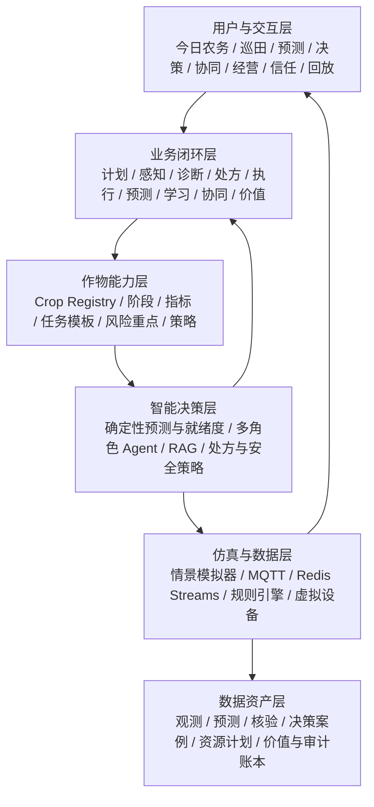

# 农智闭环：智慧农业功能架构

> 版本：v0.5（2026-08-22）
> 项目周期：15 天  
> 本期范围：模拟数据传输、智能体、可视化三条软件主线及联调  
> 明确不包含：真实传感器、鸿蒙端、硬件接入、真实端-智-云联调  
> 变更：v0.5 补齐预测、学习、协同、经营、信任五层目标能力，同时加深 P0 创新 I-01～I-14 的可验证证据（阶段切换、质量门控、漂移分流、执行异常、规则/模型仲裁和双轨回放）

## 1. 产品定位

**农智闭环（AgriLoop）**是一套面向小型温室和试验田的多作物可扩展农业运营与可信决策仿真平台。它把作物计划、农田状态、田间核验、农业知识、根因诊断、结构化处方、未来风险、协同调度、虚拟执行、经验学习和经营复盘放在同一条可追溯链路上，连续回答“现在怎样、为什么、怎么办、接下来怎样、过去怎么做更有效、多人多地如何协调、创造了多少价值、什么时候不应相信系统”。

完整目标沿用同一条可追溯链；15 天 P0 先跑通核心闭环与最小信任硬门，标注为 P1 的增强段只有在通过对应验收后才计入本期完成：

```text
Crop Pack 与作物批次 -> 全周期计划 -> 今日农务
-> 传感器感知 + 田间核验 -> 风险识别 -> 根因诊断
-> [P1] 短期预测/Time-to-Risk -> 决策就绪度/主动补证
-> 结构化农业处方 -> What-if -> [P1] 资源约束检查 -> 安全检查/人工确认
-> 虚拟执行 -> ACK -> 效果验证 -> 计划 vs 实际
-> [P1] 资源/经营价值 -> 决策回放 -> [P1/P2] 相似案例/受控策略学习
```

平台不为每种作物重复开发一套功能，而是复用统一的数据、设备、告警、Agent、控制和可视化内核，通过可插拔 **Crop Pack（作物包）**提供作物及生长阶段差异。

### 1.1 设计目标

1. 覆盖原始功能清单中的 10 项基础用户故事。
2. 在基础监测、告警、控制和问答之上增加可演示的创新功能。
3. 让数据、智能体、可视化三条主线共享同一套事件和状态合同。
4. 让每个 AI 建议可解释、可审批、可回放，不能直接绕过安全规则。
5. 在没有硬件的情况下，用异常情景和虚拟执行器证明系统真的联动。
6. 让新增作物主要通过配置完成，不要求重写后端、前端或 Agent。
7. 让计划、任务、核验、诊断、处方、执行和评价使用可关联的数据合同。
8. 让 Agent 负责理解、组合、解释和受控操作，不把确定性业务逻辑交给模型猜测。
9. 在风险真正越界前给出预测窗口、预计越界时间、不确定性和失效条件。
10. 把已评价决策沉淀为案例记忆，但任何策略变化必须经过离线回放和人工批准。
11. 在多地块、多人、设备和水源约束下给出可解释且不超容量的协同方案。
12. 用计划、实际、基线和模拟反事实核算资源、时间和成本价值，并标明数据来源。
13. 用决策就绪度、主动补证、弃权、降级和决策护照明确系统何时可靠、何时必须转人工。

## 2. 资料依据与交付边界

| 资料 | 在本架构中的用途 |
|---|---|
| `01_智慧农业_基本功能清单.md` | 10 项 P0 基线需求 |
| `2026重庆交通大学-中软国际人才培养集中实训解决方案.docx` | 15 天软件阶段、Mock 数据、MQTT/消息中间件、MaxKB/大模型、ECharts/Three.js 和成果物要求 |
| `FlowerNeverFade/smart-agriculture` | 当前 `main` 的 README、功能/技术架构、路线、状态和任务基线；v0.5 在原结构内一致性扩展 |

| 范围 | 本期 15 天 | 后续演进，不作为本期验收 |
|---|---|---|
| 数据来源 | Python/Node 模拟器、可配置情景脚本 | 真实传感器、鸿蒙开发板、网关 |
| 控制对象 | 虚拟水泵、虚拟阀门、可模拟 ACK/失败 | 真实继电器、水泵和 GPIO |
| 智能体 | MaxKB/RAG、LLM 适配器、受控工具、规则兜底 | 端侧模型、真实设备协同 |
| 交互 | Vue 工作台、管理台、可视化大屏、智能问答、回放 | 鸿蒙原生界面 |

完整目标覆盖八层用户问题，但交付必须分期：

| 范围层级 | 本期承诺 | 目标架构但不默认计入本期完成 |
|---|---|---|
| P0 | 看见、理解、行动闭环；最小决策就绪度与安全门 | — |
| P1 | 缺水/热风险短期预测、反馈与相似案例、有限水源调度、基础价值账本、完整决策护照 | 仅在 P0 稳定且有验收证据时交付 |
| P2 | 复杂时序模型、自动排班/路径、收益/产量预测、策略候选自动生成 | 只保留合同、仿真入口或后续路线，不宣传已完成 |

## 3. 用户与权限

| 角色 | 主要目标 | 核心权限 | 本期界面 |
|---|---|---|---|
| 农户 | 了解今日农务、核验现场、处理告警、确认处方、咨询农事 | 查看所属地块、提交巡田记录、确认/驳回建议 | 今日农务、巡田页、问答页 |
| 农务执行人员 | 接收任务、反馈现场、交接进度和使用资源 | 查看本人任务、提交核验/实际工时、申请资源、完成或移交任务 | 执行清单；资源日历和交接记录为 P1 |
| 农场管理员 | 统一管理地块、作物计划、设备、规则和任务 | 配置地块、批次计划、阶段、阈值、设备绑定、人员分派 | PC 管理台、运营大屏 |
| 系统管理员/评委 | 查看链路、审计、指标和演示证据 | 查看全局日志、回放、测试结果和系统配置 | 系统管理、演示回放 |

权限原则：查询权限按农场/地块隔离；控制权限按角色和风险等级隔离；中高风险动作必须人工确认；所有动作都写入审计记录。

## 4. 总体功能分层



### 4.1 农场与作物域

- 农场、区域、地块、面积、坐标和灌溉分区。
- 作物品种、种植批次、当前生长阶段、目标曲线和全周期计划时间轴。
- Crop Registry 统一管理作物包编码、版本、启停状态和适用环境。
- 地块风险等级、最近告警、今日用水和待处理任务。
- 农场/地块可配置水源容量、设备可用窗口、人员工时和成本口径；P1 调度与价值计算只读取统一配置，不在页面硬编码。
- 目标曲线支持苗期、营养生长期、开花期、结果期等阶段切换。
- Crop Pack 的 `task_templates` 按批次种植日期和阶段生成计划任务；`risk_focus` 提供各阶段重点关注风险。
- 生产计划落到统一 `work_order`，不为每种作物建立独立计划系统。
- 参数按“系统默认 -> Crop Pack -> 农场 -> 地块”逐级覆盖，最终生效值可查询、可追溯。

### 4.2 数据监测域（数据主线）

- 实时指标：土壤湿度、空气温度、空气湿度、光照、CO₂、降雨量、水流量。
- 指标使用统一编码，由当前 Crop Pack 和生长阶段决定展示项、目标范围与解释方式，不在页面或规则中按作物写死。
- 设备状态：在线、离线、心跳延迟、数据新鲜度、健康分。
- 历史趋势：7/24/168 小时、区间对比、目标曲线叠加、事件标记。
- 数据质量：范围校验、时间戳校验、重复去重、缺失、漂移、突变和可信度。
- 数据可用性：`SUPPORTED`、`SIMULATION_ONLY`、`UNAVAILABLE`；Agent 必须说明缺失项，不能猜测数值。
- 未来窗口：对质量合格的近期数据输出 1/2/4 小时预测、预计越界时间、区间和假设；不满足最低样本/质量要求时不预测。

### 4.3 告警、诊断与农务任务域

- 阈值、持续时间、迟滞、告警静默窗口和维护窗口；灌溉命令不设置时间冷却。
- 告警级别：提示、一般、严重、紧急。
- 告警生命周期：观察、待确认、活动、已确认、已解决、已升级。
- 告警转工单：分派、处理、验收、超时升级。
- 告警证据：指标窗口、规则版本、数据质量和相关设备。
- 今日农务中心聚合计划任务、活动告警、诊断结果、设备健康和逾期项，并按风险、时限和影响范围排序。
- 田间核验记录土壤表象、作物状态、设备状态、备注和操作人；人工观察是带来源的证据，不覆盖原始遥测。
- 根因诊断输出候选原因、置信度、支持/反对证据和缺失信息；同一证据输入必须得到可重复的基础评分。
- 决策就绪度综合数据新鲜度、证据覆盖、证据冲突、设备健康、动作风险和权限，输出 `READY`、`NEEDS_EVIDENCE`、`HUMAN_REVIEW` 或 `UNAVAILABLE`。
- 低就绪度时系统列出最小补证动作，并可创建巡田、复测或设备检查任务；不能只给低置信度后继续执行。
- Agent 负责解释诊断和引导补充核验，不负责凭语言模型生成候选原因概率。

### 4.4 智能决策域（智能体主线）

- 感知智能体：汇总实时值、历史窗口、目标曲线和数据质量。
- 诊断智能体：调用确定性诊断工具，解释缺水、过湿、过热、数据异常和设备异常的候选原因。
- 规划智能体：根据面积、流量、作物阶段和情景生成结构化灌溉处方，包含 WHAT、WHERE、WHEN、HOW MUCH、WHY、置信度和风险。
- 安全审核智能体：校验权限、上限、设备健康和审批要求；灌溉不设置时间冷却，告警静默期单独校验。
- 知识助手：基于 RAG 回答农事问题并提供证据。
- 报告智能体：生成日报、告警复盘和结构化摘要。
- 统一操作入口：查询今日农务、地块状态、诊断、效果与资源摘要；可创建巡田记录、生成处方和申请虚拟执行。
- 增强入口：查询未来风险、决策就绪度、相似案例、协同方案和经营价值；反馈、补证和执行申请仍通过白名单 Tool 与权限策略。
- 所有角色共享同一 Agent 框架，先解析地块、作物和生长阶段，再加载 Crop Pack；不为每种作物复制 Agent。
- RAG 优先使用“地块 -> 地区/环境 -> 阶段 -> 作物 -> 通用知识”的最窄可用证据，资料不足时逐级放宽并标明实际证据范围。

### 4.5 可视化与操作域（可视化主线）

- 今日农务中心：按地块、批次、风险、来源和截止时间展示计划任务、告警任务、核验任务和设备任务。
- 总览大屏：地块风险排序、实时指标、数据流状态、今日用水和待办。
- 地块详情：目标/观测曲线（本期观测来自模拟器）、事件标记、设备健康、情景控制。
- 巡田核验：结构化表单、证据来源、关联地块/批次/诊断和历史记录。
- 智能决策台：候选根因、处方、替代方案、证据、风险、工具调用链、确认/驳回。
- 决策回放：时间轴、事件筛选、输入快照、计划值、执行实际、效果评分和资源偏差。
- 未来风险：显示预测曲线、Time-to-Risk、区间、输入新鲜度和预测失效条件，不把单点外推包装成精确预言。
- 决策记忆：展示相似历史案例、当时动作、执行结果、适用差异和用户反馈；策略候选与当前生效策略分开展示。
- 协同排程：展示人员/设备/水源日历、冲突、分配依据、未满足需求和任务交接。
- 经营与信任：展示计划/实际/基线/反事实、资源与成本价值、来源标签，以及决策就绪度和完整决策护照。
- 管理台：地块、作物、设备、规则、用户、知识文档和审计记录。
- 页面由 Crop Pack 的指标与阶段配置驱动；切换作物后自动调整指标卡、目标曲线、规则说明和情景入口。

### 4.6 预测、学习、协同、经营与可信域

这五个域用于补齐八层问题空间，但不新增五套服务：

| 域 | 产品职责 | 确定性边界 | 主要复用模块 |
|---|---|---|---|
| 预测 | 估计未来 1/2/4 小时状态和进入风险区间所需时间 | 趋势、阈值穿越、区间与数据质量计算；Agent 只解释 | `rule-module`、`scenario-module`、`crop-pack-module` |
| 学习 | 检索类似已评价案例，沉淀反馈，提出可审核策略候选 | 只使用完整效果案例；发布前离线回放、回归和人工批准 | `audit-module`、`agent-module` |
| 协同 | 在水源、设备、人员和时间窗约束下分配任务与资源 | 容量约束、冲突检查、优先级和公平性可复算 | `workorder-module`、`farm-module`、`command-module` |
| 经营 | 说明水、能耗、工时和成本到底节省多少 | 计划/实际/基线/反事实分开，指标来源和公式可审计 | `audit-module`、`farm-module` |
| 信任 | 判断证据是否足够、动作能否执行和系统何时应弃权 | 硬门、就绪状态、主动补证、安全边界和版本追踪 | `telemetry-module`、`rule-module`、`agent-module`、`audit-module` |

统一来源标签为 `OBSERVED`（直接观测）、`USER_PROVIDED`（人工输入）、`DERIVED`（确定性推导）、`SIMULATED`（仿真/反事实）和 `ESTIMATED`（估算）。`OBSERVED` 还需保存 `sourceMode=SIMULATION|REAL`，本期固定为 `SIMULATION`。页面、报告和 Agent 回答必须保留来源，不能把模拟/估算结果显示成真实现场测量。

### 4.7 Crop Pack 最小模型

每个 Crop Pack 是版本化的专业配置，而非单独一批 RAG 文档，最少包含 8 个部分：

| 组成 | 作用 |
|---|---|
| 作物档案 | 名称、品种、环境、地区和版本 |
| 生长阶段 | 阶段顺序、各阶段目标、风险重点和任务模板 |
| 指标配置 | 所需统一指标、单位、目标范围和可用性 |
| 规则包 | 缺水、过湿、高低温、复合风险及设备/数据异常规则 |
| 知识包 | 通用、作物、阶段、地区/环境和地块知识索引 |
| 决策策略 | 灌溉上限、自动浇水阈值、风险级别和审批要求；灌溉无时间冷却 |
| 情景包 | 正常、干旱、热浪、暴雨、漂移和离线等可重复输入 |
| 测试包 | 固定规则、RAG、安全和闭环回归用例 |

15 天 P0 至少完成 2 种代表性作物的完整最小包，并用同一页面、Agent 和数据链路验证切换；后续将首批高质量 Crop Pack 扩展到 6–8 种，不扩大平台内核。

### 4.8 核心八项能力与现有架构映射

八项能力统一使用 `CAP-01`～`CAP-08`。编号表示用户可感知的业务能力，不代表新增服务；实现继续复用现有模块和实体。

| 编号 | 能力 | 复用/扩展 | 对应创新编号 |
|---|---|---|---|
| CAP-01 | 作物全周期生产计划 | Crop Pack、`crop_stage_profile`、`crop_batch`、`work_order` | I-01、I-19 |
| CAP-02 | 今日农务中心 | 告警、工单、诊断、设备健康的聚合读模型 | I-15 |
| CAP-03 | 田间核验 | 新增 `inspection_record`，接入统一证据链 | I-26 |
| CAP-04 | 多风险根因诊断 | 升级规则引擎的风险检测、证据收集和原因评分 | I-04 |
| CAP-05 | 结构化农业处方 | 升级灌溉试算与 `irrigation_plan` | I-06 |
| CAP-06 | 执行与效果验证 | 扩展虚拟执行、ACK、决策账本和回放 | I-08、I-13 |
| CAP-07 | 计划 vs 实际与资源效率 | 汇总批次计划、工单、命令实际量和效果评价 | I-17、I-19 |
| CAP-08 | Agent 统一操作入口 | 扩充现有受控 Tool，不创建第二套 Agent | I-09、I-11、I-12 |

### 4.9 核心八项能力的输入、处理、输出与验收

| 能力 | 输入 | 处理 | 输出 | 失败/降级路径 | 验收证据 |
|---|---|---|---|---|---|
| CAP-01 | Crop Pack、种植日期、批次、阶段 | 解析阶段和任务模板，生成统一工单 | 生命周期时间轴、计划任务 | 包或日期无效时不生成并返回校验错误 | 两个作物包生成不同阶段任务且来源可追溯 |
| CAP-02 | 计划任务、告警、诊断、设备健康 | 归一化为今日工作项并计算优先级 | 按地块排序的今日农务列表 | 单一来源不可用时保留其他来源并标记缺失 | 首页能解释每个工作项的来源和优先级 |
| CAP-03 | 地块、批次、结构化观察、人员、时间 | 校验权限与枚举，关联任务/诊断 | `inspection_record` 和证据引用 | 离线/上传失败时保留草稿；缺字段不进入诊断 | 人工观察可新增、查询并在诊断证据中显示 |
| CAP-04 | 遥测窗口、质量、人工观察、规则、历史 | 生成候选原因，计算支持/反对证据和置信度；`drought` 与 `sensor-drift` 必须分流 | `diagnosis_result` | 数据不足时输出 `INSUFFICIENT_EVIDENCE` 和待核验项 | 干旱、漂移、设备异常固定场景得到可重复且互不混淆的结果 |
| CAP-05 | 诊断、阶段、面积、流量、策略约束、数据质量 | 确定性试算并生成结构化处方；质量低于阈值时禁止灌溉处方 | 灌溉 `irrigation_plan` 或核验/检修建议 | 缺流量/面积或质量门控未通过时只给核验/检修建议，不猜测水量 | 完整处方含 WHAT/WHERE/WHEN/HOW MUCH/WHY；低质量场景不产出灌溉处方 |
| CAP-06 | 处方、审批、命令、ACK、执行前后遥测 | 对比预期/实际并评价效果；覆盖成功、ACK 超时、半成功、无效果 | 效果评价、告警状态、回放事件 | ACK 超时/半成功/后测缺失时标记 `PENDING`/`PARTIAL`/`INCONCLUSIVE`，不得伪装成功 | 成功闭环可追到 ACK、实际量、前后值和效果评分；至少一种失败路径可演示 |
| CAP-07 | 计划量、实际量、任务完成、效果评价 | 计算偏差、单位资源效果和批次汇总 | 计划实绩与资源效率视图 | 口径不完整时显示不可比较及缺失字段 | 展示计划/实际用水、偏差和单位用水改善 |
| CAP-08 | 用户意图、权限、上下文、白名单 Tool | 识别意图、调用工具、解释结果、请求确认 | 回答、任务、处方或虚拟执行申请 | AI 不可用时切换规则/表单入口；越权请求拒绝 | 固定问题能查询今日任务、解释诊断并受控申请执行 |

### 4.10 五项增强能力与现有架构映射

| 编号 | 能力 | 复用/扩展 | 对应创新编号 | 首个可交付切片 |
|---|---|---|---|---|
| CAP-09 | 未来风险预测与 Time-to-Risk | `rule-module`、Crop Pack 目标、情景快照和审计账本 | I-07、I-16、I-27 | 缺水/热风险 1/2/4 小时预测、预计越界时间和区间 |
| CAP-10 | 决策记忆与受控学习 | 效果评价、建议反馈、回放和 `audit-module` | I-08、I-13、I-23、I-29 | 完整案例入库、相似案例检索、采纳/修改/驳回反馈 |
| CAP-11 | 多人多地多资源协同 | 统一工单、今日农务、资源配置和虚拟命令 | I-15、I-22 | 有限水量下的多地块分配、冲突提示和任务交接 |
| CAP-12 | 经营价值与效益归因 | 计划实绩、资源效率、批次和决策账本 | I-17、I-19 | 水/能耗/工时/成本计划实绩与基线差异 |
| CAP-13 | 决策就绪度与可信运行 | 数据质量、诊断证据、安全闸门、降级和审计 | I-03、I-10~I-14、I-24、I-26、I-28 | 四态就绪度、缺失证据、主动补证、拒绝/转人工和决策护照 |

### 4.11 五项增强能力的输入、处理、输出与验收

| 能力 | 输入 | 处理 | 输出 | 失败/降级路径 | 验收证据 |
|---|---|---|---|---|---|
| CAP-09 | 质量合格的近期遥测、阶段目标、模拟天气、计划动作 | 稳健趋势/简化水分模型、阈值穿越、预测区间与质量门 | `forecast_snapshot`、1/2/4 小时预测、Time-to-Risk、假设和失效时间 | 样本不足、阶段未知或质量低时返回 `UNAVAILABLE` 并列出补证项；模型不得补值 | 同一快照/算法版本结果一致；`gradual-drydown` 在后续模拟轨迹越界前产生预警，预测误差和覆盖率可计算 |
| CAP-10 | 已完成效果评价、诊断/处方/版本、采纳/修改/驳回反馈 | 生成案例指纹、过滤低质量/混杂案例、相似度排序；可选形成策略候选 | `decision_case`、相似案例、反馈摘要、`strategy_candidate` | 合格案例不足时返回 `INSUFFICIENT_CASES`；候选不能自动生效 | 只检索评价完整案例；相同上下文排序可重复；未经离线回放和批准的候选不能进入 Active 版本 |
| CAP-11 | 今日任务、Time-to-Risk、动作风险、人员技能/工时、设备/水源容量和时间窗 | 约束校验、冲突检测、优先级/公平性排序与资源分配 | `resource_plan`、任务分派、预留、冲突、未满足需求和交接记录 | 无可行方案时返回 `INFEASIBLE` 和冲突解释，不超配资源或伪造完成 | `limited-water` 场景分配总量不超过容量；相同输入结果一致；未满足地块有原因和后续任务 |
| CAP-12 | 计划/实际、基线、模拟反事实、资源价格、工时和数据来源 | 按版本化公式核算用水、能耗、工时、成本与差异，保留分子分母和假设 | `value_ledger`、资源节省、时间节省、成本差异和可信范围 | 缺价格/基线时标记 `INCOMPLETE`，只展示可计算项；无产量/价格证据不输出利润 | 每个数值可由原始记录复算；五类统一来源标签完整；总账与明细一致 |
| CAP-13 | 数据质量/新鲜度/覆盖、证据冲突、预测不确定性、设备健康、权限、动作风险和策略版本 | 硬门校验 + 可解释评分，生成四态就绪度和最小补证动作 | `decision_readiness`、缺失/冲突证据、补证任务、决策护照和适用边界 | 必要证据缺失为 `UNAVAILABLE/NEEDS_EVIDENCE`；中高风险或冲突为 `HUMAN_REVIEW`；禁止继续自动执行 | 低质量或冲突场景能阻断高风险动作；一键生成核验任务；补证后重新评估且完整保留前后版本 |

“诊断置信度高”不等于“可以执行”。例如缺水原因置信度很高，但水泵离线、流量未知或资源冲突时，决策就绪度仍必须是 `NEEDS_EVIDENCE`、`HUMAN_REVIEW` 或 `UNAVAILABLE`。

## 5. 基线功能覆盖

以下 10 项对应 `01_智慧农业_基本功能清单.md`，全部列为 P0，不因创新功能而删减。

| 编号 | 原始用户故事/功能 | 本项目功能落点 | 验收证据 |
|---|---|---|---|
| B-01 | 查看土壤湿度 | 地块卡片、实时曲线、质量标签 | 模拟器持续上报，数值秒级刷新 |
| B-02 | 查看温度 | 环境指标卡片和曲线 | 情景切换后曲线变化 |
| B-03 | 查看历史数据趋势 | 7/24/168 小时趋势、区间对比 | 可选地块、指标和时间范围 |
| B-04 | 远程控制灌溉开关 | 虚拟水泵/阀门开关、时长/水量、失败重试、幂等演示入口 | 指令、ACK、失败提示和审计 |
| B-05 | 设置土壤湿度阈值告警 | 阈值、持续时间、迟滞、通知策略 | 连续低于阈值触发告警 |
| B-06 | 查看设备在线状态 | 心跳、延迟、新鲜度、健康分 | 模拟离线和自动恢复 |
| B-07 | 对话咨询灌溉建议 | RAG 问答、实时数据工具、灌溉试算，并在回答末尾生成可审批决策卡 | 回答附知识和数据证据 |
| B-08 | 多地块数据总览 | 网格/地图、聚合指标、风险排序；P1 增加水源冲突提示 | 一屏查看所有地块 |
| B-09 | 设备绑定管理 | 模拟设备注册、绑定、解绑、分配 | 绑定关系可查询可追溯 |
| B-10 | 查看系统告警记录 | 告警列表、筛选、确认、关闭、导出 | 可按级别、地块、时间检索 |

## 6. 创新增量功能

### 6.1 P0 创新（必须进入主演示）

| 编号 | 功能 | 超越基础清单的价值 | 演示证据 |
|---|---|---|---|
| I-01 | Crop Pack 与生长阶段 | 作物差异配置化，不同阶段使用不同目标与规则 | 固定脚本切换作物/阶段后，指标卡、目标曲线、规则说明和 RAG 上下文同步变化 |
| I-02 | 动态目标曲线 | 识别趋势和偏差，减少阈值抖动 | 目标与模拟观测叠加；阶段切换后目标带立即跳变且可在回放中标注 |
| I-03 | 数据质量评分与门控 | 区分实际缺水状态和数据不可信，避免错误灌溉 | 卡片显示新鲜度/完整率/可信度；质量低于阈值时 Agent 拒绝灌溉处方，仅给核验或检修建议 |
| I-04 | 多风险检测与根因诊断 | 结合遥测质量、人工观察、历史和规则区分实际缺水状态、漂移与设备问题 | 同屏对比 `drought` 与 `sensor-drift`：前者出灌溉处方候选，后者出巡检/校准建议且不混淆 |
| I-05 | 迟滞与告警去重 | 避免告警频繁开关，同时不阻塞真实缺水处置 | 连续越界才告警，告警记录按规则静默期复用；灌溉命令不设置时间冷却，重复请求仍由幂等键去重 |
| I-06 | 结构化农业处方 | 从“开/关”升级到何时、哪里、做什么、做多少及为什么；P0 先实现灌溉 | 输入诊断/面积/流量/目标，输出完整处方；质量门控或证据不足时不生成灌溉处方 |
| I-07 | What-if 情景模拟 | 无硬件也能验证策略 | 干旱、暴雨、热浪、漂移一键切换；同一快照可推演执行/不执行两条路径 |
| I-08 | 执行与效果验证闭环 | 不仅证明命令执行，还验证实际结果是否达到处方预期 | 成功路径展示 ACK、实际水量、前后对比和效果评分；另演示至少一种 ACK 超时/半成功/无效果并标记非成功评价 |
| I-09 | 多角色智能体与统一操作入口 | 让 AI 职责清楚且可通过受控 Tool 查询和发起业务操作 | 感知 -> 诊断 -> 处方 -> 安全 -> 查询效果；展示工具链与角色边界 |
| I-10 | RAG 证据链 | 降低农业建议幻觉 | 展示知识片段、版本、引用；资料回退时标明实际命中范围 |
| I-11 | 工具调用审计 | 解释 AI 如何得到结论 | 展示工具入参、出参、耗时与 `traceId` |
| I-12 | 人在回路安全闸门 | 防止模型直接执行高风险动作；规则与模型冲突时以策略层为准 | 未审批动作被拦截；构造规则否决/模型仍建议时，安全闸门拒绝执行并写入审计 |
| I-13 | 决策回放与双轨对比 | 让评委看到完整因果链，并证明“执行是否改变结果” | 同一 `scenarioId` 可重复回放；最小双轨对比展示执行 vs 不执行的曲线/风险差异 |
| I-14 | 规则/模型双轨降级 | LLM 失败不影响核心系统 | 断开 AI 后规则告警、根因基础分和灌溉试算仍可用，UI 明确显示规则模式 |
| I-15 | 统一农务工单与今日农务中心 | 聚合计划、告警、诊断、核验和设备任务，形成统一处理入口 | 首页展示来源、优先级、处理状态和原始记录链接 |
| I-28 | 决策就绪度与主动证据获取 | 不只给置信度，还说明证据是否足够、缺什么以及是否允许行动 | 低质量/冲突证据阻断执行并创建巡田或设备检查任务 |

#### P0 创新加深约定（v0.5）

以下约定不新增编号，只加深 I-01～I-14 的验收硬度；实现仍复用既有模块：

1. **阶段切换脚本（I-01/I-02）**：答辩使用固定 `cropPackVersion` + 生长阶段切换步骤，证明配置驱动而非页面写死。
2. **质量门控（I-03/I-06）**：可信度或新鲜度低于 Crop Pack/地块阈值时，不得输出可执行灌溉处方。
3. **漂移分流（I-04）**：`sensor-drift` 不得走到与 `drought` 相同的灌溉闭环结论。
4. **执行异常（I-08）**：虚拟执行器至少支持成功与一种非成功路径，效果评价不得把失败标成成功。
5. **冲突仲裁（I-12）**：模型建议与规则/策略冲突时，以安全闸门结果为准并保留双方输入快照。
6. **双轨回放（I-07/I-13）**：P0 至少提供执行/不执行对比曲线或风险摘要；更完整的 What-if 报告可作为 P1 增强。

### 6.2 P1 增强（主线稳定后实现）

| 编号 | 功能 | 交付方式 |
|---|---|---|
| I-16 | Mock 天气情景 | 输入未来降雨、温度和光照情景，作为预测与推荐计划的显式假设 |
| I-17 | 经营价值与效益归因 | 在计划/实际/基线/模拟反事实之间核算资源、工时和成本；原资源效率口径继续保留 |
| I-18 | 设备健康与自愈 | 心跳异常生成检修任务，恢复后关闭 |
| I-19 | 作物全周期计划与批次追溯 | 批次计划关联阶段任务、环境、核验、灌溉、效果和操作人 |
| I-22 | 多地块、多人员与多资源协同调度 | 先实现受限水源的地块优先级和水量分配，再扩展设备/人员日历、冲突与交接 |
| I-23 | 建议反馈与案例记忆 | 采纳/驳回/修改进入决策案例；反馈不能直接静默修改策略 |
| I-24 | 多级降级（扩展 I-14） | AI/消息中间件/存储三级降级与 UI 模式标识 |
| I-25 | 定期报告生成与订阅 | 报告 Agent 生成日报/周报并推送 |
| I-26 | 田间核验与人机证据融合 | 结构化人工观察进入诊断证据链，并保留来源、人员、时间和关联任务 |
| I-27 | 未来风险预测与 Time-to-Risk | 输出短期预测、预计越界时间、区间、输入质量、假设和失效条件 |
| I-29 | 决策记忆与受控策略学习 | 从评价完整案例检索相似经验；策略候选必须离线验证、人工批准和可回滚 |

> I-22~I-25 为 v0.3 补强项，I-26 为 v0.4 人机证据能力。v0.5 不新增 P0 编号，只加深 I-01～I-14 的演示证据与失败路径；新增 I-27~I-29 分别承载预测、决策就绪度和受控学习，协同与经营继续升级既有 I-22/I-17，避免机械堆叠编号。未经测试的增强能力只能标为目标设计/P1/P2。

### 6.3 P2 预留（不阻塞 15 天交付）

- **I-20 视觉病害识别**：保留图片上传和 Mock 识别接口，不把训练模型作为本期承诺。
- **I-21 语音问答**：文本输入模拟转写，作为交互扩展，不影响主线。
- **高级预测**：机器学习、病害/产量预测和外部真实天气只在数据量、校准和回测证据充分后启用。
- **自动排班与路径优化**：多班组、多设备路线和跨农场调度在有限水源切片稳定后再做。
- **策略候选生成与发布**：P2 可生成候选，但仍须离线回放、回归、人工批准和一键回滚；不做无监督在线自学习。
- **收益与避免损失估算**：只有具备产量、价格和可信基线时才进入经营报表，否则只展示资源/时间/成本的仿真估算。
- Three.js 复杂三维场景：只有在 ECharts、回放和联调稳定后再增加。

## 7. 功能优先级与验收规则

### P0 必须完成

- B-01 至 B-10 全部可操作。
- 至少 3 个地块、2 种作物、6 类统一指标持续产生数据；每种作物均有可校验的档案、阶段、指标、规则、知识、策略、情景和测试配置。
- `normal`、`drought`、`sensor-drift`、`device-offline` 四个情景可运行，且干旱与漂移结论可区分。
- 今日农务中心能够聚合计划、告警、诊断和设备任务，并说明优先级来源。
- 一次异常可以完成告警、根因诊断、决策就绪度、结构化灌溉处方、人工确认、虚拟执行、ACK、效果验证和回放。
- 低质量数据或漂移场景不生成可执行灌溉处方；虚拟执行至少覆盖一种非成功评价路径。
- 同一 `scenarioId` 支持执行/不执行最小双轨对比回放。
- Agent 能通过白名单工具查询今日任务、解释诊断、生成处方和申请虚拟执行；规则与模型冲突时以安全闸门为准。
- 决策证据不足、设备/资源不可用或中高风险时，系统能够补证、转人工或拒绝，不允许高置信度文本绕过硬门。
- AI 服务不可用时，规则告警和灌溉试算仍然可用。

### P1 交付判断

- 不破坏 P0 的稳定性。
- 有页面入口、接口记录和测试证据。
- 在答辩脚本中能用固定数据重复演示。
- 优先顺序为：田间核验/完整生命周期 -> CAP-09 短期预测 -> CAP-13 完整决策护照 -> CAP-11 有限水源协同 -> CAP-12 基础价值账本 -> CAP-10 相似案例。
- CAP-09 必须显示预测窗口、区间、算法版本和不可预测原因；不以单个预测样例宣称“准确率高”。
- CAP-10 只使用效果评价完整案例，任何策略候选不得自动生效。
- CAP-11 分配不得超过资源容量，并显示冲突和未满足需求。
- CAP-12 每个指标都可复算并使用五类统一来源标签；没有证据时不输出利润。
- 未完成增强能力必须保留合同和任务，并在 UI/答辩中标记为目标设计，不得标成已交付。

### 功能验收清单

```text
[ ] 实时湿度/温度可以秒级刷新
[ ] 历史曲线可切换地块、指标和时间范围
[ ] 模拟离线后状态会变化，恢复后自动上线
[ ] 连续越界才产生告警，告警静默期内复用记录；灌溉重复请求仅按幂等键处理
[ ] 智能体回答包含 evidence、confidence 和 traceId
[ ] 今日农务能够聚合并解释计划、告警、诊断和设备任务
[ ] 固定证据可以复现候选根因；drought 与 sensor-drift 结论可区分，证据不足时不会伪造结论
[ ] 数据质量低于阈值时不生成可执行灌溉处方
[ ] 决策就绪度与诊断置信度分开展示，低就绪度会补证、转人工或阻断
[ ] 灌溉处方包含 WHAT/WHERE/WHEN/HOW MUCH/WHY、风险和审批要求
[ ] 切换作物/阶段后，页面、规则和 RAG 使用对应 Crop Pack，目标曲线同步变化
[ ] 缺少指标时明确显示不可用，Agent 不生成猜测值
[ ] 未审批的中高风险动作会被拒绝；规则否决优先于模型建议
[ ] 虚拟执行成功路径返回 ACK、实际量与效果评价；至少一种非成功路径可演示
[ ] 事件时间轴可复盘闭环，并展示执行/不执行最小双轨对比
[ ] 断开 LLM 后核心功能仍可运行
[ ] P1 预测显示 1/2/4 小时、Time-to-Risk、区间、算法版本和 `UNAVAILABLE` 原因
[ ] P1 相似案例只来自评价完整记录，用户反馈有来源，策略候选不会自动发布
[ ] P1 协同分配不超容量，冲突、优先级、未满足需求和交接均可解释
[ ] P1 经营指标区分计划/实际/基线/反事实，并标明观测、模拟或估算来源
[ ] 决策护照可追到数据、预测、诊断、处方、策略检查、人工动作、执行与效果版本
```

## 8. 创新点的可验证证据

| 创新点 | 不是口号的实现 | 现场证据 |
|---|---|---|
| 情景数字孪生 | 用状态快照复制未来窗口，复用规则和 Agent | 切换干旱/暴雨/漂移，并对比执行与不执行 |
| 多智能体协作 | 固定角色、Tool Schema、traceId 和结果合同，Agent 只组合受控业务能力 | 展开查询、诊断、处方、安全与效果工具链 |
| 可解释决策 | 证据、输入快照、置信度、策略版本和人工动作入账 | 点击建议跳到决策账本 |
| 质量门控决策 | 质量分进入诊断与处方前置条件，低质量阻断灌溉建议 | 漂移/低新鲜度场景只给核验或检修，不给浇水处方 |
| 安全控制 | 风险、权限、上限、二次确认、幂等，以及规则优先于模型 | 未审批命令被拒绝；灌溉无时间冷却但仍受幂等和资源校验；冲突场景以闸门结果入账 |
| 效果与异常路径 | 成功与非成功 ACK/效果评价共用合同，禁止伪装成功 | 成功回升与 ACK 超时/无效果各演示一次 |
| 可用性工程 | LLM、消息延迟、离线均有模拟和降级 | 断开 AI 后规则模式继续运行 |
| 可持续扩展 | 数据源/执行器用适配器隔离，作物差异由 Crop Pack 注入 | 展示两种作物/阶段切换后目标与规则同步变化 |
| 农务经营闭环 | 批次计划、今日任务、执行实际和资源效果共享关联标识 | 从今日任务追到计划来源、处方、执行与效果 |
| 人机证据融合 | 遥测与人工观察各自保留来源和可信度，由确定性诊断工具合并 | 新增巡田记录后诊断证据更新且原始遥测不被覆盖 |
| 未来风险与提前量 | 同一快照使用版本化确定性算法输出时间窗、区间与越界时间 | `gradual-drydown` 先预警、后越界，并展示预测误差与失效条件 |
| 主动证据获取 | 就绪度硬门识别缺失/冲突证据，并生成最小补证任务 | 低质量传感器阻断灌溉，完成复测后重新评估且保留版本 |
| 经验可复用但不失控 | 只有评价完整案例进入记忆，策略候选需离线验证、批准和回滚 | 展示相似案例、差异、候选状态和未批准不可生效测试 |
| 多资源协同 | 调度器显式读取容量和时间窗，不用 Agent 文本“安排” | 受限水源分配总量不超上限，冲突与未满足地块有解释 |
| 经营价值可信 | 计划/实际/基线/反事实和来源标签进入价值账本 | 从汇总下钻到用水、工时、价格假设和公式，能够复算 |

## 9. 15 天完成定义

- 一键启动模拟器、消息代理、后端、前端和数据库。
- “干旱情景”在 3 分钟内完成数据变化、根因诊断、灌溉处方、确认、执行、效果验证和复盘。
- 另备 `sensor-drift` 与一种虚拟执行非成功路径，证明系统不会把漂移当干旱、也不会把失败当成功。
- 每个建议都有输入快照、证据、风险等级和最终执行人。
- 每个建议记录 Crop Pack、规则、知识和 Agent 版本，支持按版本回放与执行/不执行最小双轨对比。
- 每次虚拟执行关联原处方、计划值、实际值和效果评价；无法评价时明确记录原因。
- 所有可执行决策先产生四态就绪度；`NEEDS_EVIDENCE/HUMAN_REVIEW/UNAVAILABLE` 不得被 Agent 绕过。
- 若交付 CAP-09~CAP-12 的 P1 切片，必须分别提供预测回测、案例过滤、资源约束和价值对账证据；否则只标记为目标设计。
- 交付 Demo、代码仓、数据字典、接口文档、测试报告、答辩 PPT 和演示脚本。

## 10. 农户端农智助手功能切片（2026-08-30）

农户侧新增独立 `#assistant` 视图，主导航固定为“灌溉系统 → 消息中心 → 农智助手 → 更多工具”。视图采用单列连续消息，顶部显示服务状态、当前地块、历史对话和新对话；中部展示结论、下一步、来源/降级状态与操作卡；底部为圆角输入框。历史对话从右侧抽屉加载，空会话提供四个农户快捷问题，依据与执行记录按需展开，窄屏时抽屉全宽且工具栏换行。

农户 Agent 作为既有智能体主线中的受控入口，不创建平行闭环。白名单工具为本人任务状态转换、文字巡田记录、授权地块补证申请和 `READY` 灌溉处方虚拟执行。写操作统一经过“预览 → 农户确认/取消 → 服务端重新鉴权 → 虚拟执行/结果刷新”，状态覆盖待确认、执行中、已完成、失败、部分成功、已取消和已过期。管理员工具对农户不可见；歧义、缺失证据、低质量、`sensor-drift` 和非 `READY` 只返回候选或补证动作，不生成执行卡。

### 状态与结果刷新补充（2026-08-31）

操作预览的状态以服务端操作记录为准，农户从其他页面返回或重新加载农智助手时必须重新读取操作状态；`EXECUTING`、`SUCCEEDED`、`PARTIAL`、`FAILED`、`TIMEOUT`、`CANCELED` 和 `EXPIRED` 均不再提供确认入口。虚拟灌溉完成后，按命令实际水量刷新受影响地块的土壤湿度与水位，失败/超时不改变地块状态；演示模式只在浏览器会话内保存这些仿真结果，正式模式仍以后端事实为准。
