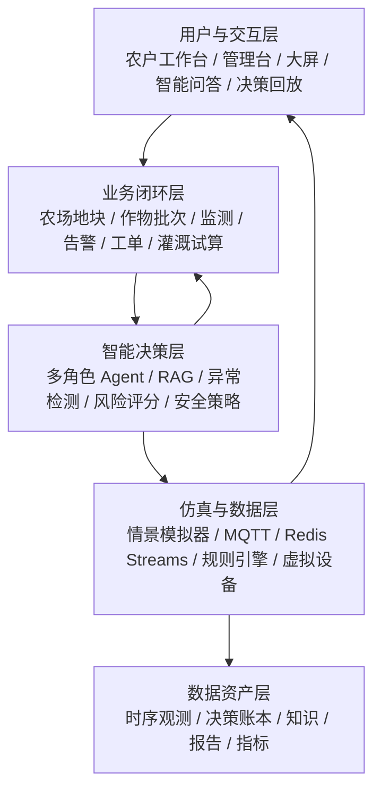

# 农智闭环：智慧农业功能架构

> 版本：v0.1  
> 项目周期：15 天  
> 本期范围：模拟数据传输、智能体、可视化三条软件主线及联调  
> 明确不包含：真实传感器、鸿蒙端、硬件接入、真实端-智-云联调

## 1. 产品定位

**农智闭环（AgriLoop）**是一套面向小型温室和试验田的软件仿真平台。它把农田状态、农业知识、智能决策、虚拟执行和复盘分析放在同一条可追溯链路上，解决“看到了异常，但不知道为什么、该不该浇、浇多少、如何证明有效”的问题。

本期不是简单做一个监控大屏，而是完成下面的可重复软件闭环：

```text
模拟农田数据 -> 规则与异常识别 -> 智能体分析/试算
-> 人工确认或策略放行 -> 虚拟灌溉执行 -> 结果回传
-> 可视化更新 -> 决策回放与审计
```

### 1.1 设计目标

1. 覆盖原始功能清单中的 10 项基础用户故事。
2. 在基础监测、告警、控制和问答之上增加可演示的创新功能。
3. 让数据、智能体、可视化三条主线共享同一套事件和状态合同。
4. 让每个 AI 建议可解释、可审批、可回放，不能直接绕过安全规则。
5. 在没有硬件的情况下，用异常情景和虚拟执行器证明系统真的联动。

## 2. 资料依据与交付边界

| 资料 | 在本架构中的用途 |
|---|---|
| `01_智慧农业_基本功能清单.md` | 10 项 P0 基线需求 |
| `2026重庆交通大学-中软国际人才培养集中实训解决方案.docx` | 15 天软件阶段、Mock 数据、MQTT/消息中间件、MaxKB/大模型、ECharts/Three.js 和成果物要求 |
| `FlowerNeverFade/smart-agriculture` | 当前仓库仅有初始 README，本项目提供完整功能设计和 README |

| 范围 | 本期 15 天 | 后续演进，不作为本期验收 |
|---|---|---|
| 数据来源 | Python/Node 模拟器、可配置情景脚本 | 真实传感器、鸿蒙开发板、网关 |
| 控制对象 | 虚拟水泵、虚拟阀门、可模拟 ACK/失败 | 真实继电器、水泵和 GPIO |
| 智能体 | MaxKB/RAG、LLM 适配器、受控工具、规则兜底 | 端侧模型、真实设备协同 |
| 交互 | Vue 工作台、管理台、可视化大屏、智能问答、回放 | 鸿蒙原生界面 |

## 3. 用户与权限

| 角色 | 主要目标 | 核心权限 | 本期界面 |
|---|---|---|---|
| 农户 | 了解地块状态、处理告警、确认灌溉、咨询农事 | 查看所属地块、确认/驳回建议、创建巡检任务 | 移动优先工作台、问答页 |
| 农场管理员 | 统一管理地块、作物、设备、规则和任务 | 配置地块、作物阶段、阈值、设备绑定、人员分派 | PC 管理台、运营大屏 |
| 系统管理员/评委 | 查看链路、审计、指标和演示证据 | 查看全局日志、回放、测试结果和系统配置 | 系统管理、演示回放 |

权限原则：查询权限按农场/地块隔离；控制权限按角色和风险等级隔离；中高风险动作必须人工确认；所有动作都写入审计记录。

## 4. 总体功能分层



### 4.1 农场与作物域

- 农场、区域、地块、面积、坐标和灌溉分区。
- 作物品种、种植批次、当前生长阶段和目标曲线。
- 地块风险等级、最近告警、今日用水和待处理任务。
- 目标曲线支持苗期、营养生长期、开花期、结果期等阶段切换。

### 4.2 数据监测域（数据主线）

- 实时指标：土壤湿度、空气温度、空气湿度、光照、CO₂、降雨量、水流量。
- 设备状态：在线、离线、心跳延迟、数据新鲜度、健康分。
- 历史趋势：7/24/168 小时、区间对比、目标曲线叠加、事件标记。
- 数据质量：范围校验、时间戳校验、重复去重、缺失、漂移、突变和可信度。

### 4.3 告警与任务域

- 阈值、持续时间、迟滞、冷却窗口和维护窗口。
- 告警级别：提示、一般、严重、紧急。
- 告警生命周期：观察、待确认、活动、已确认、已解决、已升级。
- 告警转工单：分派、处理、验收、超时升级。
- 告警证据：指标窗口、规则版本、数据质量和相关设备。

### 4.4 智能决策域（智能体主线）

- 感知智能体：汇总实时值、历史窗口、目标曲线和数据质量。
- 诊断智能体：识别缺水、过湿、过热、数据异常和设备异常。
- 规划智能体：根据面积、流量、作物阶段和情景试算时长、水量。
- 安全审核智能体：校验权限、上限、冷却、设备健康和审批要求。
- 知识助手：基于 RAG 回答农事问题并提供证据。
- 报告智能体：生成日报、告警复盘和结构化摘要。

### 4.5 可视化与操作域（可视化主线）

- 总览大屏：地块风险排序、实时指标、数据流状态、今日用水和待办。
- 地块详情：目标/实测曲线、事件标记、设备健康、情景控制。
- 智能决策台：建议、证据、风险、工具调用链、确认/驳回。
- 决策回放：时间轴、事件筛选、输入快照、执行结果和效果评分。
- 管理台：地块、作物、设备、规则、用户、知识文档和审计记录。

## 5. 基线功能覆盖

以下 10 项对应 `01_智慧农业_基本功能清单.md`，全部列为 P0，不因创新功能而删减。

| 编号 | 原始用户故事/功能 | 本项目功能落点 | 验收证据 |
|---|---|---|---|
| B-01 | 查看土壤湿度 | 地块卡片、实时曲线、质量标签 | 模拟器持续上报，数值秒级刷新 |
| B-02 | 查看温度 | 环境指标卡片和曲线 | 情景切换后曲线变化 |
| B-03 | 查看历史数据趋势 | 7/24/168 小时趋势、区间对比 | 可选地块、指标和时间范围 |
| B-04 | 远程控制灌溉开关 | 虚拟水泵/阀门开关、时长控制 | 指令、ACK、失败提示和审计 |
| B-05 | 设置土壤湿度阈值告警 | 阈值、持续时间、迟滞、通知策略 | 连续低于阈值触发告警 |
| B-06 | 查看设备在线状态 | 心跳、延迟、新鲜度、健康分 | 模拟离线和自动恢复 |
| B-07 | 对话咨询灌溉建议 | RAG 问答、实时数据工具、灌溉试算 | 回答附知识和数据证据 |
| B-08 | 多地块数据总览 | 网格/地图、聚合指标、风险排序 | 一屏查看所有地块 |
| B-09 | 设备绑定管理 | 模拟设备注册、绑定、解绑、分配 | 绑定关系可查询可追溯 |
| B-10 | 查看系统告警记录 | 告警列表、筛选、确认、关闭、导出 | 可按级别、地块、时间检索 |

## 6. 创新增量功能

### 6.1 P0 创新（必须进入主演示）

| 编号 | 功能 | 超越基础清单的价值 | 演示证据 |
|---|---|---|---|
| I-01 | 作物档案与生长阶段 | 不同阶段使用不同目标，而非一个固定阈值 | 切换番茄苗期/结果期，目标自动变化 |
| I-02 | 动态目标曲线 | 识别趋势和偏差，减少阈值抖动 | 目标曲线与实测曲线叠加 |
| I-03 | 数据质量评分 | 区分真实缺水和数据不可信 | 卡片显示新鲜度、完整率、可信度 |
| I-04 | 多指标异常检测 | 结合湿度、温度、光照判断复合风险 | 干旱情景触发复合风险 |
| I-05 | 迟滞与冷却窗口 | 避免告警和灌溉频繁开关 | 连续越界才告警，执行后进入冷却 |
| I-06 | 灌溉量试算器 | 从“开/关”升级到“浇多久、多少水” | 输入面积/流量/目标，输出水量 |
| I-07 | What-if 情景模拟 | 无硬件也能验证策略 | 干旱、暴雨、热浪、漂移一键切换 |
| I-08 | 虚拟执行闭环 | 证明智能建议对状态产生结果 | ACK、湿度回升、效果评分 |
| I-09 | 多角色智能体 | 让 AI 决策职责清楚且可控 | 感知 -> 诊断 -> 规划 -> 安全 |
| I-10 | RAG 证据链 | 降低农业建议幻觉 | 展示知识片段、版本、引用 |
| I-11 | 工具调用审计 | 解释 AI 如何得到结论 | 展示工具入参、出参、耗时 |
| I-12 | 人在回路安全闸门 | 防止模型直接执行高风险动作 | 未审批动作被拦截 |
| I-13 | 决策回放时间轴 | 让评委看到完整因果链 | 同一 `scenarioId` 可重复回放 |
| I-14 | 规则/模型双轨降级 | LLM 失败不影响核心系统 | 断开 AI 仍可告警和试算 |

### 6.2 P1 增强（主线稳定后实现）

| 编号 | 功能 | 交付方式 |
|---|---|---|
| I-15 | 告警自动转工单 | 分派、处理、验收、超时升级 |
| I-16 | Mock 天气情景 | 输入未来降雨概率，影响推荐计划 |
| I-17 | 水量/能耗/碳排指标 | 看板展示节水率和估算能耗 |
| I-18 | 设备健康与自愈 | 心跳异常生成检修任务，恢复后关闭 |
| I-19 | 农事批次追溯 | 批次编号关联环境、灌溉和操作人 |

### 6.3 P2 预留（不阻塞 15 天交付）

- **I-20 视觉病害识别**：保留图片上传和 Mock 识别接口，不把训练模型作为本期承诺。
- **I-21 语音问答**：文本输入模拟转写，作为交互扩展，不影响主线。
- Three.js 复杂三维场景：只有在 ECharts、回放和联调稳定后再增加。

## 7. 功能优先级与验收规则

### P0 必须完成

- B-01 至 B-10 全部可操作。
- 至少 3 个地块、2 种作物、6 类指标持续产生数据。
- `normal`、`drought`、`device-offline` 三个情景可运行。
- 一次异常可以完成告警、Agent 建议、人工确认、虚拟执行、ACK 和回放。
- AI 服务不可用时，规则告警和灌溉试算仍然可用。

### P1 交付判断

- 不破坏 P0 的稳定性。
- 有页面入口、接口记录和测试证据。
- 在答辩脚本中能用固定数据重复演示。

### 功能验收清单

```text
[ ] 实时湿度/温度可以秒级刷新
[ ] 历史曲线可切换地块、指标和时间范围
[ ] 模拟离线后状态会变化，恢复后自动上线
[ ] 连续越界才产生告警，冷却期间不重复执行
[ ] 智能体回答包含 evidence、confidence 和 traceId
[ ] 未审批的中高风险动作会被拒绝
[ ] 虚拟执行返回 ACK，状态和曲线发生可解释变化
[ ] 事件时间轴可以复盘一整次闭环
[ ] 断开 LLM 后核心功能仍可运行
```

## 8. 创新点的可验证证据

| 创新点 | 不是口号的实现 | 现场证据 |
|---|---|---|
| 情景数字孪生 | 用状态快照复制未来窗口，复用规则和 Agent | 切换干旱/暴雨并对比执行与不执行 |
| 多智能体协作 | 固定角色、Tool Schema、traceId 和结果合同 | 展开四段调用链 |
| 可解释决策 | 证据、输入快照、置信度、策略版本和人工动作入账 | 点击建议跳到决策账本 |
| 安全控制 | 风险、权限、冷却、上限、二次确认和幂等 | 未审批命令被拒绝，重复点击不重复执行 |
| 可用性工程 | LLM、消息延迟、离线均有模拟和降级 | 断开 AI 后规则模式继续运行 |
| 可持续扩展 | 数据源和执行器用适配器隔离 | 展示 Mock 与未来适配器边界 |

## 9. 15 天完成定义

- 一键启动模拟器、消息代理、后端、前端和数据库。
- “干旱情景”在 3 分钟内完成数据变化、告警、诊断、试算、确认、执行和复盘。
- 每个建议都有输入快照、证据、风险等级和最终执行人。
- 交付 Demo、代码仓、数据字典、接口文档、测试报告、答辩 PPT 和演示脚本。
