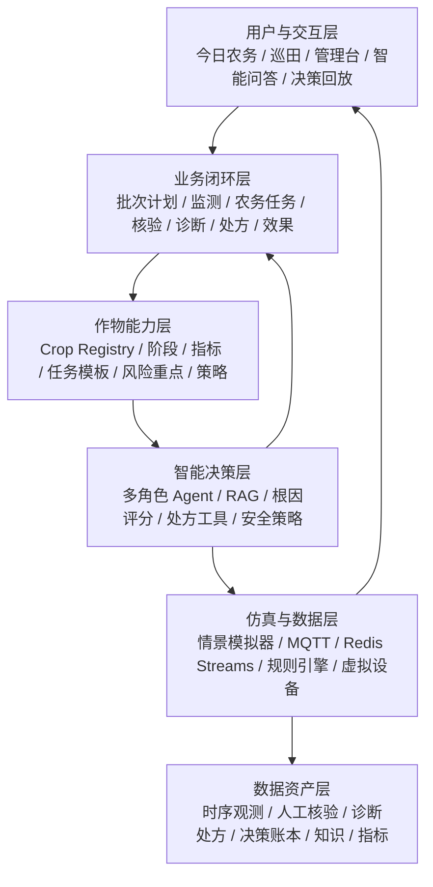

# 农智闭环：智慧农业功能架构

> 版本：v0.5（2026-08-22）
> 项目周期：15 天  
> 本期范围：模拟数据传输、智能体、可视化三条软件主线及联调  
> 明确不包含：真实传感器、鸿蒙端、硬件接入、真实端-智-云联调  
> 变更：v0.5 加深 P0 创新 I-01～I-14 的可验证证据（阶段切换脚本、质量门控、漂移分流、执行异常路径、规则/模型仲裁、执行/不执行双轨）

## 1. 产品定位

**农智闭环（AgriLoop）**是一套面向小型温室和试验田的多作物可扩展软件仿真平台。它把作物计划、农田状态、田间核验、农业知识、根因诊断、结构化处方、虚拟执行和复盘分析放在同一条可追溯链路上，解决“今天该做什么、异常为什么发生、应该怎么处理、执行是否有效、资源是否浪费”的问题。

本期不是简单做一个监控大屏，而是完成下面的可重复软件闭环：

```text
Crop Pack 与作物批次 -> 全周期计划 -> 今日农务
-> 传感器感知 + 田间核验 -> 风险识别 -> 根因诊断
-> 结构化农业处方 -> What-if -> 安全检查/人工确认
-> 虚拟执行 -> ACK -> 效果验证 -> 计划 vs 实际
-> 资源效率 -> 决策回放与优化
```

平台不为每种作物重复开发一套功能，而是复用统一的数据、设备、告警、Agent、控制和可视化内核，通过可插拔 **Crop Pack（作物包）**提供作物及生长阶段差异。

### 1.1 设计目标

1. 覆盖原始功能清单中的 10 项基础用户故事。
2. 在基础监测、告警、控制和问答之上增加可演示的创新功能。
3. 让数据、智能体、可视化三条主线共享同一套事件和状态合同。
4. 让每个 AI 建议可解释、可审批、可回放，不能直接绕过安全规则。
5. 在没有硬件的情况下，用异常情景和虚拟执行器证明系统真的联动。
6. 让新增作物主要通过配置完成，不要求重写后端、前端或 Agent。
7. 让计划、任务、核验、诊断、处方、执行和评价使用可关联的数据合同。
8. 让 Agent 负责理解、组合、解释和受控操作，不把确定性业务逻辑交给模型猜测。

## 2. 资料依据与交付边界

| 资料 | 在本架构中的用途 |
|---|---|
| `01_智慧农业_基本功能清单.md` | 10 项 P0 基线需求 |
| `2026重庆交通大学-中软国际人才培养集中实训解决方案.docx` | 15 天软件阶段、Mock 数据、MQTT/消息中间件、MaxKB/大模型、ECharts/Three.js 和成果物要求 |
| `FlowerNeverFade/smart-agriculture` | 当前仓库仅有初始 README，本项目提供完整功能设计和 README |

| 范围 | 本期 15 天 | 后续演进，不作为本期验收 |
|---|---|---|
| 数据来源 | Python/Node 模拟器、可配置情景脚本 | 真实传感器、鸿蒙开发板、网关 |
| 控制对象 | 虚拟水泵、虚拟阀门、可模拟 ACK/失败 | 真实继电器、水泵和 GPIO |
| 智能体 | MaxKB/RAG、LLM 适配器、受控工具、规则兜底 | 端侧模型、真实设备协同 |
| 交互 | Vue 工作台、管理台、可视化大屏、智能问答、回放 | 鸿蒙原生界面 |

## 3. 用户与权限

| 角色 | 主要目标 | 核心权限 | 本期界面 |
|---|---|---|---|
| 农户 | 了解今日农务、核验现场、处理告警、确认处方、咨询农事 | 查看所属地块、提交巡田记录、确认/驳回建议 | 今日农务、巡田页、问答页 |
| 农场管理员 | 统一管理地块、作物计划、设备、规则和任务 | 配置地块、批次计划、阶段、阈值、设备绑定、人员分派 | PC 管理台、运营大屏 |
| 系统管理员/评委 | 查看链路、审计、指标和演示证据 | 查看全局日志、回放、测试结果和系统配置 | 系统管理、演示回放 |

权限原则：查询权限按农场/地块隔离；控制权限按角色和风险等级隔离；中高风险动作必须人工确认；所有动作都写入审计记录。

## 4. 总体功能分层



### 4.1 农场与作物域

- 农场、区域、地块、面积、坐标和灌溉分区。
- 作物品种、种植批次、当前生长阶段、目标曲线和全周期计划时间轴。
- Crop Registry 统一管理作物包编码、版本、启停状态和适用环境。
- 地块风险等级、最近告警、今日用水和待处理任务。
- 目标曲线支持苗期、营养生长期、开花期、结果期等阶段切换。
- Crop Pack 的 `task_templates` 按批次种植日期和阶段生成计划任务；`risk_focus` 提供各阶段重点关注风险。
- 生产计划落到统一 `work_order`，不为每种作物建立独立计划系统。
- 参数按“系统默认 -> Crop Pack -> 农场 -> 地块”逐级覆盖，最终生效值可查询、可追溯。

### 4.2 数据监测域（数据主线）

- 实时指标：土壤湿度、空气温度、空气湿度、光照、CO₂、降雨量、水流量。
- 指标使用统一编码，由当前 Crop Pack 和生长阶段决定展示项、目标范围与解释方式，不在页面或规则中按作物写死。
- 设备状态：在线、离线、心跳延迟、数据新鲜度、健康分。
- 历史趋势：7/24/168 小时、区间对比、目标曲线叠加、事件标记。
- 数据质量：范围校验、时间戳校验、重复去重、缺失、漂移、突变和可信度。
- 数据可用性：`SUPPORTED`、`SIMULATION_ONLY`、`UNAVAILABLE`；Agent 必须说明缺失项，不能猜测数值。

### 4.3 告警、诊断与农务任务域

- 阈值、持续时间、迟滞、冷却窗口和维护窗口。
- 告警级别：提示、一般、严重、紧急。
- 告警生命周期：观察、待确认、活动、已确认、已解决、已升级。
- 告警转工单：分派、处理、验收、超时升级。
- 告警证据：指标窗口、规则版本、数据质量和相关设备。
- 今日农务中心聚合计划任务、活动告警、诊断结果、设备健康和逾期项，并按风险、时限和影响范围排序。
- 田间核验记录土壤表象、作物状态、设备状态、备注和操作人；人工观察是带来源的证据，不覆盖原始遥测。
- 根因诊断输出候选原因、置信度、支持/反对证据和缺失信息；同一证据输入必须得到可重复的基础评分。
- Agent 负责解释诊断和引导补充核验，不负责凭语言模型生成候选原因概率。

### 4.4 智能决策域（智能体主线）

- 感知智能体：汇总实时值、历史窗口、目标曲线和数据质量。
- 诊断智能体：调用确定性诊断工具，解释缺水、过湿、过热、数据异常和设备异常的候选原因。
- 规划智能体：根据面积、流量、作物阶段和情景生成结构化灌溉处方，包含 WHAT、WHERE、WHEN、HOW MUCH、WHY、置信度和风险。
- 安全审核智能体：校验权限、上限、冷却、设备健康和审批要求。
- 知识助手：基于 RAG 回答农事问题并提供证据。
- 报告智能体：生成日报、告警复盘和结构化摘要。
- 统一操作入口：查询今日农务、地块状态、诊断、效果与资源摘要；可创建巡田记录、生成处方和申请虚拟执行。
- 所有角色共享同一 Agent 框架，先解析地块、作物和生长阶段，再加载 Crop Pack；不为每种作物复制 Agent。
- RAG 按“通用 -> 作物 -> 阶段 -> 地区/环境 -> 地块”定向检索，资料不足时逐级回退并标明证据范围。

### 4.5 可视化与操作域（可视化主线）

- 今日农务中心：按地块、批次、风险、来源和截止时间展示计划任务、告警任务、核验任务和设备任务。
- 总览大屏：地块风险排序、实时指标、数据流状态、今日用水和待办。
- 地块详情：目标/实测曲线、事件标记、设备健康、情景控制。
- 巡田核验：结构化表单、证据来源、关联地块/批次/诊断和历史记录。
- 智能决策台：候选根因、处方、替代方案、证据、风险、工具调用链、确认/驳回。
- 决策回放：时间轴、事件筛选、输入快照、计划值、执行实际、效果评分和资源偏差。
- 管理台：地块、作物、设备、规则、用户、知识文档和审计记录。
- 页面由 Crop Pack 的指标与阶段配置驱动；切换作物后自动调整指标卡、目标曲线、规则说明和情景入口。

### 4.6 Crop Pack 最小模型

每个 Crop Pack 是版本化的专业配置，而非单独一批 RAG 文档，最少包含 8 个部分：

| 组成 | 作用 |
|---|---|
| 作物档案 | 名称、品种、环境、地区和版本 |
| 生长阶段 | 阶段顺序、各阶段目标、风险重点和任务模板 |
| 指标配置 | 所需统一指标、单位、目标范围和可用性 |
| 规则包 | 缺水、过湿、高低温、复合风险及设备/数据异常规则 |
| 知识包 | 通用、作物、阶段、地区/环境和地块知识索引 |
| 决策策略 | 灌溉上限、冷却时间、风险级别和审批要求 |
| 情景包 | 正常、干旱、热浪、暴雨、漂移和离线等可重复输入 |
| 测试包 | 固定规则、RAG、安全和闭环回归用例 |

15 天 P0 至少完成 2 种代表性作物的完整最小包，并用同一页面、Agent 和数据链路验证切换；后续将首批高质量 Crop Pack 扩展到 6–8 种，不扩大平台内核。

### 4.7 八项能力与现有架构映射

八项能力统一使用 `CAP-01`～`CAP-08`。编号表示用户可感知的业务能力，不代表新增服务；实现继续复用现有模块和实体。

| 编号 | 能力 | 复用/扩展 | 对应创新编号 |
|---|---|---|---|
| CAP-01 | 作物全周期生产计划 | Crop Pack、`crop_stage_profile`、`crop_batch`、`work_order` | I-01、I-19 |
| CAP-02 | 今日农务中心 | 告警、工单、诊断、设备健康的聚合读模型 | I-15 |
| CAP-03 | 田间核验 | 新增 `inspection_record`，接入统一证据链 | I-26 |
| CAP-04 | 多风险根因诊断 | 升级规则引擎的风险检测、证据收集和原因评分 | I-04 |
| CAP-05 | 结构化农业处方 | 升级灌溉试算与 `irrigation_plan` | I-06 |
| CAP-06 | 执行与效果验证 | 扩展虚拟执行、ACK、决策账本和回放 | I-08、I-13 |
| CAP-07 | 计划 vs 实际与资源效率 | 汇总批次计划、工单、命令实际量和效果评价 | I-17、I-19 |
| CAP-08 | Agent 统一操作入口 | 扩充现有受控 Tool，不创建第二套 Agent | I-09、I-11、I-12 |

### 4.8 八项能力的输入、处理、输出与验收

| 能力 | 输入 | 处理 | 输出 | 失败/降级路径 | 验收证据 |
|---|---|---|---|---|---|
| CAP-01 | Crop Pack、种植日期、批次、阶段 | 解析阶段和任务模板，生成统一工单 | 生命周期时间轴、计划任务 | 包或日期无效时不生成并返回校验错误 | 两个作物包生成不同阶段任务且来源可追溯 |
| CAP-02 | 计划任务、告警、诊断、设备健康 | 归一化为今日工作项并计算优先级 | 按地块排序的今日农务列表 | 单一来源不可用时保留其他来源并标记缺失 | 首页能解释每个工作项的来源和优先级 |
| CAP-03 | 地块、批次、结构化观察、人员、时间 | 校验权限与枚举，关联任务/诊断 | `inspection_record` 和证据引用 | 离线/上传失败时保留草稿；缺字段不进入诊断 | 人工观察可新增、查询并在诊断证据中显示 |
| CAP-04 | 遥测窗口、质量、人工观察、规则、历史 | 生成候选原因，计算支持/反对证据和置信度；`drought` 与 `sensor-drift` 必须分流 | `diagnosis_result` | 数据不足时输出 `INSUFFICIENT_EVIDENCE` 和待核验项 | 干旱、漂移、设备异常固定场景得到可重复且互不混淆的结果 |
| CAP-05 | 诊断、阶段、面积、流量、策略约束、数据质量 | 确定性试算并生成结构化处方；质量低于阈值时禁止灌溉处方 | 灌溉 `irrigation_plan` 或核验/检修建议 | 缺流量/面积或质量门控未通过时只给核验/检修建议，不猜测水量 | 完整处方含 WHAT/WHERE/WHEN/HOW MUCH/WHY；低质量场景不产出灌溉处方 |
| CAP-06 | 处方、审批、命令、ACK、执行前后遥测 | 对比预期/实际并评价效果；覆盖成功、ACK 超时、半成功、无效果 | 效果评价、告警状态、回放事件 | ACK 超时/半成功/后测缺失时标记 `PENDING`/`PARTIAL`/`INCONCLUSIVE`，不得伪装成功 | 成功闭环可追到 ACK、实际量、前后值和效果评分；至少一种失败路径可演示 |
| CAP-07 | 计划量、实际量、任务完成、效果评价 | 计算偏差、单位资源效果和批次汇总 | 计划实绩与资源效率视图 | 口径不完整时显示不可比较及缺失字段 | 展示计划/实际用水、偏差和单位用水改善 |
| CAP-08 | 用户意图、权限、上下文、白名单 Tool | 识别意图、调用工具、解释结果、请求确认 | 回答、任务、处方或虚拟执行申请 | AI 不可用时切换规则/表单入口；越权请求拒绝 | 固定问题能查询今日任务、解释诊断并受控申请执行 |

## 5. 基线功能覆盖

以下 10 项对应 `01_智慧农业_基本功能清单.md`，全部列为 P0，不因创新功能而删减。

| 编号 | 原始用户故事/功能 | 本项目功能落点 | 验收证据 |
|---|---|---|---|
| B-01 | 查看土壤湿度 | 地块卡片、实时曲线、质量标签 | 模拟器持续上报，数值秒级刷新 |
| B-02 | 查看温度 | 环境指标卡片和曲线 | 情景切换后曲线变化 |
| B-03 | 查看历史数据趋势 | 7/24/168 小时趋势、区间对比 | 可选地块、指标和时间范围 |
| B-04 | 远程控制灌溉开关 | 虚拟水泵/阀门开关、时长控制 | 指令、ACK、失败提示和审计 |
| B-05 | 设置土壤湿度阈值告警 | 阈值、持续时间、迟滞、通知策略 | 连续低于阈值触发告警 |
| B-06 | 查看设备在线状态 | 心跳、延迟、新鲜度、健康分 | 模拟离线和自动恢复 |
| B-07 | 对话咨询灌溉建议 | RAG 问答、实时数据工具、灌溉试算 | 回答附知识和数据证据 |
| B-08 | 多地块数据总览 | 网格/地图、聚合指标、风险排序 | 一屏查看所有地块 |
| B-09 | 设备绑定管理 | 模拟设备注册、绑定、解绑、分配 | 绑定关系可查询可追溯 |
| B-10 | 查看系统告警记录 | 告警列表、筛选、确认、关闭、导出 | 可按级别、地块、时间检索 |

## 6. 创新增量功能

### 6.1 P0 创新（必须进入主演示）

| 编号 | 功能 | 超越基础清单的价值 | 演示证据 |
|---|---|---|---|
| I-01 | Crop Pack 与生长阶段 | 作物差异配置化，不同阶段使用不同目标与规则 | 固定脚本切换作物/阶段后，指标卡、目标曲线、规则说明和 RAG 上下文同步变化 |
| I-02 | 动态目标曲线 | 识别趋势和偏差，减少阈值抖动 | 目标与实测叠加；阶段切换后目标带立即跳变且可在回放中标注 |
| I-03 | 数据质量评分与门控 | 区分真实缺水和数据不可信，避免错误灌溉 | 卡片显示新鲜度/完整率/可信度；质量低于阈值时 Agent 拒绝灌溉处方，仅给核验或检修建议 |
| I-04 | 多风险检测与根因诊断 | 结合遥测质量、人工观察、历史和规则区分真实缺水、漂移与设备问题 | 同屏对比 `drought` 与 `sensor-drift`：前者出灌溉处方候选，后者出巡检/校准建议且不混淆 |
| I-05 | 迟滞与冷却窗口 | 避免告警和灌溉频繁开关 | 连续越界才告警，执行后进入冷却；冷却期内重复点击不重复执行 |
| I-06 | 结构化农业处方 | 从“开/关”升级到何时、哪里、做什么、做多少及为什么；P0 先实现灌溉 | 输入诊断/面积/流量/目标，输出完整处方；质量门控或证据不足时不生成灌溉处方 |
| I-07 | What-if 情景模拟 | 无硬件也能验证策略 | 干旱、暴雨、热浪、漂移一键切换；同一快照可推演执行/不执行两条路径 |
| I-08 | 执行与效果验证闭环 | 不仅证明命令执行，还验证实际结果是否达到处方预期 | 成功路径展示 ACK、实际水量、前后对比和效果评分；另演示至少一种 ACK 超时/半成功/无效果并标记非成功评价 |
| I-09 | 多角色智能体与统一操作入口 | 让 AI 职责清楚且可通过受控 Tool 查询和发起业务操作 | 感知 -> 诊断 -> 处方 -> 安全 -> 查询效果；展示工具链与角色边界 |
| I-10 | RAG 证据链 | 降低农业建议幻觉 | 展示知识片段、版本、引用；资料回退时标明实际命中范围 |
| I-11 | 工具调用审计 | 解释 AI 如何得到结论 | 展示工具入参、出参、耗时与 `traceId` |
| I-12 | 人在回路安全闸门 | 防止模型直接执行高风险动作；规则与模型冲突时以策略层为准 | 未审批动作被拦截；构造规则否决/模型仍建议时，安全闸门拒绝执行并写入审计 |
| I-13 | 决策回放与双轨对比 | 让评委看到完整因果链，并证明“执行是否改变结果” | 同一 `scenarioId` 可重复回放；最小双轨对比展示执行 vs 不执行的曲线/风险差异 |
| I-14 | 规则/模型双轨降级 | LLM 失败不影响核心系统 | 断开 AI 后规则告警、根因基础分和灌溉试算仍可用，UI 明确显示规则模式 |
| I-15 | 统一农务工单与今日农务中心 | 聚合计划、告警、诊断、核验和设备任务，形成统一处理入口 | 首页展示来源、优先级、处理状态和原始记录链接 |

#### P0 创新加深约定（v0.5）

以下约定不新增编号，只加深 I-01～I-14 的验收硬度；实现仍复用既有模块：

1. **阶段切换脚本（I-01/I-02）**：答辩使用固定 `cropPackVersion` + 生长阶段切换步骤，证明配置驱动而非页面写死。
2. **质量门控（I-03/I-06）**：可信度或新鲜度低于 Crop Pack/地块阈值时，不得输出可执行灌溉处方。
3. **漂移分流（I-04）**：`sensor-drift` 不得走到与 `drought` 相同的灌溉闭环结论。
4. **执行异常（I-08）**：虚拟执行器至少支持成功与一种非成功路径，效果评价不得把失败标成成功。
5. **冲突仲裁（I-12）**：模型建议与规则/策略冲突时，以安全闸门结果为准并保留双方输入快照。
6. **双轨回放（I-07/I-13）**：P0 至少提供执行/不执行对比曲线或风险摘要；更完整的 What-if 报告可作为 P1 增强。

### 6.2 P1 增强（主线稳定后实现）

| 编号 | 功能 | 交付方式 |
|---|---|---|
| I-16 | Mock 天气情景 | 输入未来降雨概率，影响推荐计划 |
| I-17 | 计划 vs 实际与资源效率 | 比较计划/实际水量、任务偏差、单位用水效果；能耗/碳排作为可选估算 |
| I-18 | 设备健康与自愈 | 心跳异常生成检修任务，恢复后关闭 |
| I-19 | 作物全周期计划与批次追溯 | 批次计划关联阶段任务、环境、核验、灌溉、效果和操作人 |
| I-22 | 多地块水资源协同调度 | 水源受限时多地块灌溉优先级排序与水量分配 |
| I-23 | 建议反馈闭环 | 农户采纳/驳回/修改回流策略参数 |
| I-24 | 多级降级（扩展 I-14） | AI/消息中间件/存储三级降级与 UI 模式标识 |
| I-25 | 定期报告生成与订阅 | 报告 Agent 生成日报/周报并推送 |
| I-26 | 田间核验与人机证据融合 | 结构化人工观察进入诊断证据链，并保留来源、人员、时间和关联任务 |

> I-22~I-25 为 v0.3 补强项，编号与含义保持不变。v0.4 新增 I-26，将 I-15 提升为 P0，并升级 I-04、I-06、I-08、I-09、I-15、I-17、I-19 的描述；八项业务能力不机械新增八个创新编号。v0.5 不新增 P0 编号，只加深 I-01～I-14 的演示证据与失败路径。进度允许时，田间核验、完整生产计划和计划实绩进入增强演示。

### 6.3 P2 预留（不阻塞 15 天交付）

- **I-20 视觉病害识别**：保留图片上传和 Mock 识别接口，不把训练模型作为本期承诺。
- **I-21 语音问答**：文本输入模拟转写，作为交互扩展，不影响主线。
- Three.js 复杂三维场景：只有在 ECharts、回放和联调稳定后再增加。

## 7. 功能优先级与验收规则

### P0 必须完成

- B-01 至 B-10 全部可操作。
- 至少 3 个地块、2 种作物、6 类统一指标持续产生数据；每种作物均有可校验的档案、阶段、指标、规则、知识、策略、情景和测试配置。
- `normal`、`drought`、`sensor-drift`、`device-offline` 四个情景可运行，且干旱与漂移结论可区分。
- 今日农务中心能够聚合计划、告警、诊断和设备任务，并说明优先级来源。
- 一次异常可以完成告警、根因诊断、结构化灌溉处方、人工确认、虚拟执行、ACK、效果验证和回放。
- 低质量数据场景下不生成可执行灌溉处方；虚拟执行至少覆盖一种非成功评价路径。
- 同一 `scenarioId` 支持执行/不执行最小双轨对比回放。
- Agent 能通过白名单工具查询今日任务、解释诊断、生成处方和申请虚拟执行；规则与模型冲突时以安全闸门为准。
- AI 服务不可用时，规则告警和灌溉试算仍然可用。

### P1 交付判断

- 不破坏 P0 的稳定性。
- 有页面入口、接口记录和测试证据。
- 在答辩脚本中能用固定数据重复演示。
- 优先实现田间核验、完整生命周期时间轴和计划 vs 实际/资源效率；未完成时必须保留合同和任务，不得标成已交付。

### 功能验收清单

```text
[ ] 实时湿度/温度可以秒级刷新
[ ] 历史曲线可切换地块、指标和时间范围
[ ] 模拟离线后状态会变化，恢复后自动上线
[ ] 连续越界才产生告警，冷却期间不重复执行
[ ] 智能体回答包含 evidence、confidence 和 traceId
[ ] 今日农务能够聚合并解释计划、告警、诊断和设备任务
[ ] 固定证据可以复现候选根因；drought 与 sensor-drift 结论可区分
[ ] 数据质量低于阈值时不生成可执行灌溉处方
[ ] 灌溉处方包含 WHAT/WHERE/WHEN/HOW MUCH/WHY、风险和审批要求
[ ] 切换作物/阶段后，页面、规则和 RAG 使用对应 Crop Pack，目标曲线同步变化
[ ] 缺少指标时明确显示不可用，Agent 不生成猜测值
[ ] 未审批的中高风险动作会被拒绝；规则否决优先于模型建议
[ ] 虚拟执行成功路径返回 ACK、实际量与效果评价；至少一种非成功路径可演示
[ ] 事件时间轴可复盘闭环，并展示执行/不执行最小双轨对比
[ ] 断开 LLM 后核心功能仍可运行
```

## 8. 创新点的可验证证据

| 创新点 | 不是口号的实现 | 现场证据 |
|---|---|---|
| 情景数字孪生 | 用状态快照复制未来窗口，复用规则和 Agent | 切换干旱/暴雨/漂移，并对比执行与不执行 |
| 多智能体协作 | 固定角色、Tool Schema、traceId 和结果合同，Agent 只组合受控业务能力 | 展开查询、诊断、处方、安全与效果工具链 |
| 可解释决策 | 证据、输入快照、置信度、策略版本和人工动作入账 | 点击建议跳到决策账本 |
| 质量门控决策 | 质量分进入诊断与处方前置条件，低质量阻断灌溉建议 | 漂移/低新鲜度场景只给核验或检修，不给浇水处方 |
| 安全控制 | 风险、权限、冷却、上限、二次确认、幂等，以及规则优先于模型 | 未审批命令被拒绝；冲突场景以闸门结果入账 |
| 效果与异常路径 | 成功与非成功 ACK/效果评价共用合同，禁止伪装成功 | 成功回升与 ACK 超时/无效果各演示一次 |
| 可用性工程 | LLM、消息延迟、离线均有模拟和降级 | 断开 AI 后规则模式继续运行 |
| 可持续扩展 | 数据源/执行器用适配器隔离，作物差异由 Crop Pack 注入 | 展示两种作物/阶段切换后目标与规则同步变化 |
| 农务经营闭环 | 批次计划、今日任务、执行实际和资源效果共享关联标识 | 从今日任务追到计划来源、处方、执行与效果 |
| 人机证据融合 | 遥测与人工观察各自保留来源和可信度，由确定性诊断工具合并 | 新增巡田记录后诊断证据更新且原始遥测不被覆盖 |

## 9. 15 天完成定义

- 一键启动模拟器、消息代理、后端、前端和数据库。
- “干旱情景”在 3 分钟内完成数据变化、根因诊断、灌溉处方、确认、执行、效果验证和复盘。
- 另备 `sensor-drift` 与一种虚拟执行非成功路径，证明系统不会把漂移当干旱、也不会把失败当成功。
- 每个建议都有输入快照、证据、风险等级和最终执行人。
- 每个建议记录 Crop Pack、规则、知识和 Agent 版本，支持按版本回放与执行/不执行最小双轨对比。
- 每次虚拟执行关联原处方、计划值、实际值和效果评价；无法评价时明确记录原因。
- 交付 Demo、代码仓、数据字典、接口文档、测试报告、答辩 PPT 和演示脚本。
