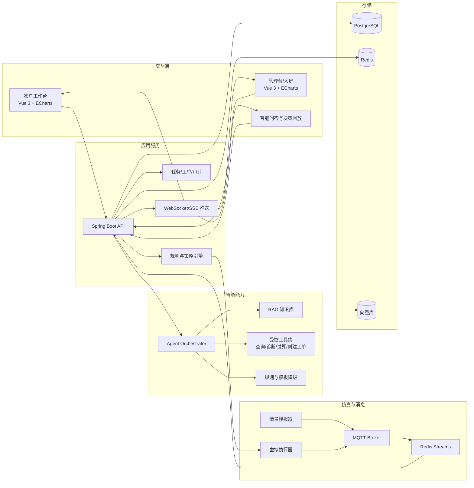
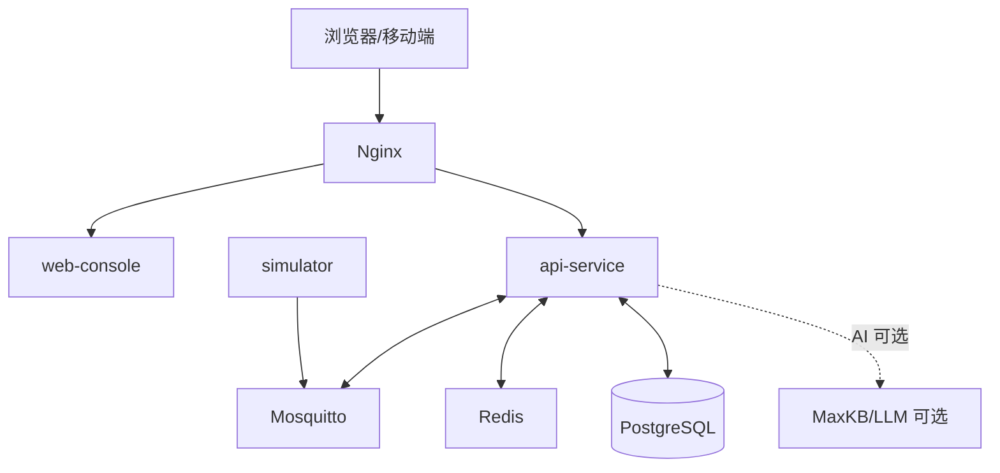
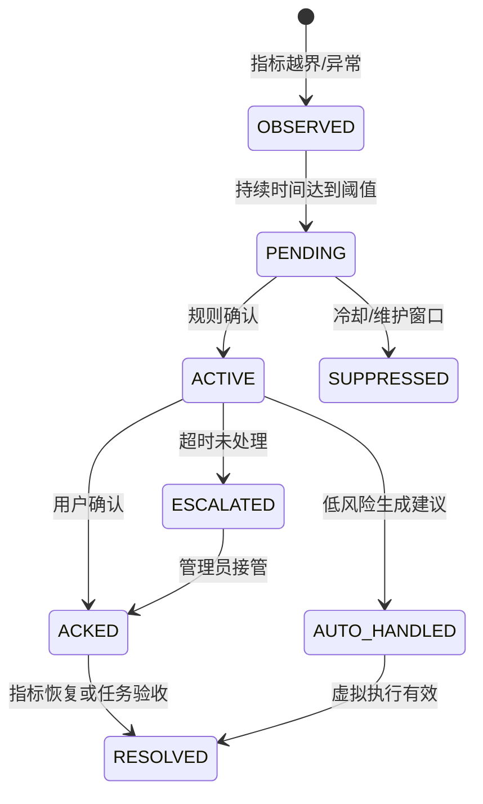

# 农智闭环：智慧农业技术架构

> 版本：v0.1  
> 适用范围：15 天软件仿真态  
> 技术主线：模拟数据传输 + 智能体工具编排 + 可视化实时联动  
> 约束：不依赖真实传感器、鸿蒙端或硬件环境

## 1. 架构原则

1. **先跑通三条主线，再做增强**：采用模块化单体，避免 15 天内陷入微服务治理。
2. **事件合同先于页面**：D3 冻结 MQTT、内部事件、REST 和 Agent Tool Schema，前后端并行开发。
3. **模拟数据可重复**：所有异常都由带种子的情景脚本生成，答辩不依赖随机现场。
4. **AI 受控而非直连执行**：模型只能调用白名单工具，命令必须经过策略和权限检查。
5. **可观测、可降级**：记录 requestId、traceId、scenarioId；LLM 不可用时回退规则和模板。
6. **接口可替换**：本期只实现 MockDataSource 和 VirtualActuator，未来增加真实适配器不修改业务合同。

## 2. 推荐技术栈

| 层次 | 建议选型 | 选择理由 | 15 天取舍 |
|---|---|---|---|
| Web 前端 | Vue 3 + TypeScript + Vite | 组件、状态和图表生态成熟 | 先工作台，再大屏动效 |
| UI/图表 | ECharts；Three.js 轻量可选 | 趋势、仪表盘、事件标记开发快 | 复杂 3D 不列为 P0 |
| 后端 | Spring Boot 3 + Java 17/21 | 模块化、测试和接口规范成熟 | 不引入复杂微服务注册中心 |
| AI 编排 | MaxKB/RAG + LLM Adapter | 符合实训要求，便于知识库和工作流 | LLM 失败切换规则模式 |
| AI 工具 | Spring Boot Tool API；可选 FastAPI sidecar | 参数可校验、可审计、易测试 | 先用确定性算法，不训练模型 |
| 消息 | Mosquitto/EMQX MQTT + Redis Streams | 贴合物联网和可靠事件处理 | Kafka 作为后续扩展 |
| 实时推送 | SSE 或 WebSocket | 前端秒级刷新，开发成本低 | 项目统一选一种 |
| 业务数据 | PostgreSQL | 配置、告警、审计和时序统一 | 时序表加索引，TimescaleDB 可选 |
| 缓存/幂等 | Redis | Streams、缓存、限流和幂等可复用 | 只部署实际使用能力 |
| 向量检索 | MaxKB 内置向量库或 pgvector | 减少组件数量 | 知识少时提供本地检索兜底 |
| 文件 | MinIO 或本地对象目录 | 报告、图片和导入文件 | P1/P2 才启用图片流程 |
| 工程化 | Docker Compose + GitHub Actions | 可复现、可健康检查、便于答辩 | 一键启动优先 |

## 3. 总体逻辑架构



## 4. 三条主线的技术边界

### 4.1 数据主线

```text
Scenario Runner
  -> MQTT topic
  -> Ingestion Consumer
  -> Schema Validation / Deduplication / Quality Score
  -> Redis Streams
  -> PostgreSQL(time-series)
  -> Rule Engine + Anomaly Detector
  -> SSE/WebSocket event
```

数据接入服务只负责标准化、校验、落库和发布事件，不把业务规则硬编码在模拟器中。

### 4.2 智能体主线

```text
User/Event
  -> Agent Orchestrator
  -> retrieve/query/diagnose/plan tools
  -> Safety Policy
  -> recommendation or virtual command
  -> decision ledger
```

模型不能直接生成 SQL、拼接 MQTT topic 或调用任意 HTTP；所有工具使用 JSON Schema 校验输入，并把输出写入 `agent_run`。

### 4.3 可视化主线

```text
REST(query) + SSE(event)
  -> frontend state store
  -> cards/charts/timeline/map
  -> user confirmation
  -> REST(command)
  -> event update
```

页面不直接连接 MQTT。浏览器只访问 API 和实时事件流，避免把消息代理凭据暴露给用户端。

## 5. 应用模块划分

| 模块 | 责任 | 主要接口/事件 |
|---|---|---|
| `farm-module` | 农场、地块、作物批次、目标曲线 | `/farms`、`/plots`、`/crop-batches` |
| `telemetry-module` | 消息消费、校验、去重、落库、查询 | `telemetry.received` |
| `device-module` | 模拟设备注册、绑定、心跳、健康度 | `/devices`、`device.status` |
| `rule-module` | 阈值、迟滞、冷却、风险分和告警状态机 | `/rules`、`alert.*` |
| `agent-module` | RAG、Agent 编排、工具调用、降级 | `/agent/chat`、`agent.run.*` |
| `command-module` | 试算、审批、幂等、虚拟执行和 ACK | `/commands/virtual`、`command.*` |
| `workorder-module` | 工单分派、处理、验收、升级 | `/work-orders`、`workorder.*` |
| `audit-module` | 决策账本、操作审计、回放索引 | `/agent/runs/{traceId}` |
| `scenario-module` | 情景启动、暂停、快照、回放 | `/scenarios/runs` |

模块在同一个 Spring Boot 进程内通过领域事件解耦，后续才考虑拆服务。

## 6. 模拟态可替换设计

模拟器不是一次性脚本，而是实现统一接口的适配器：

```java
public interface DataSource {
    void start(ScenarioConfig config);
    void pause();
    void publish(TelemetryEvent event);
    void stop();
}

public interface Actuator {
    CommandAck execute(VirtualCommand command);
    DeviceStatus status(String deviceId);
}
```

本期实现：

- `MockDataSource`：按情景和随机种子生成遥测。
- `ReplayDataSource`：读取固定事件文件，保证答辩可重复。
- `VirtualActuator`：模拟执行延迟、成功、失败、部分成功和状态变化。

未来真实设备接入只增加新的 `DataSource`/`Actuator` 适配器，不修改规则、Agent、前端和事件合同。本期不宣称已完成真实设备联调。

## 7. 部署拓扑



开发环境建议用 `docker compose` 启动 PostgreSQL、Redis、MQTT；前端和后端可本地热更新运行。每个基础设施容器必须有健康检查，API 启动时检查依赖并给出清晰错误。

## 8. 数据架构

### 8.1 核心实体

| 实体 | 关键字段 | 作用 |
|---|---|---|
| `farm` | id、name、owner_id | 农场租户边界 |
| `plot` | id、farm_id、area、location、risk_level | 地块和灌溉分区 |
| `crop_batch` | id、plot_id、crop、stage、target_profile | 作物阶段目标 |
| `device` | id、plot_id、type、status、last_seen、health_score | 模拟设备状态 |
| `telemetry` | device_id、metric、value、ts、quality、scenario_id | 时序观测 |
| `rule` | metric、operator、threshold、duration、cooldown | 规则和迟滞 |
| `alert` | level、source、status、evidence、assignee | 告警生命周期 |
| `irrigation_plan` | plot_id、duration、water_litre、reason、confidence | 灌溉试算 |
| `command` | type、target、payload、approval、ack、result | 虚拟控制命令 |
| `agent_run` | trace_id、role、input_snapshot、tools、answer、confidence | Agent 调用链 |
| `decision_ledger` | event_id、before、decision、after、actor、hash | 决策审计和回放 |
| `work_order` | source_alert、assignee、status、checklist | 告警到任务闭环 |

### 8.2 MQTT 主题

| 主题 | 方向 | 说明 |
|---|---|---|
| `agri/{farmId}/{plotId}/telemetry` | 模拟器 -> 平台 | 传感器观测 |
| `agri/{farmId}/{plotId}/device/status` | 模拟器/执行器 -> 平台 | 在线、心跳、健康度 |
| `agri/{farmId}/{plotId}/command` | 平台 -> 虚拟执行器 | 灌溉、暂停、校准 |
| `agri/{farmId}/{plotId}/command/ack` | 虚拟执行器 -> 平台 | 接收、成功、失败 |
| `agri/{farmId}/event` | 平台内部 | 告警、Agent、工单事件 |

### 8.3 遥测事件合同

```json
{
  "eventId": "evt-20260821-000001",
  "farmId": "farm-demo",
  "plotId": "plot-a01",
  "deviceId": "mock-soil-01",
  "metric": "soilMoisture",
  "value": 18.4,
  "unit": "%",
  "ts": "2026-08-21T09:30:00+08:00",
  "quality": {
    "status": "GOOD",
    "freshnessMs": 420,
    "confidence": 0.98
  },
  "scenario": "drought",
  "schemaVersion": "1.0"
}
```

### 8.4 虚拟控制命令合同

```json
{
  "commandId": "cmd-20260821-000017",
  "plotId": "plot-a01",
  "type": "IRRIGATION_START",
  "durationSec": 420,
  "waterLitre": 126.0,
  "source": "agent-plan",
  "riskLevel": "MEDIUM",
  "approval": {
    "required": true,
    "approvedBy": "user-001",
    "approvedAt": "2026-08-21T09:31:10+08:00"
  },
  "idempotencyKey": "plot-a01-20260821-093110"
}
```

### 8.5 Agent 输出合同

```json
{
  "traceId": "run-abc123",
  "intent": "IRRIGATION_RECOMMENDATION",
  "summary": "A01 地块处于缺水风险，建议先进行 7 分钟虚拟灌溉",
  "riskLevel": "MEDIUM",
  "confidence": 0.87,
  "evidence": [
    {"type": "telemetry", "ref": "soilMoisture:last-30m", "value": 18.4},
    {"type": "rule", "ref": "tomato-fruit-stage-v2"},
    {"type": "knowledge", "ref": "番茄灌溉手册#3.2"}
  ],
  "plan": {"durationSec": 420, "waterLitre": 126.0},
  "requiresApproval": true,
  "fallback": "RULE_ENGINE_AVAILABLE",
  "nextActions": ["确认虚拟灌溉", "创建巡检工单"]
}
```

### 8.6 告警状态机



## 9. 核心 API 草案

| 方法 | 路径 | 主线 | 说明 |
|---|---|---|---|
| `GET` | `/api/v1/overview` | 可视化 | 地块聚合指标、风险排序、待办数量 |
| `GET` | `/api/v1/plots/{plotId}/telemetry` | 数据 | 按指标和时间范围查询历史 |
| `GET` | `/api/v1/plots/{plotId}/timeline` | 可视化 | 告警、Agent、审批和执行事件 |
| `GET` | `/api/v1/events/stream` | 数据/可视化 | SSE 实时事件流 |
| `POST` | `/api/v1/scenarios/runs` | 数据 | 启动、暂停、停止情景 |
| `POST` | `/api/v1/rules/evaluate` | 数据 | 对窗口执行规则和风险评分 |
| `POST` | `/api/v1/irrigation/estimate` | 智能体 | 试算时长和水量 |
| `POST` | `/api/v1/agent/chat` | 智能体 | 问答、检索、工具调用和建议 |
| `GET` | `/api/v1/agent/runs/{traceId}` | 智能体 | 证据、工具输入输出和降级信息 |
| `POST` | `/api/v1/commands/virtual` | 闭环 | 安全闸门后发布虚拟命令 |
| `POST` | `/api/v1/alerts/{alertId}/ack` | 业务 | 确认、关闭、升级告警 |
| `POST` | `/api/v1/work-orders` | 业务 | 从告警或建议创建工单 |

统一返回 `requestId`、`timestamp`、`schemaVersion` 和错误码；动作接口必须携带幂等键和当前用户身份。接口在 D3 以 OpenAPI 文件冻结。

## 10. 智能体与工具安全

| Agent 角色 | 可用工具 | 禁止行为 |
|---|---|---|
| 感知 | `get_latest_metrics`、`get_history` | 不下结论、不发命令 |
| 诊断 | `detect_anomaly`、`get_crop_profile` | 不直接控制执行器 |
| 规划 | `calculate_irrigation`、`forecast_scenario` | 不绕过安全策略 |
| 安全 | `check_policy`、`check_device_health` | 不修改原始观测 |
| 报告 | `get_decision_trace` | 不编造证据 |

安全措施：

- 工具白名单和 JSON Schema 参数校验。
- 用户、知识文档、系统规则分层，防止提示注入改变策略。
- 最大单次灌溉时长、每日用水量、冷却窗口和权限检查。
- 中高风险命令需要二次确认；重复请求用幂等键拦截。
- 保存原始输入、检索证据、工具输出、审批人和最终结果。
- AI API 超时自动进入 `rules-only`，前端明确显示降级状态。

## 11. 可靠性与可观测性

| 能力 | 设计 |
|---|---|
| 去重 | `eventId` 唯一约束，重复遥测不重复落库 |
| 幂等 | `idempotencyKey` 唯一约束，重复命令只执行一次 |
| 重试 | 消费失败进入 Redis 重试队列，超过次数进入死信列表 |
| 离线 | 心跳超时标记离线，恢复心跳自动上线 |
| 回放 | 事件带 `scenarioId` 和 `traceId`，按时间排序重放 |
| 日志 | 统一 requestId、traceId、scenarioId、userId |
| 健康检查 | API、MQTT、Redis、PostgreSQL、AI 适配器分别暴露状态 |
| 指标 | 消息延迟、消费失败、告警数、Agent 耗时、页面刷新延迟 |

## 12. 建议仓库结构

```text
smart-agriculture/
├─ README.md
├─ docs/
│  ├─ 01_智慧农业_基本功能清单.md
│  ├─ 02_智慧农业_功能架构.md
│  ├─ 03_智慧农业_技术架构.md
│  ├─ 04_智慧农业_大致路线与流程.md
│  ├─ api/openapi.yaml
│  └─ test/acceptance-matrix.md
├─ apps/
│  ├─ web-console/          # Vue 工作台、大屏、回放
│  ├─ api-service/          # Spring Boot 模块化单体
│  └─ ai-tools/             # Agent 工具和确定性算法
├─ simulator/
│  ├─ scenarios/            # normal/drought/heat-wave/...
│  └─ runner/               # MQTT 发布和虚拟执行器
├─ infra/docker-compose.yml
└─ .github/workflows/ci.yml
```

## 13. 本地启动约定

```bash
docker compose -f infra/docker-compose.yml up -d
./gradlew :apps:api-service:bootRun
pnpm --dir apps/web-console dev
python simulator/runner/main.py --scenario drought --speed 1
```

```text
APP_MODE=simulation
MQTT_URL=tcp://localhost:1883
REDIS_URL=redis://localhost:6379
DATABASE_URL=jdbc:postgresql://localhost:5432/agri
AI_MODE=rag          # rag | rules-only | mock
COMMAND_MODE=virtual
```

