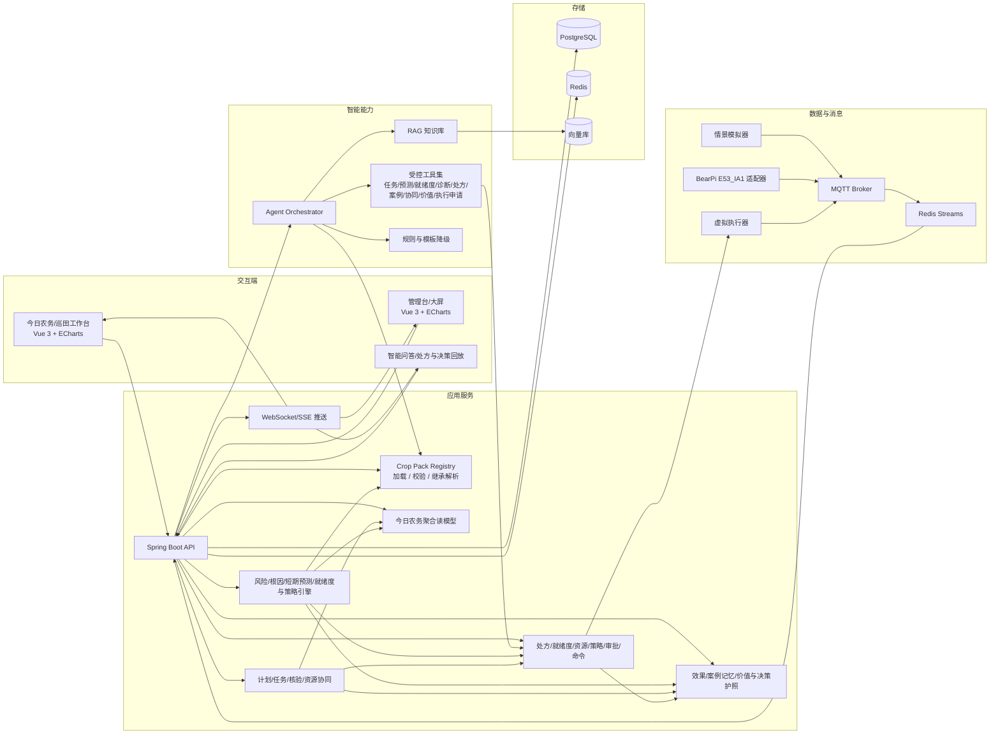
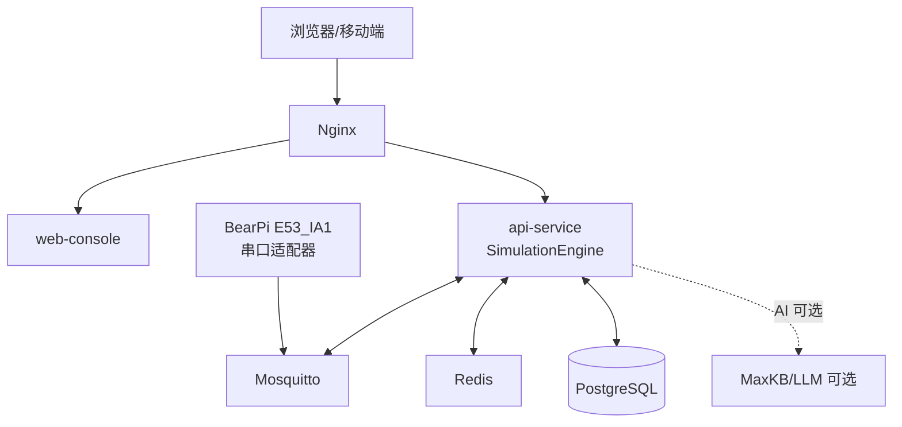
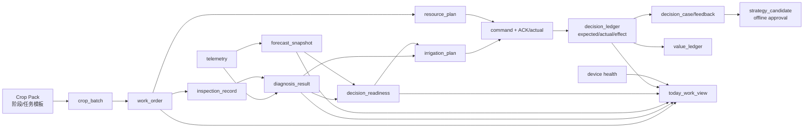
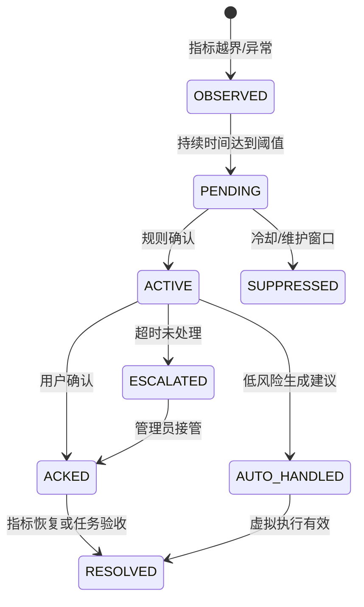
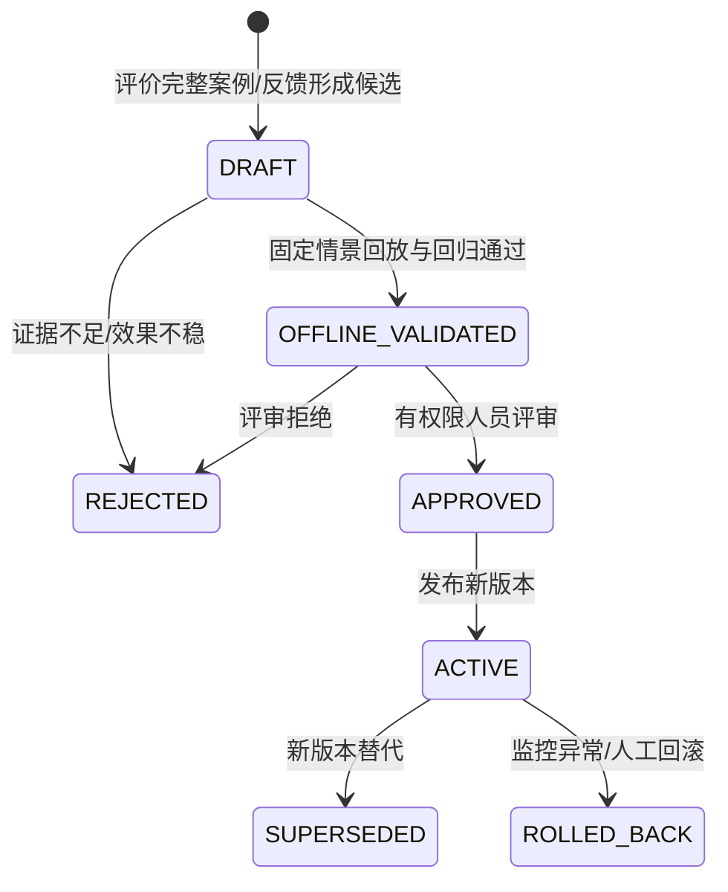

# 农智闭环：智慧农业技术架构

> 版本：v0.4（2026-08-22）
> 适用范围：15 天软件仿真 + BearPi E53_IA1 真实遥测联调
> 技术主线：模拟/真实数据传输 + 智能体工具编排 + 可视化实时联动
> 约束：未接入的现场硬件仍不得作为运行前提；已验证的 BearPi 遥测链路按来源标记接入

## 1. 架构原则

1. **先跑通三条主线，再做增强**：采用模块化单体，避免 15 天内陷入微服务治理。
2. **事件合同先于页面**：D3 冻结 MQTT、内部事件、REST 和 Agent Tool Schema，前后端并行开发。
3. **模拟数据可重复**：所有异常都由带种子的情景脚本生成，答辩不依赖随机现场。
4. **AI 受控而非直连执行**：模型只能调用白名单工具，命令必须经过策略和权限检查。
5. **可观测、可降级**：记录 requestId、traceId、scenarioId；LLM 不可用时回退规则和模板。
6. **接口可替换**：本期实现进程内 SimulationEngine、BearPi E53_IA1 遥测适配器和 VirtualActuator；未来为其他真实设备增加适配器时不修改业务合同。
7. **内核统一、作物配置化**：数据、设备、Agent、控制和页面复用同一内核，作物差异由版本化 Crop Pack 注入。
8. **计划与实际可关联**：计划任务、人工观察、诊断、处方、命令、ACK 和效果评价必须通过稳定标识串联，不能各自形成孤岛。
9. **确定性能力先于 Agent**：根因评分、灌溉试算、优先级和效果评价由可测试服务计算；Agent 负责理解、组合、解释和发起受控操作。
10. **预测先校准再表达**：预测必须携带时点、窗口、区间、算法版本、输入质量和失效条件；数据不足时弃权，不把趋势外推包装成精确概率。
11. **学习只产生受控版本**：已评价案例可以支持相似检索和策略候选，但候选必须经过离线回放、回归、人工批准与可回滚发布，禁止运行时静默修改规则。
12. **约束与价值均可复算**：资源分配不得超过容量；经营指标必须保存公式、分子分母、基线、反事实、价格假设和来源标签。
13. **信任是执行前硬门**：诊断置信度不代替决策就绪度；必要证据、设备健康、权限、资源和风险任一硬门不通过，就补证、转人工或拒绝。

## 2. 推荐技术栈

| 层次 | 建议选型 | 选择理由 | 15 天取舍 |
|---|---|---|---|
| Web 前端 | Vue 3 + TypeScript + Vite | 组件、状态和图表生态成熟 | 先工作台，再大屏动效 |
| UI/图表 | ECharts；Three.js 轻量可选 | 趋势、仪表盘、事件标记开发快 | 复杂 3D 不列为 P0 |
| 后端 | Spring Boot 3 + Java 17/21 | 模块化、测试和接口规范成熟 | 不引入复杂微服务注册中心 |
| 作物配置 | YAML/JSON + JSON Schema | Crop Pack 易审查、可校验、可版本化 | P0 不建设复杂插件运行时 |
| AI 编排 | MaxKB/RAG + LLM Adapter | 符合实训要求，便于知识库和工作流 | LLM 失败切换规则模式 |
| AI 工具 | Spring Boot Tool API；可选 FastAPI sidecar | 参数可校验、可审计、易测试 | 先用确定性算法，不训练模型 |
| 预测/调度/价值 | Java 确定性服务；可选 Python 离线回测 | 与业务合同同进程、结果可复现 | P0/P1 不引入在线训练平台；复杂优化器为 P2 |
| 消息 | Mosquitto/EMQX MQTT + Redis Streams | 贴合物联网和可靠事件处理 | Kafka 作为后续扩展 |
| 实时推送 | SSE 或 WebSocket | 前端秒级刷新，开发成本低 | 项目统一选一种 |
| 业务数据 | PostgreSQL | 配置、告警、审计和时序统一 | 时序表加索引，TimescaleDB 可选 |
| 缓存/幂等 | Redis | Streams、缓存、限流和幂等可复用 | 只部署实际使用能力 |
| 向量检索 | MaxKB 内置向量库或 pgvector | 减少组件数量 | 知识少时提供本地检索兜底 |
| 文件 | MinIO 或本地对象目录 | 报告、图片和导入文件 | P1/P2 才启用图片流程 |
| 工程化 | Docker Compose + GitHub Actions | 可复现、可健康检查、便于答辩 | 一键启动优先 |

## 3. 总体逻辑架构



## 4. 三条主线的技术边界

### 4.1 数据主线

```text
Scenario Runner 或 BearPi 实时适配器
  -> MQTT topic
  -> Ingestion Consumer
  -> Schema Validation / Deduplication / Quality Score
  -> Redis Streams
  -> PostgreSQL(time-series)
  -> Resolve Crop/Stage/Metric Profile
  -> Merge Optional Human Observation Evidence
  -> Rule Engine + Risk Detector + Cause Evaluator
  -> Short-horizon Forecast + Time-to-Risk
  -> Decision Readiness + Evidence Gap Detection
  -> SSE/WebSocket event
```

数据接入服务只负责标准化、校验、落库和发布事件，不把业务规则硬编码在模拟器中。

### 4.2 智能体主线

```text
User/Today Work/Risk Event
  -> resolve plot/crop/growth-stage context
  -> load resolved Crop Pack
  -> deterministic diagnosis/forecast/readiness/prescription/evaluation services
  -> hierarchical RAG + query/diagnose/forecast/readiness/prescribe/evaluate tools
  -> Agent Orchestrator
  -> Safety Policy
  -> recommendation or virtual execution request
  -> expected/actual evaluation + feedback + case memory + decision/value ledger
```

模型不能直接生成 SQL、拼接 MQTT topic 或调用任意 HTTP；所有工具使用 JSON Schema 校验输入，并把输出写入 `agent_run`。

### 4.3 可视化主线

```text
REST(query) + SSE(event)
  -> frontend state store
  -> Crop Pack-driven cards/targets/scenarios
  -> today work/inspection/forecast/readiness/diagnosis/prescription/charts/timeline
  -> user confirmation
  -> REST(command)
  -> execution/effect/plan-actual/case/resource/value/passport event update
```

页面不直接连接 MQTT。浏览器只访问 API 和实时事件流，避免把消息代理凭据暴露给用户端。

## 5. 应用模块划分

| 模块 | 责任 | 主要接口/事件 |
|---|---|---|
| `farm-module` | 农场、地块、作物批次、生命周期计划、阶段切换、目标曲线、资源容量和成本配置 | `/farms`、`/plots`、`/crop-batches`、`/resource-profiles` |
| `crop-pack-module` | 作物包注册、版本、Schema 校验、阶段识别、任务模板、风险重点、预测参数、处方约束和参数继承 | `/crop-packs`、`crop-pack.*` |
| `telemetry-module` | 消息消费、校验、去重、落库、查询 | `telemetry.received` |
| `device-module` | 模拟设备注册、绑定、心跳、健康度 | `/devices`、`device.status` |
| `rule-module` | 阈值、迟滞、冷却、风险检测、证据收集、候选原因评分、短期预测、决策就绪度和告警状态机 | `/rules`、`alert.*`、`diagnosis.*`、`forecast.*`、`readiness.*` |
| `agent-module` | RAG、Agent 编排、任务/核验/预测/就绪度/诊断/处方/案例/协同/价值/效果 Tool 和降级 | `/agent/chat`、`agent.run.*` |
| `command-module` | 灌溉处方试算、资源预留检查、审批、幂等、虚拟执行、实际量和 ACK | `/commands/virtual`、`command.*` |
| `workorder-module` | 计划、巡田、设备和告警任务；今日农务聚合；人员/设备/水源资源计划、冲突、分派、交接、验收和升级 | `/work-orders`、`/work-items/today`、`/resource-plans`、`inspection.*` |
| `audit-module` | 决策账本、操作审计、效果评价、反馈、案例记忆、策略候选、计划实绩、价值账本、决策护照和回放索引 | `/agent/runs/{traceId}`、`evaluation.*`、`case.*`、`value.*` |
| `scenario-module` | 情景启动、暂停、快照、未来窗口、回放和离线策略验证输入 | `/scenarios/runs` |

模块在同一个 Spring Boot 进程内通过领域事件解耦，后续才考虑拆服务。

核心八项能力不新增八个模块：生命周期计划归入 `farm-module` 与 `workorder-module`，今日农务是聚合读模型，田间核验使用现有任务模块，根因诊断升级 `rule-module`，灌溉处方和执行复用 `command-module`，效果与计划实绩归入 `audit-module`，Agent 仅增加白名单 Tool。

CAP-09~CAP-13 同样不增加模块：预测与就绪度扩展 `rule-module`，案例学习和经营价值扩展 `audit-module`，协同调度扩展 `workorder-module`，所有自然语言入口继续由 `agent-module` 调用确定性 Tool。新增实体不等于新增微服务。

## 6. 模拟态可替换设计

模拟器不是一次性脚本，而是实现统一接口的适配器：

```java
public interface DataSource {
    void start(ScenarioConfig config);
    void pause();
    void publish(TelemetryEvent event);
    void stop();
}

public interface Actuator {
    CommandAck execute(VirtualCommand command);
    DeviceStatus status(String deviceId);
}
```

本期实现：

- `MockDataSource`：按情景和随机种子生成遥测。
- `ReplayDataSource`：读取固定事件文件，保证答辩可重复。
- `VirtualActuator`：模拟执行延迟、成功、失败、部分成功和状态变化。

P0 情景必须包含 `drought`、`sensor-drift` 和至少一种非成功执行结果。模拟器可从同一冻结快照、随机种子和时间窗派生 `EXECUTE` / `NO_ACTION` 两个只读分支，用于最小双轨比较；两条分支必须带相同 `scenarioId` 和不同 `branchId`，且不得回写主状态。

增强场景继续只生成输入，不直接生成业务结论：`gradual-drydown` 验证提前预警，`forecast-miss` 验证预测修订，`evidence-conflict` 验证主动补证，`limited-water` 验证多地块资源约束，`repeated-case` 验证相似案例过滤，`cost-shift` 验证价值口径。预测、就绪度、调度和价值必须由平台服务根据这些输入计算。

模拟器从当前 Crop Pack 的情景与指标配置生成输入，但仍只发布标准遥测；它不能直接写入告警、Agent 结论或最终控制结果。

BearPi E53_IA1 已作为 `DataSource` 适配器接入；未来其他真实设备仍只需增加新的 `DataSource`/`Actuator` 适配器，不修改规则、Agent、前端和事件合同。当前不宣称已完成真实执行器或完整现场端到端联调。

## 7. 部署拓扑



开发环境建议用 `docker compose` 启动 PostgreSQL、Redis、MQTT；前端和后端可本地热更新运行。每个基础设施容器必须有健康检查，API 启动时检查依赖并给出清晰错误。

## 8. 数据架构

### 8.1 核心实体

| 实体 | 关键字段 | 作用 |
|---|---|---|
| `farm` | id、name、owner_id | 农场租户边界 |
| `plot` | id、farm_id、area、location、risk_level | 地块和灌溉分区 |
| `resource_profile` | id、scope_type、scope_id、resource_type、capacity、unit、availability_calendar、cost_parameters、version | 水源、设备、人员和价格/工时等统一资源配置 |
| `crop_pack` | crop_code、version、identity、status、schema_version | 作物包注册与版本边界 |
| `crop_stage_profile` | crop_pack_id、stage_code、sequence、targets、risk_focus、task_templates | 生长阶段、目标、风险重点与计划任务模板 |
| `crop_metric_profile` | crop_pack_id、stage_code、metric_code、range、availability | 动态指标和数据可用性 |
| `crop_batch` | id、plot_id、crop_code、stage_code、crop_pack_version、planted_at、planned_end_at | 地块当前作物上下文与生命周期锚点 |
| `device` | id、plot_id、type、status、last_seen、health_score | 模拟或真实设备状态，来源需可追溯 |
| `telemetry` | device_id、metric、value、ts、quality、scenario_id | 时序观测 |
| `rule` | crop_pack_version、stage_code、metric、operator、threshold、duration、cooldown | 版本化规则和迟滞；灌溉规则的 `cooldown=0`，告警静默期单独配置 |
| `alert` | level、source、status、evidence、assignee、diagnosis_id | 告警生命周期与诊断关联 |
| `inspection_record` | id、plot_id、crop_batch_id、work_order_id、operator_id、observed_at、observations、note、quality、revision | 田间核验与人工观察证据 |
| `diagnosis_result` | id、plot_id、risk_type、candidate_causes、confidence、evidence、missing_information、rule_version | 可重复的根因诊断结果 |
| `forecast_snapshot` | id、plot_id、crop_batch_id、issued_at、status、horizon、predictions、time_to_risk、intervals、input_window、quality、assumptions、algorithm_version、expires_at | 短期预测、预计越界时间和不确定性快照 |
| `decision_readiness` | id、subject_type、subject_id、status、score、hard_gates、evidence_coverage、missing_evidence、conflicts、required_actions、policy_version、evaluated_at | 执行前四态就绪度和主动补证依据 |
| `irrigation_plan` | id、plot_id、diagnosis_id、forecast_id、readiness_id、resource_plan_id、recommended_window、duration、water_litre、expected_result、alternatives、evidence、requires_approval | P0 结构化农业处方及预测/就绪度/资源依据 |
| `command` | type、target、plan_id、resource_reservation、payload、approval、ack、result、actual_start、actual_end、actual_water_litre | 虚拟控制命令、资源预留与执行实际 |
| `agent_run` | trace_id、role、crop_pack_version、input_snapshot、tools、answer、confidence | Agent 调用链 |
| `decision_feedback` | id、trace_id、plan_id、evaluation_id、actor_id、decision、reason_codes、modifications、note、created_at | 采纳、修改、驳回及原因的结构化反馈 |
| `decision_case` | id、fingerprint、context_snapshot、diagnosis_ref、plan_ref、evaluation_ref、feedback_ref、versions、quality | 只由评价完整决策形成的相似案例记忆 |
| `strategy_candidate` | id、source_case_ids、proposed_changes、offline_result、status、reviewer、candidate_version、rollback_ref | DRAFT 到 ACTIVE 的受控策略候选与回滚边界 |
| `resource_plan` | id、scope、window、constraints、allocations、conflicts、unmet_demands、status、algorithm_version | 多地块/人员/设备/水源的容量约束与分配方案 |
| `value_ledger` | id、scope、baseline、actual、counterfactual、metrics、source_labels、assumptions、algorithm_version、status | 资源、工时、成本和价值的可复算账本 |
| `decision_ledger` | event_id、scenario_id、branch_id、before、decision、forecast_ref、readiness_ref、resource_plan_ref、expected_result、after、actual_result、effectiveness_score、plan_actual_diff、value_ref、provenance、versions、actor、hash | 决策审计、双轨回放、效果、价值、来源和计划实绩 |
| `work_order` | id、source_type、source_ref、source_version、action_type、priority、due_at、planned_start、assignee、team、dependencies、resource_requirements、estimated_duration、actual_duration、handoff、status、linked_alert、linked_diagnosis、checklist | 计划、巡田、设备、告警和协同任务闭环 |

`today_work_view` 是按查询构建的聚合读模型，不单独发展成业务模块或第二套任务表。它把 `work_order`、活动告警、诊断结果和设备健康归一化为工作项，并返回 `sourceType`、`priority`、`dueAt`、`reason` 和原始记录链接。



### 8.2 MQTT 主题

| 主题 | 方向 | 说明 |
|---|---|---|
| `agri/{farmId}/{plotId}/telemetry` | 模拟器或 BearPi 适配器 -> 平台 | 传感器观测，必须保留 `sourceMode`/`dataOrigin` |
| `agri/{farmId}/{plotId}/device/status` | 模拟器、BearPi/设备适配器 -> 平台 | 在线、心跳、健康度 |
| `agri/{farmId}/{plotId}/command` | 平台 -> 虚拟执行器 | 灌溉、暂停、校准 |
| `agri/{farmId}/{plotId}/command/ack` | 虚拟执行器 -> 平台 | 接收、成功、失败 |
| `agri/{farmId}/event` | 平台内部 | 告警、Agent、工单事件 |

### 8.3 遥测事件合同

```json
{
  "eventId": "evt-20260821-000001",
  "farmId": "farm-demo",
  "plotId": "plot-a01",
  "deviceId": "mock-soil-01",
  "metric": "SOIL_MOISTURE",
  "value": 18.4,
  "unit": "%",
  "ts": "2026-08-21T09:30:00+08:00",
  "quality": {
    "status": "GOOD",
    "freshnessMs": 420,
    "confidence": 0.98
  },
  "scenario": "drought",
  "schemaVersion": "1.0"
}
```

### 8.4 虚拟控制命令合同

```json
{
  "commandId": "cmd-20260821-000017",
  "plotId": "plot-a01",
  "type": "IRRIGATION_START",
  "durationSec": 420,
  "waterLitre": 126.0,
  "source": "agent-plan",
  "riskLevel": "MEDIUM",
  "approval": {
    "required": true,
    "approvedBy": "user-001",
    "approvedAt": "2026-08-21T09:31:10+08:00"
  },
  "idempotencyKey": "plot-a01-20260821-093110"
}
```

### 8.5 Agent 输出合同

```json
{
  "traceId": "run-abc123",
  "intent": "IRRIGATION_RECOMMENDATION",
  "context": {
    "cropCode": "tomato",
    "growthStage": "fruiting",
    "cropPackVersion": "1.0",
    "ruleVersion": "1.0",
    "knowledgeVersion": "1.0",
    "agentVersion": "0.4"
  },
  "summary": "A01 地块处于缺水风险，建议先进行 7 分钟虚拟灌溉",
  "riskLevel": "MEDIUM",
  "confidence": 0.87,
  "diagnosis": {
    "diagnosisId": "diag-001",
    "primaryCause": "WATER_DEFICIT",
    "candidateCauses": [
      {"code": "WATER_DEFICIT", "confidence": 0.82},
      {"code": "SENSOR_DRIFT", "confidence": 0.13},
      {"code": "DEVICE_FAULT", "confidence": 0.05}
    ]
  },
  "evidence": [
    {"type": "telemetry", "ref": "SOIL_MOISTURE:last-30m", "value": 18.4},
    {"type": "rule", "ref": "tomato-fruiting-v1"},
    {"type": "knowledge", "ref": "番茄灌溉手册#3.2"}
  ],
  "plan": {
    "type": "IRRIGATION",
    "what": "START_VIRTUAL_IRRIGATION",
    "where": "plot-a01",
    "when": {"start": "2026-08-21T17:00:00+08:00", "end": "2026-08-21T17:30:00+08:00"},
    "howMuch": {"durationSec": 420, "waterLitre": 126.0},
    "why": "结果期湿度持续低于目标且数据质量良好",
    "expectedResult": {"metric": "SOIL_MOISTURE", "from": 18.4, "to": 29.0}
  },
  "requiresApproval": true,
  "fallback": "RULE_ENGINE_AVAILABLE",
  "nextActions": ["确认虚拟灌溉", "创建巡检工单"]
}
```

### 8.6 告警状态机



### 8.7 Crop Pack 配置与解析合同

Crop Pack 是可校验、可版本化的配置目录，至少包含作物档案、生长阶段、指标、规则、知识索引、决策策略、情景和测试：

```text
crop-packs/{cropCode}/
├─ pack.yaml
├─ rules.yaml
├─ knowledge/
├─ scenarios/
└─ tests/
```

运行时解析顺序固定为：

```text
地块 -> 作物批次 -> 当前生长阶段 -> Crop Pack 版本
     -> 系统默认 / Crop Pack / 农场 / 地块逐级覆盖
     -> 生效指标、规则、知识范围和决策策略
```

- 指标使用统一编码，如 `SOIL_MOISTURE`、`AIR_TEMPERATURE`、`LIGHT`、`CO2`、`PH`、`EC` 和 `WATER_LEVEL`。
- 每项指标声明 `SUPPORTED`、`SIMULATION_ONLY` 或 `UNAVAILABLE`；后两种状态必须进入 Agent 上下文和 UI，禁止补造观测值。
- RAG 先按作物、阶段、地区/环境和地块过滤；资料不足时依次回退到更宽层级，并保存实际命中的知识版本。
- 每次决策保存 `cropPackVersion`、`ruleVersion`、`knowledgeVersion` 和 `agentVersion`，保证结果可复现。
- Crop Pack 发布前必须通过 Schema、规则、检索、安全策略和固定情景回归；平台内核不包含按作物分支的业务代码。

阶段配置还应提供计划与诊断所需的扩展项：

```yaml
stage: fruiting
risk_focus: [WATER_DEFICIT, HEAT_STRESS]
task_templates:
  - action_type: INSPECTION
    interval_days: 2
    priority: MEDIUM
  - action_type: IRRIGATION_CHECK
    interval_days: 1
    priority: HIGH
prescription_constraints:
  max_duration_sec: 900
  cooldown_minutes: 0
  automatic_watering_threshold: 10
forecast_profile:
  algorithm: robust-trend-v1
  horizons_minutes: [60, 120, 240]
  min_valid_samples: 12
  max_staleness_seconds: 120
coordination_profile:
  stage_sensitivity: 0.9
  starvation_guard_minutes: 120
```

Crop Pack 只提供作物/阶段相关的预测参数和调度敏感性；人员工资、水电单价、资源容量和经营基线属于农场版本化配置。模型不得自行选择预测算法、修改阶段敏感性或把另一作物的参数用于当前地块。

### 8.8 田间核验合同

```json
{
  "inspectionId": "ins-20260821-001",
  "plotId": "plot-a01",
  "cropBatchId": "batch-tomato-01",
  "workOrderId": "wo-001",
  "operatorId": "user-001",
  "observedAt": "2026-08-21T09:32:00+08:00",
  "observations": {
    "soilCondition": "DRY",
    "cropStatus": "SLIGHT_WILT",
    "deviceStatus": "NORMAL"
  },
  "note": "表层偏干，无漏水迹象",
  "quality": {"status": "GOOD", "completeness": 1.0, "confidence": 0.9},
  "revision": 1,
  "provenance": "USER_PROVIDED",
  "sourceType": "HUMAN_OBSERVATION"
}
```

人工观察使用受控枚举并保留自由文本备注；自由文本不能直接改变风险分，必须先由确定性规则读取结构化字段。任何修改都保留修订记录，不能覆盖原始遥测。

### 8.9 效果评价合同

```json
{
  "evaluationId": "eval-001",
  "planId": "plan-001",
  "commandId": "cmd-20260821-000017",
  "status": "COMPLETED",
  "expected": {"soilMoistureBefore": 18.4, "soilMoistureAfter": 29.0, "waterLitre": 126.0},
  "actual": {"soilMoistureBefore": 18.4, "soilMoistureAfter": 28.4, "waterLitre": 132.0},
  "planActualDiff": {"waterLitrePct": 4.76, "soilMoisturePoint": -0.6},
  "effectivenessScore": 0.94,
  "result": "GOOD",
  "evidenceWindow": {"beforeMinutes": 30, "afterMinutes": 30}
}
```

命令/ACK 至少区分 `SUCCEEDED`、`PARTIAL`、`FAILED`、`TIMEOUT`，并与评价状态分开表达。评价只在执行实际量和前后观测窗口满足最低质量条件时计算：证据齐全时可为 `COMPLETED`，但 `result` 仍可能是 `GOOD`、`NO_EFFECT` 或 `EXECUTION_FAILED`；部分执行为 `PARTIAL`；ACK 超时或后测窗口未结束为 `PENDING`，窗口关闭后仍缺证据则为 `INCONCLUSIVE`。任何非成功命令或无效果结果都不得伪装成成功。该合同作为 `ACTION_EVALUATED` 类型事件写入 `decision_ledger`，其中 `evaluationId` 对应账本事件标识，不另建大型评价系统，也不能用 Agent 文本代替观测结果。

### 8.10 计划实绩与资源效率口径

P0/P1 使用可解释的简单口径，不引入完整 ERP：

```text
用水偏差率 = (实际用水量 - 计划用水量) / 计划用水量
湿度改善值 = 后测土壤湿度 - 前测土壤湿度
单位用水效果 = 湿度改善值 / 实际用水量
基础效果得分 = clamp(实际湿度改善值 / 预期湿度改善值, 0, 1)
任务按期率 = 按期完成任务数 / 已到期任务数
```

所有指标返回分子、分母、单位、时间窗、算法版本和不可计算原因；分母为零或观测质量不足时不计算，避免展示无法审计的百分比。

### 8.11 未来风险预测与 Time-to-Risk 合同

P1 首版不训练复杂模型，使用版本化的确定性短期预测器。默认流程为：过滤低质量点 -> 用稳健斜率/EWMA 估计近期趋势 -> 叠加 Crop Pack 阶段参数、显式模拟天气和已安排动作 -> 计算未来 1/2/4 小时点位与阈值穿越 -> 用近期残差和质量惩罚生成区间。具体窗口、最少样本、算法和阈值均配置化并写入快照。

```text
predicted(t+h) = current + robust_slope * h
                 + declared_weather_adjustment
                 + scheduled_action_adjustment

Time-to-Risk = 首次进入当前阶段风险区间的未来时刻 - issuedAt
```

如果趋势远离阈值则 `timeToRisk=null`；如果样本、阶段、单位或质量不满足硬门则 `status=UNAVAILABLE`。未经历史回测校准，不输出“发生概率 82%”一类伪概率，只输出风险带、区间和假设。

`forecast_snapshot.status` 只允许 `AVAILABLE`、`DEGRADED` 或 `UNAVAILABLE`；`DEGRADED` 必须说明区间变宽或假设变弱的原因，且能否用于处方由就绪度策略决定。

```json
{
  "forecastId": "fc-001",
  "plotId": "plot-a01",
  "metric": "SOIL_MOISTURE",
  "issuedAt": "2026-08-21T09:30:00+08:00",
  "status": "AVAILABLE",
  "horizons": [
    {"minutes": 60, "value": 26.8, "lower": 25.9, "upper": 27.7},
    {"minutes": 120, "value": 23.9, "lower": 22.4, "upper": 25.4},
    {"minutes": 240, "value": 18.1, "lower": 15.4, "upper": 20.8}
  ],
  "riskBoundary": {"operator": "LT", "value": 20.0, "unit": "%"},
  "timeToRiskMinutes": 201,
  "inputWindow": {"from": "2026-08-21T09:00:00+08:00", "to": "2026-08-21T09:30:00+08:00", "validSamples": 30},
  "quality": {"coverage": 1.0, "confidenceBandSource": "RESIDUAL_MAD"},
  "assumptions": ["NO_IRRIGATION", "MOCK_WEATHER_STABLE"],
  "algorithmVersion": "robust-trend-v1",
  "expiresAt": "2026-08-21T09:40:00+08:00"
}
```

预测回测至少报告 MAE、风险越界提前量、区间覆盖率、不可预测率和误报/漏报场景，不只展示一条成功曲线。

### 8.12 决策就绪度与决策护照合同

就绪度先执行硬门，再计算用于排序和解释的分数。分数不能覆盖硬门：缺必要数据、设备离线、资源冲突、权限不足或动作超限时，即使诊断置信度高也不能变为 `READY`。

| 状态 | 含义 | 系统动作 |
|---|---|---|
| `READY` | 必要证据、设备、资源、权限和安全门均通过 | 允许进入既定审批/执行流程 |
| `NEEDS_EVIDENCE` | 可通过补测、巡田或设备检查补齐 | 列出最小补证动作并可创建工单 |
| `HUMAN_REVIEW` | 中高风险、证据冲突或预测区间过宽 | 必须由有权限用户复核，不自动执行 |
| `UNAVAILABLE` | 关键指标不支持、上下文缺失或系统不可用 | 拒绝生成可执行处方，说明恢复条件 |

`HUMAN_REVIEW` 不能由 Agent 自行改为 `READY`。有权限用户复核后，系统保存审批结果并重新生成就绪度版本；只有新的硬门/审批结果满足执行条件后才能下发命令。

```json
{
  "readinessId": "ready-001",
  "subject": {"type": "IRRIGATION_PLAN", "id": "plan-001"},
  "status": "NEEDS_EVIDENCE",
  "score": 0.61,
  "diagnosisConfidence": 0.82,
  "hardGates": {
    "requiredMetrics": "PASS",
    "freshness": "PASS",
    "deviceHealth": "PASS",
    "flowCalibration": "FAIL",
    "resourceCapacity": "PASS",
    "permission": "PASS",
    "safetyLimit": "PASS"
  },
  "missingEvidence": ["FLOW_RATE_CALIBRATION"],
  "conflicts": [],
  "requiredActions": [
    {"type": "CREATE_INSPECTION", "action": "CHECK_FLOW_METER", "priority": "HIGH"}
  ],
  "policyVersion": "readiness-v1",
  "evaluatedAt": "2026-08-21T09:32:30+08:00"
}
```

决策护照不是另一套事实表，而是按 `traceId` 聚合遥测/人工输入来源、预测、诊断、就绪度、处方、资源计划、知识引用、安全检查、人工修改、命令、ACK、效果、价值、算法与配置版本及适用边界。每个条目必须带 `OBSERVED`、`USER_PROVIDED`、`DERIVED`、`SIMULATED` 或 `ESTIMATED` 来源标签；`OBSERVED` 另带 `sourceMode`，本期只能是 `SIMULATION`。

### 8.13 决策记忆与受控学习合同

只有 `evaluation.status=COMPLETED`、证据质量达标且关键版本完整的决策才能生成 `decision_case`。案例指纹至少包含作物、阶段、环境、风险类型、候选根因、指标分箱、数据质量、动作类型和情景；相似度权重版本化，低质量、缺失效果或明显混杂案例排除。



Agent 可以解释相似案例和提交反馈，但不能自行写入效果、修改相似度权重、把 `strategy_candidate` 置为 `ACTIVE` 或改写 Crop Pack。候选发布必须保存来源案例、离线指标、评审人、版本、发布时间和回滚引用。

### 8.14 协同资源计划与经营价值合同

`resource_plan` 显式读取水源容量、设备窗口、人员工时/技能、任务依赖、Time-to-Risk、动作风险和截止时间。首版采用可复算的规则排序与容量分配；不可行时返回 `INFEASIBLE`、冲突和未满足需求，不让 Agent 用自然语言假装已经排好。

优先顺序默认先看安全/不可逆风险，再看 Time-to-Risk、阶段敏感性、到期时间和防饥饿公平性；经营价值只能在农场明确配置后作为次级规则，不能默认用“更赚钱”覆盖安全与公平。

```text
任意资源 r、时间窗 w：sum(allocation[r,w]) <= capacity[r,w]
任务只有在依赖满足、人员具备技能、设备可用且资源已预留时才能进入 READY_TO_EXECUTE。
```

价值账本沿用 8.10 的可解释口径并增加来源：

```text
资源节省量 = 基线资源量 - 实际资源量
资源成本 = 实际资源量 * 版本化单价
工时节省量 = 基线工时 - 实际工时
经营成本差异 = 实际经营成本 - 基线经营成本
```

“基线”必须说明来自计划、历史中位数还是人工配置；“反事实”必须标为 `SIMULATED/ESTIMATED`。只有真实产量、价格和有效归因证据齐备时才计算利润或避免损失，否则 `value_ledger.status=INCOMPLETE` 并展示缺失项。

## 9. 核心 API 草案

| 方法 | 路径 | 主线 | 说明 |
|---|---|---|---|
| `GET` | `/api/v1/overview` | 可视化 | 地块聚合指标、风险排序、待办数量 |
| `GET` | `/api/v1/work-items/today` | 业务/可视化 | 聚合计划、告警、诊断、核验和设备任务 |
| `GET` | `/api/v1/crop-packs` | 业务 | 查询可用作物包及版本 |
| `GET` | `/api/v1/crop-manuals` | 业务/可视化 | 作物培养手册目录 |
| `GET` | `/api/v1/crop-manuals/{cropCode}` | 业务/可视化 | 按作物和可选生长阶段返回培养说明、阶段指标和生效规则 |
| `GET` | `/api/v1/crop-manuals/{cropCode}/stages/{stageCode}` | 业务/可视化 | 指定生长阶段培养手册 |
| `GET` | `/api/v1/plots/{plotId}/crop-manual` | 业务/可视化 | 当前地块作物/阶段培养手册 |
| `GET` | `/api/v1/plots/{plotId}/health` | 业务/可视化 | 按阶段目标、设备新鲜度和风险计算综合健康分 |
| `GET` | `/api/v1/plots/{plotId}/resolved-profile` | 业务 | 查询地块最终生效的阶段、指标、规则和参数来源 |
| `GET` | `/api/v1/crop-batches/{batchId}/plan` | 业务 | 查询生命周期时间轴和计划任务来源 |
| `GET` | `/api/v1/plots/{plotId}/telemetry` | 数据 | 按指标和时间范围查询历史 |
| `GET` | `/api/v1/plots/{plotId}/risk-forecast` | 业务/可视化 | P1 查询指定指标 1/2/4 小时预测、Time-to-Risk、区间和失效条件 |
| `POST` | `/api/v1/forecasts/evaluate` | 业务 | P1 对冻结快照执行版本化确定性预测/回测 |
| `GET` | `/api/v1/plots/{plotId}/timeline` | 可视化 | 告警、Agent、审批和执行事件 |
| `POST` | `/api/v1/inspections` | 业务 | 提交带来源的结构化田间核验 |
| `GET` | `/api/v1/plots/{plotId}/inspections` | 业务 | 查询田间核验与关联任务/诊断 |
| `GET` | `/api/v1/events/stream` | 数据/可视化 | SSE 实时事件流 |
| `POST` | `/api/v1/scenarios/runs` | 数据 | 启动、暂停、停止情景 |
| `POST` | `/api/v1/rules/evaluate` | 数据 | 对窗口执行规则和风险评分 |
| `POST` | `/api/v1/diagnoses/evaluate` | 业务/智能体 | 生成候选根因、证据、置信度和待核验项 |
| `GET` | `/api/v1/diagnoses/{diagnosisId}` | 业务/智能体 | 查询可重复诊断结果 |
| `GET` | `/api/v1/decisions/{subjectType}/{subjectId}/readiness` | 业务/智能体 | 查询四态决策就绪度、硬门、缺失证据与最小补证动作 |
| `POST` | `/api/v1/decision-readiness/{readinessId}/evidence-requests` | 业务 | 受控创建巡田、复测或设备检查任务 |
| `POST` | `/api/v1/irrigation/estimate` | 智能体 | 生成结构化灌溉处方；保留原路径并扩展返回合同 |
| `GET/PUT` | `/api/v1/plots/{plotId}/automatic-watering` | 可视化/业务 | 读取或保存当前地块自动浇水开关；关闭只阻断自动触发，不改变手动灌溉安全门 |
| `POST` | `/api/v1/irrigation/auto` | 闭环 | 低于 10% 的合格土壤湿度触发一次虚拟浇水；复用就绪度、资源和幂等校验 |
| `POST` | `/api/v1/agent/chat` | 智能体 | 问答、检索、工具调用和建议 |
| `GET` | `/api/v1/agent/runs/{traceId}` | 智能体 | 证据、工具输入输出和降级信息 |
| `POST` | `/api/v1/commands/virtual` | 闭环 | 安全闸门后发布虚拟命令 |
| `GET` | `/api/v1/commands/{commandId}/evaluation` | 闭环 | 查询预期/实际、计划偏差与效果评分 |
| `GET` | `/api/v1/crop-batches/{batchId}/plan-actual` | 业务/可视化 | 查询任务、用水和资源效率汇总 |
| `POST` | `/api/v1/decisions/{traceId}/feedback` | 业务/智能体 | P1 记录采纳、修改、驳回和结构化原因 |
| `GET` | `/api/v1/decisions/{traceId}/similar-cases` | 业务/智能体 | P1 返回评价完整且版本可追踪的相似案例 |
| `POST` | `/api/v1/resource-plans/evaluate` | 业务 | P1 在容量、技能、时间窗和依赖约束下生成资源方案 |
| `GET` | `/api/v1/resource-plans/{resourcePlanId}` | 业务/可视化 | 查询分配、冲突、未满足需求和算法版本 |
| `GET` | `/api/v1/value-ledgers` | 业务/可视化 | P1 按批次/地块/时间查询资源、工时和成本价值账本 |
| `GET` | `/api/v1/decision-passports/{traceId}` | 审计/可视化 | 聚合来源、预测、就绪度、工具、安全、人工动作、执行、效果与价值 |
| `POST` | `/api/v1/alerts/{alertId}/ack` | 业务 | 确认、关闭、升级告警 |
| `POST` | `/api/v1/work-orders` | 业务 | 从告警或建议创建工单 |

统一返回 `requestId`、`timestamp`、`schemaVersion` 和错误码；动作接口必须携带幂等键和当前用户身份。接口在 D3 以 OpenAPI 文件冻结。

## 10. 智能体与工具安全

| Agent 角色 | 可用工具 | 禁止行为 |
|---|---|---|
| 感知 | `get_plot_status`、`get_latest_metrics`、`get_history` | 不下结论、不发命令 |
| 诊断 | `get_crop_context`、`evaluate_diagnosis`、`get_inspections`、`get_risk_forecast` | 不直接控制执行器，不猜测不可用指标，不凭模型生成原因/未来概率 |
| 规划 | `generate_irrigation_plan`、`forecast_scenario`、`get_decision_readiness`、`get_resource_plan` | 不绕过安全/资源硬门，不在缺少面积/流量时猜测剂量 |
| 安全 | `check_policy`、`check_device_health` | 不修改原始观测 |
| 报告 | `get_today_work_items`、`get_effect_evaluation`、`get_resource_summary`、`get_value_summary`、`get_similar_cases`、`get_decision_passport` | 不编造证据，不把估算/仿真冒充真实现场观测，不把不可计算指标显示为零 |

Agent Orchestrator 面向用户统一暴露以下业务 Tool，并按意图路由到现有模块：

```text
get_plot_status
get_today_work_items
get_crop_context
get_diagnosis
get_risk_forecast
get_decision_readiness
create_inspection
request_evidence_task
generate_irrigation_plan
get_effect_evaluation
get_resource_summary
get_similar_cases
record_decision_feedback
get_resource_plan
get_value_summary
get_decision_passport
request_virtual_execution
```

`create_inspection`、`request_evidence_task` 和 `record_decision_feedback` 必须校验地块权限、结构化枚举与目标记录；`request_virtual_execution` 只创建受控申请，仍需经过就绪度、资源、安全策略、审批和幂等检查。Agent 不得自行写入原因概率、未来概率、`effectiveness_score`、价值指标或策略候选状态。

安全措施：

- 工具白名单和 JSON Schema 参数校验。
- 用户、知识文档、系统规则分层，防止提示注入改变策略。
- 最大单次灌溉时长、每日用水量和权限检查；灌溉不设置时间冷却，告警静默期单独由 `alertCooldownMinutes` 控制。
- 中高风险命令需要二次确认；重复请求用幂等键拦截。
- 保存原始输入、检索证据、工具输出、审批人和最终结果。
- 人工观察与遥测分别保存来源、时间和修改历史，任何 Tool 不得覆盖原始证据。
- 处方必须关联诊断和版本；执行必须关联处方；效果评价必须关联命令与实际观测。
- 数据质量/新鲜度未通过硬门或诊断指向 `SENSOR_DRIFT` 时，不得生成可执行灌溉处方，只能返回补证、巡检或校准动作。
- 规则/安全策略与模型建议冲突时，以确定性策略结果为准；双方输入输出和否决原因都写入审计，模型不能重试绕过。
- 预测过期、就绪度不是 `READY`、资源未预留或存在未解决硬冲突时，执行申请必须拒绝或进入人工复核。
- 相似案例只读返回评价完整记录；策略候选激活、价格/基线修改和资源策略变更不开放给通用 Agent Tool。
- Agent 回答必须保留 `OBSERVED/USER_PROVIDED/DERIVED/SIMULATED/ESTIMATED` 来源，不得把模拟反事实写成实际节省。
- 固定使用已解析的 Crop Pack 和版本；模型不得自行选择阈值、改写规则或跨作物混用证据。
- AI API 超时自动进入 `rules-only`，前端明确显示降级状态。

## 11. 可靠性与可观测性

| 能力 | 设计 |
|---|---|
| 去重 | `eventId` 唯一约束，重复遥测不重复落库 |
| 幂等 | `idempotencyKey` 唯一约束，重复命令只执行一次 |
| 重试 | 消费失败进入 Redis 重试队列，超过次数进入死信列表 |
| 离线 | 心跳超时标记离线，恢复心跳自动上线 |
| 回放 | 事件带 `scenarioId` 和 `traceId`，按时间排序重放 |
| 双轨比较 | 同一冻结快照/随机种子/窗口派生 `EXECUTE` 与 `NO_ACTION` 分支；分支只读隔离并带 `branchId` |
| 版本追踪 | 决策关联 Crop Pack、规则、知识和 Agent 版本，旧版本只读保留 |
| 评价幂等 | 同一命令和评价窗口只产生一个有效效果评价，补齐后测数据时保留修订版本 |
| 预测快照 | 同一输入快照、参数和算法版本产生同一结果；新数据生成新快照，不覆盖历史 |
| 就绪度门控 | 就绪度评估与执行申请原子校验；过期或状态变化时要求重新评估 |
| 案例资格 | 只有评价完整、质量和版本门通过的记录进入案例库；删除/修订保留审计 |
| 资源约束 | 资源预留使用版本/锁或事务，保证并发分配总量不超过容量 |
| 价值对账 | 价值汇总可下钻到原始用量、工时、单价、公式和来源；修订保留版本 |
| 日志 | 统一 requestId、traceId、scenarioId、userId |
| 健康检查 | API、MQTT、Redis、PostgreSQL、AI 适配器分别暴露状态 |
| 指标 | 消息延迟、消费失败、告警数、Agent 耗时、预测 MAE/覆盖/弃权率、就绪状态分布、资源冲突/超配、案例命中、价值缺失率、页面刷新延迟 |

## 12. 建议仓库结构

```text
smart-agriculture/
├─ README.md
├─ docs/
│  ├─ 01_智慧农业_基本功能清单.md
│  ├─ 02_智慧农业_功能架构.md
│  ├─ 03_智慧农业_技术架构.md
│  ├─ 04_智慧农业_大致路线与流程.md
│  ├─ api/openapi.yaml
│  └─ test/acceptance-matrix.md
├─ apps/
│  ├─ web-console/          # Vue 工作台、大屏、回放
│  ├─ api-service/          # Spring Boot 模块化单体（含 SimulationEngine）
│  └─ ai-tools/             # Agent 工具和确定性算法
├─ crop-packs/
│  ├─ schema/               # Pack Schema 与校验规则
│  └─ {cropCode}/           # pack/rules/knowledge/scenarios/tests
├─ infra/docker-compose.yml
└─ .github/workflows/ci.yml
```

## 13. 本地启动约定

```bash
docker compose -f infra/docker-compose.yml up -d
./gradlew :apps:api-service:bootRun
pnpm --dir apps/web-console dev
# standalone/simulation 模式下 API 内置 SimulationEngine 自动写入模拟遥测
```

```text
APP_MODE=simulation
MQTT_URL=tcp://localhost:1883
REDIS_URL=redis://localhost:6379
DATABASE_URL=jdbc:postgresql://localhost:5432/agri
AI_MODE=rag          # rag | rules-only | mock
COMMAND_MODE=virtual
FORECAST_MODE=deterministic
LEARNING_MODE=case-only     # case-only | candidate-review；禁止 silent-online
VALUE_MODE=simulation       # simulation | observed，页面必须展示来源
```

## 14. 版本变更说明

- v0.3 将核心八项业务能力整合进现有模块，没有新增微服务边界。
- `crop_stage_profile`、`work_order`、`irrigation_plan`、`command` 和 `decision_ledger` 采用向后兼容的字段扩展；原 `/irrigation/estimate` 路径继续保留。
- 新增 `inspection_record` 与 `diagnosis_result` 两个必要实体；今日农务使用聚合读模型，不复制任务数据。
- Agent `plan` 输出扩展为结构化处方内容，原有时长和水量仍保留在 `howMuch` 中。
- v0.4 在同一模块化单体中增加 CAP-09~CAP-13 的目标合同：`forecast_snapshot`、`decision_readiness`、`decision_feedback`、`decision_case`、`resource_plan`、`value_ledger` 和 `strategy_candidate`，没有新增五个服务。
- v0.4 同步功能架构 v0.5 的 P0 证据硬度：质量门控、干旱/漂移分流、规则优先仲裁、非成功执行状态和最小双轨回放均有技术落点。
- P0 只要求最小决策就绪度硬门；预测、案例、协同和价值按 P1/P2 启用。未启用接口返回明确能力状态，不生成伪数据或空白“已完成”页面。
- 旧处方、命令和账本记录允许 `forecast_ref/readiness_ref/resource_plan_ref/value_ref` 为空；新版本写入时使用版本字段，保证历史回放兼容。

## 15. 农户 Agent 接口与会话合同（2026-08-30）

农智助手复用 `POST /api/v1/agent/chat` 的 `message`、`plotId`、`conversationId` 入参，并补齐 `GET /api/v1/agent/conversations`、`GET /api/v1/agent/history`、`GET /api/v1/agent/actions/{actionId}`、`POST /api/v1/agent/actions/{actionId}/confirm|cancel` 和按当前身份过滤的 `GET /api/v1/agent/tools`。`actionProposal` 保留原有操作编号、工具、参数、摘要、状态、有效期和影响域，新增 `actorRole`、`riskLevel`、`sourceMode` 与面向农户的 `argumentSummary`；确认沿用 `agent-confirm:{actionId}` 幂等键并记录输入、确认人、工具结果和最终状态。

农户白名单工具及边界：`transition_assigned_work_order` 仅允许本人且唯一匹配的任务；`create_inspection_record` 保存 `USER_PROVIDED` 文字观察，未知指标不补造；`create_evidence_request` 仅作用于授权地块；`execute_virtual_irrigation` 只接受确定性引擎生成且仍为 `READY` 的处方，来源标注 `SIMULATED`。确认阶段再次校验角色、资源范围、数据新鲜度/质量、诊断就绪度、设备健康、资源上限和幂等；低于 10% 的合格土壤湿度事件可调用自动虚拟浇水入口。演示模式将会话、消息和操作保存于浏览器 `sessionStorage`，正式模式以后端持久化为准；本期不迁移数据库，也不连接真实执行器。

状态一致性补充（2026-08-31）：前端重新进入会话时以 `GET /agent/actions/{actionId}` 覆盖消息中的 `actionProposal` 快照，并按 `AWAITING_CONFIRMATION` 门控确认/取消按钮，避免旧消息把已完成操作恢复成待确认。演示 API 使用按用户隔离的 `agriloop-workspace-session:*` 会话存储，持久化处方、命令、效果评价和地块指标；`executeIrrigation` 在成功/部分成功时按实际水量回写 `SOIL_MOISTURE` 与 `WATER_LEVEL`，失败/超时保持原值。正式链路继续由后端命令 ACK、效果评价和遥测事件提供事实，不把浏览器缓存当作生产数据源。
