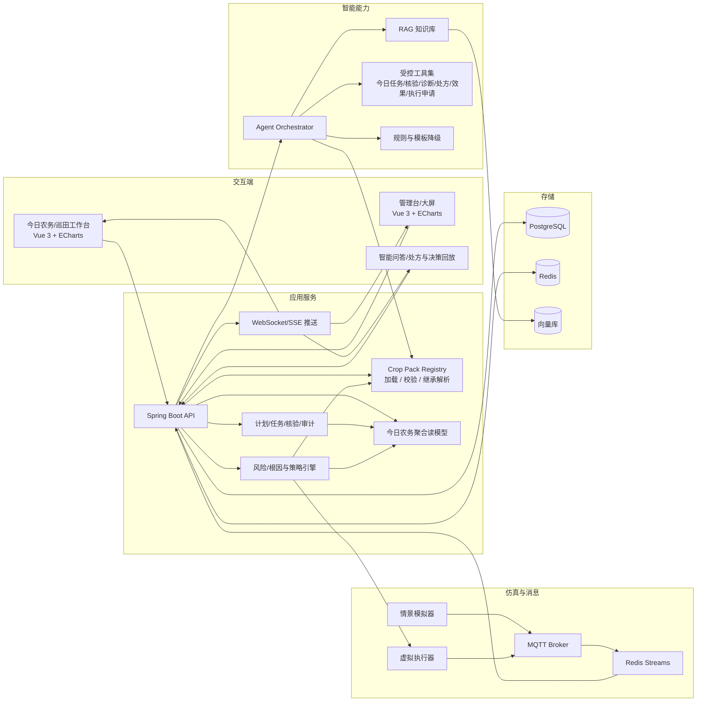
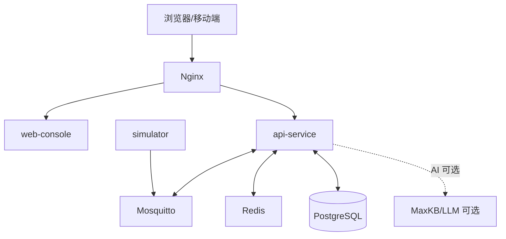
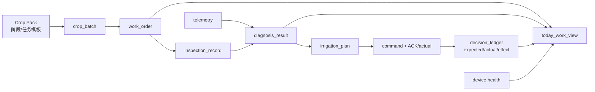
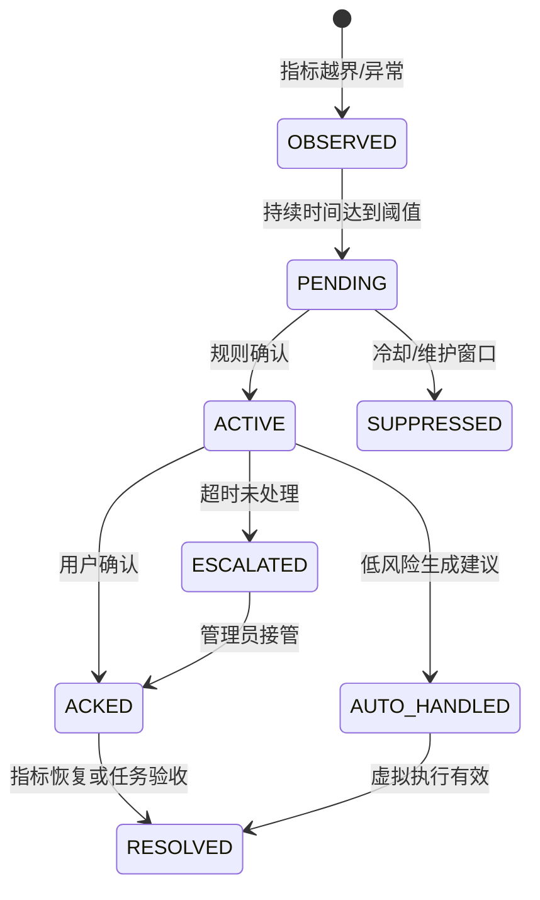

# 农智闭环：智慧农业技术架构

> 版本：v0.3（2026-08-22）
> 适用范围：15 天软件仿真态  
> 技术主线：模拟数据传输 + 智能体工具编排 + 可视化实时联动  
> 约束：不依赖真实传感器、鸿蒙端或硬件环境

## 1. 架构原则

1. **先跑通三条主线，再做增强**：采用模块化单体，避免 15 天内陷入微服务治理。
2. **事件合同先于页面**：D3 冻结 MQTT、内部事件、REST 和 Agent Tool Schema，前后端并行开发。
3. **模拟数据可重复**：所有异常都由带种子的情景脚本生成，答辩不依赖随机现场。
4. **AI 受控而非直连执行**：模型只能调用白名单工具，命令必须经过策略和权限检查。
5. **可观测、可降级**：记录 requestId、traceId、scenarioId；LLM 不可用时回退规则和模板。
6. **接口可替换**：本期只实现 MockDataSource 和 VirtualActuator，未来增加真实适配器不修改业务合同。
7. **内核统一、作物配置化**：数据、设备、Agent、控制和页面复用同一内核，作物差异由版本化 Crop Pack 注入。
8. **计划与实际可关联**：计划任务、人工观察、诊断、处方、命令、ACK 和效果评价必须通过稳定标识串联，不能各自形成孤岛。
9. **确定性能力先于 Agent**：根因评分、灌溉试算、优先级和效果评价由可测试服务计算；Agent 负责理解、组合、解释和发起受控操作。

## 2. 推荐技术栈

| 层次 | 建议选型 | 选择理由 | 15 天取舍 |
|---|---|---|---|
| Web 前端 | Vue 3 + TypeScript + Vite | 组件、状态和图表生态成熟 | 先工作台，再大屏动效 |
| UI/图表 | ECharts；Three.js 轻量可选 | 趋势、仪表盘、事件标记开发快 | 复杂 3D 不列为 P0 |
| 后端 | Spring Boot 3 + Java 17/21 | 模块化、测试和接口规范成熟 | 不引入复杂微服务注册中心 |
| 作物配置 | YAML/JSON + JSON Schema | Crop Pack 易审查、可校验、可版本化 | P0 不建设复杂插件运行时 |
| AI 编排 | MaxKB/RAG + LLM Adapter | 符合实训要求，便于知识库和工作流 | LLM 失败切换规则模式 |
| AI 工具 | Spring Boot Tool API；可选 FastAPI sidecar | 参数可校验、可审计、易测试 | 先用确定性算法，不训练模型 |
| 消息 | Mosquitto/EMQX MQTT + Redis Streams | 贴合物联网和可靠事件处理 | Kafka 作为后续扩展 |
| 实时推送 | SSE 或 WebSocket | 前端秒级刷新，开发成本低 | 项目统一选一种 |
| 业务数据 | PostgreSQL | 配置、告警、审计和时序统一 | 时序表加索引，TimescaleDB 可选 |
| 缓存/幂等 | Redis | Streams、缓存、限流和幂等可复用 | 只部署实际使用能力 |
| 向量检索 | MaxKB 内置向量库或 pgvector | 减少组件数量 | 知识少时提供本地检索兜底 |
| 文件 | MinIO 或本地对象目录 | 报告、图片和导入文件 | P1/P2 才启用图片流程 |
| 工程化 | Docker Compose + GitHub Actions | 可复现、可健康检查、便于答辩 | 一键启动优先 |

## 3. 总体逻辑架构



## 4. 三条主线的技术边界

### 4.1 数据主线

```text
Scenario Runner
  -> MQTT topic
  -> Ingestion Consumer
  -> Schema Validation / Deduplication / Quality Score
  -> Redis Streams
  -> PostgreSQL(time-series)
  -> Resolve Crop/Stage/Metric Profile
  -> Merge Optional Human Observation Evidence
  -> Rule Engine + Risk Detector + Cause Evaluator
  -> SSE/WebSocket event
```

数据接入服务只负责标准化、校验、落库和发布事件，不把业务规则硬编码在模拟器中。

### 4.2 智能体主线

```text
User/Today Work/Risk Event
  -> resolve plot/crop/growth-stage context
  -> load resolved Crop Pack
  -> deterministic diagnosis/prescription/evaluation services
  -> hierarchical RAG + query/diagnose/prescribe/evaluate tools
  -> Agent Orchestrator
  -> Safety Policy
  -> recommendation or virtual execution request
  -> expected/actual evaluation + decision ledger
```

模型不能直接生成 SQL、拼接 MQTT topic 或调用任意 HTTP；所有工具使用 JSON Schema 校验输入，并把输出写入 `agent_run`。

### 4.3 可视化主线

```text
REST(query) + SSE(event)
  -> frontend state store
  -> Crop Pack-driven cards/targets/scenarios
  -> today work/inspection/diagnosis/prescription/charts/timeline
  -> user confirmation
  -> REST(command)
  -> execution/effect/plan-actual event update
```

页面不直接连接 MQTT。浏览器只访问 API 和实时事件流，避免把消息代理凭据暴露给用户端。

## 5. 应用模块划分

| 模块 | 责任 | 主要接口/事件 |
|---|---|---|
| `farm-module` | 农场、地块、作物批次、生命周期计划、阶段切换和目标曲线 | `/farms`、`/plots`、`/crop-batches` |
| `crop-pack-module` | 作物包注册、版本、Schema 校验、阶段识别、任务模板、风险重点、处方约束和参数继承 | `/crop-packs`、`crop-pack.*` |
| `telemetry-module` | 消息消费、校验、去重、落库、查询 | `telemetry.received` |
| `device-module` | 模拟设备注册、绑定、心跳、健康度 | `/devices`、`device.status` |
| `rule-module` | 阈值、迟滞、冷却、风险检测、证据收集、候选原因评分和告警状态机 | `/rules`、`alert.*`、`diagnosis.*` |
| `agent-module` | RAG、Agent 编排、今日任务/核验/诊断/处方/效果 Tool 和降级 | `/agent/chat`、`agent.run.*` |
| `command-module` | 灌溉处方试算、审批、幂等、虚拟执行、实际量和 ACK | `/commands/virtual`、`command.*` |
| `workorder-module` | 计划、巡田、设备和告警任务；今日农务聚合；分派、处理、验收、升级 | `/work-orders`、`/work-items/today`、`inspection.*` |
| `audit-module` | 决策账本、操作审计、效果评价、计划实绩和回放索引 | `/agent/runs/{traceId}`、`evaluation.*` |
| `scenario-module` | 情景启动、暂停、快照、回放 | `/scenarios/runs` |

模块在同一个 Spring Boot 进程内通过领域事件解耦，后续才考虑拆服务。

八项能力不新增八个模块：生命周期计划归入 `farm-module` 与 `workorder-module`，今日农务是聚合读模型，田间核验使用现有任务模块，根因诊断升级 `rule-module`，灌溉处方和执行复用 `command-module`，效果与计划实绩归入 `audit-module`，Agent 仅增加白名单 Tool。

## 6. 模拟态可替换设计

模拟器不是一次性脚本，而是实现统一接口的适配器：

```java
public interface DataSource {
    void start(ScenarioConfig config);
    void pause();
    void publish(TelemetryEvent event);
    void stop();
}

public interface Actuator {
    CommandAck execute(VirtualCommand command);
    DeviceStatus status(String deviceId);
}
```

本期实现：

- `MockDataSource`：按情景和随机种子生成遥测。
- `ReplayDataSource`：读取固定事件文件，保证答辩可重复。
- `VirtualActuator`：模拟执行延迟、成功、失败、部分成功和状态变化。

模拟器从当前 Crop Pack 的情景与指标配置生成输入，但仍只发布标准遥测；它不能直接写入告警、Agent 结论或最终控制结果。

未来真实设备接入只增加新的 `DataSource`/`Actuator` 适配器，不修改规则、Agent、前端和事件合同。本期不宣称已完成真实设备联调。

## 7. 部署拓扑



开发环境建议用 `docker compose` 启动 PostgreSQL、Redis、MQTT；前端和后端可本地热更新运行。每个基础设施容器必须有健康检查，API 启动时检查依赖并给出清晰错误。

## 8. 数据架构

### 8.1 核心实体

| 实体 | 关键字段 | 作用 |
|---|---|---|
| `farm` | id、name、owner_id | 农场租户边界 |
| `plot` | id、farm_id、area、location、risk_level | 地块和灌溉分区 |
| `crop_pack` | crop_code、version、identity、status、schema_version | 作物包注册与版本边界 |
| `crop_stage_profile` | crop_pack_id、stage_code、sequence、targets、risk_focus、task_templates | 生长阶段、目标、风险重点与计划任务模板 |
| `crop_metric_profile` | crop_pack_id、stage_code、metric_code、range、availability | 动态指标和数据可用性 |
| `crop_batch` | id、plot_id、crop_code、stage_code、crop_pack_version、planted_at、planned_end_at | 地块当前作物上下文与生命周期锚点 |
| `device` | id、plot_id、type、status、last_seen、health_score | 模拟设备状态 |
| `telemetry` | device_id、metric、value、ts、quality、scenario_id | 时序观测 |
| `rule` | crop_pack_version、stage_code、metric、operator、threshold、duration、cooldown | 版本化规则和迟滞 |
| `alert` | level、source、status、evidence、assignee、diagnosis_id | 告警生命周期与诊断关联 |
| `inspection_record` | id、plot_id、crop_batch_id、work_order_id、operator_id、observed_at、observations、note、quality、revision | 田间核验与人工观察证据 |
| `diagnosis_result` | id、plot_id、risk_type、candidate_causes、confidence、evidence、missing_information、rule_version | 可重复的根因诊断结果 |
| `irrigation_plan` | id、plot_id、diagnosis_id、recommended_window、duration、water_litre、expected_result、alternatives、evidence、requires_approval | P0 结构化农业处方 |
| `command` | type、target、plan_id、payload、approval、ack、result、actual_start、actual_end、actual_water_litre | 虚拟控制命令与执行实际 |
| `agent_run` | trace_id、role、crop_pack_version、input_snapshot、tools、answer、confidence | Agent 调用链 |
| `decision_ledger` | event_id、before、decision、expected_result、after、actual_result、effectiveness_score、plan_actual_diff、versions、actor、hash | 决策审计、效果评价和计划实绩 |
| `work_order` | id、source_type、source_ref、source_version、action_type、priority、due_at、planned_start、assignee、status、linked_alert、linked_diagnosis、checklist | 计划、巡田、设备和告警任务闭环 |

`today_work_view` 是按查询构建的聚合读模型，不单独发展成业务模块或第二套任务表。它把 `work_order`、活动告警、诊断结果和设备健康归一化为工作项，并返回 `sourceType`、`priority`、`dueAt`、`reason` 和原始记录链接。



### 8.2 MQTT 主题

| 主题 | 方向 | 说明 |
|---|---|---|
| `agri/{farmId}/{plotId}/telemetry` | 模拟器 -> 平台 | 传感器观测 |
| `agri/{farmId}/{plotId}/device/status` | 模拟器/执行器 -> 平台 | 在线、心跳、健康度 |
| `agri/{farmId}/{plotId}/command` | 平台 -> 虚拟执行器 | 灌溉、暂停、校准 |
| `agri/{farmId}/{plotId}/command/ack` | 虚拟执行器 -> 平台 | 接收、成功、失败 |
| `agri/{farmId}/event` | 平台内部 | 告警、Agent、工单事件 |

### 8.3 遥测事件合同

```json
{
  "eventId": "evt-20260821-000001",
  "farmId": "farm-demo",
  "plotId": "plot-a01",
  "deviceId": "mock-soil-01",
  "metric": "SOIL_MOISTURE",
  "value": 18.4,
  "unit": "%",
  "ts": "2026-08-21T09:30:00+08:00",
  "quality": {
    "status": "GOOD",
    "freshnessMs": 420,
    "confidence": 0.98
  },
  "scenario": "drought",
  "schemaVersion": "1.0"
}
```

### 8.4 虚拟控制命令合同

```json
{
  "commandId": "cmd-20260821-000017",
  "plotId": "plot-a01",
  "type": "IRRIGATION_START",
  "durationSec": 420,
  "waterLitre": 126.0,
  "source": "agent-plan",
  "riskLevel": "MEDIUM",
  "approval": {
    "required": true,
    "approvedBy": "user-001",
    "approvedAt": "2026-08-21T09:31:10+08:00"
  },
  "idempotencyKey": "plot-a01-20260821-093110"
}
```

### 8.5 Agent 输出合同

```json
{
  "traceId": "run-abc123",
  "intent": "IRRIGATION_RECOMMENDATION",
  "context": {
    "cropCode": "tomato",
    "growthStage": "fruiting",
    "cropPackVersion": "1.0",
    "ruleVersion": "1.0",
    "knowledgeVersion": "1.0",
    "agentVersion": "0.3"
  },
  "summary": "A01 地块处于缺水风险，建议先进行 7 分钟虚拟灌溉",
  "riskLevel": "MEDIUM",
  "confidence": 0.87,
  "diagnosis": {
    "diagnosisId": "diag-001",
    "primaryCause": "WATER_DEFICIT",
    "candidateCauses": [
      {"code": "WATER_DEFICIT", "confidence": 0.82},
      {"code": "SENSOR_DRIFT", "confidence": 0.13},
      {"code": "DEVICE_FAULT", "confidence": 0.05}
    ]
  },
  "evidence": [
    {"type": "telemetry", "ref": "SOIL_MOISTURE:last-30m", "value": 18.4},
    {"type": "rule", "ref": "tomato-fruiting-v1"},
    {"type": "knowledge", "ref": "番茄灌溉手册#3.2"}
  ],
  "plan": {
    "type": "IRRIGATION",
    "what": "START_VIRTUAL_IRRIGATION",
    "where": "plot-a01",
    "when": {"start": "2026-08-21T17:00:00+08:00", "end": "2026-08-21T17:30:00+08:00"},
    "howMuch": {"durationSec": 420, "waterLitre": 126.0},
    "why": "结果期湿度持续低于目标且数据质量良好",
    "expectedResult": {"metric": "SOIL_MOISTURE", "from": 18.4, "to": 29.0}
  },
  "requiresApproval": true,
  "fallback": "RULE_ENGINE_AVAILABLE",
  "nextActions": ["确认虚拟灌溉", "创建巡检工单"]
}
```

### 8.6 告警状态机



### 8.7 Crop Pack 配置与解析合同

Crop Pack 是可校验、可版本化的配置目录，至少包含作物档案、生长阶段、指标、规则、知识索引、决策策略、情景和测试：

```text
crop-packs/{cropCode}/
├─ pack.yaml
├─ rules.yaml
├─ knowledge/
├─ scenarios/
└─ tests/
```

运行时解析顺序固定为：

```text
地块 -> 作物批次 -> 当前生长阶段 -> Crop Pack 版本
     -> 系统默认 / Crop Pack / 农场 / 地块逐级覆盖
     -> 生效指标、规则、知识范围和决策策略
```

- 指标使用统一编码，如 `SOIL_MOISTURE`、`AIR_TEMPERATURE`、`LIGHT`、`CO2`、`PH`、`EC` 和 `WATER_LEVEL`。
- 每项指标声明 `SUPPORTED`、`SIMULATION_ONLY` 或 `UNAVAILABLE`；后两种状态必须进入 Agent 上下文和 UI，禁止补造观测值。
- RAG 先按作物、阶段、地区/环境和地块过滤；资料不足时依次回退到更宽层级，并保存实际命中的知识版本。
- 每次决策保存 `cropPackVersion`、`ruleVersion`、`knowledgeVersion` 和 `agentVersion`，保证结果可复现。
- Crop Pack 发布前必须通过 Schema、规则、检索、安全策略和固定情景回归；平台内核不包含按作物分支的业务代码。

阶段配置还应提供计划与诊断所需的扩展项：

```yaml
stage: fruiting
risk_focus: [WATER_DEFICIT, HEAT_STRESS]
task_templates:
  - action_type: INSPECTION
    interval_days: 2
    priority: MEDIUM
  - action_type: IRRIGATION_CHECK
    interval_days: 1
    priority: HIGH
prescription_constraints:
  max_duration_sec: 900
  cooldown_minutes: 120
```

### 8.8 田间核验合同

```json
{
  "inspectionId": "ins-20260821-001",
  "plotId": "plot-a01",
  "cropBatchId": "batch-tomato-01",
  "workOrderId": "wo-001",
  "operatorId": "user-001",
  "observedAt": "2026-08-21T09:32:00+08:00",
  "observations": {
    "soilCondition": "DRY",
    "cropStatus": "SLIGHT_WILT",
    "deviceStatus": "NORMAL"
  },
  "note": "表层偏干，无漏水迹象",
  "quality": {"status": "GOOD", "completeness": 1.0, "confidence": 0.9},
  "revision": 1,
  "source": "HUMAN_OBSERVATION"
}
```

人工观察使用受控枚举并保留自由文本备注；自由文本不能直接改变风险分，必须先由确定性规则读取结构化字段。任何修改都保留修订记录，不能覆盖原始遥测。

### 8.9 效果评价合同

```json
{
  "evaluationId": "eval-001",
  "planId": "plan-001",
  "commandId": "cmd-20260821-000017",
  "status": "COMPLETED",
  "expected": {"soilMoistureBefore": 18.4, "soilMoistureAfter": 29.0, "waterLitre": 126.0},
  "actual": {"soilMoistureBefore": 18.4, "soilMoistureAfter": 28.4, "waterLitre": 132.0},
  "planActualDiff": {"waterLitrePct": 4.76, "soilMoisturePoint": -0.6},
  "effectivenessScore": 0.94,
  "result": "GOOD",
  "evidenceWindow": {"beforeMinutes": 30, "afterMinutes": 30}
}
```

评价只在 ACK、执行实际量和前后观测窗口满足最低质量条件时生成。该合同作为 `ACTION_EVALUATED` 类型事件写入 `decision_ledger`，其中 `evaluationId` 对应账本事件标识，不另建大型评价系统。资料不足时状态为 `PENDING` 或 `INCONCLUSIVE`，不能用 Agent 文本代替测量结果。

### 8.10 计划实绩与资源效率口径

P0/P1 使用可解释的简单口径，不引入完整 ERP：

```text
用水偏差率 = (实际用水量 - 计划用水量) / 计划用水量
湿度改善值 = 后测土壤湿度 - 前测土壤湿度
单位用水效果 = 湿度改善值 / 实际用水量
基础效果得分 = clamp(实际湿度改善值 / 预期湿度改善值, 0, 1)
任务按期率 = 按期完成任务数 / 已到期任务数
```

所有指标返回分子、分母、单位、时间窗、算法版本和不可计算原因；分母为零或观测质量不足时不计算，避免展示无法审计的百分比。

## 9. 核心 API 草案

| 方法 | 路径 | 主线 | 说明 |
|---|---|---|---|
| `GET` | `/api/v1/overview` | 可视化 | 地块聚合指标、风险排序、待办数量 |
| `GET` | `/api/v1/work-items/today` | 业务/可视化 | 聚合计划、告警、诊断、核验和设备任务 |
| `GET` | `/api/v1/crop-packs` | 业务 | 查询可用作物包及版本 |
| `GET` | `/api/v1/plots/{plotId}/resolved-profile` | 业务 | 查询地块最终生效的阶段、指标、规则和参数来源 |
| `GET` | `/api/v1/crop-batches/{batchId}/plan` | 业务 | 查询生命周期时间轴和计划任务来源 |
| `GET` | `/api/v1/plots/{plotId}/telemetry` | 数据 | 按指标和时间范围查询历史 |
| `GET` | `/api/v1/plots/{plotId}/timeline` | 可视化 | 告警、Agent、审批和执行事件 |
| `POST` | `/api/v1/inspections` | 业务 | 提交带来源的结构化田间核验 |
| `GET` | `/api/v1/plots/{plotId}/inspections` | 业务 | 查询田间核验与关联任务/诊断 |
| `GET` | `/api/v1/events/stream` | 数据/可视化 | SSE 实时事件流 |
| `POST` | `/api/v1/scenarios/runs` | 数据 | 启动、暂停、停止情景 |
| `POST` | `/api/v1/rules/evaluate` | 数据 | 对窗口执行规则和风险评分 |
| `POST` | `/api/v1/diagnoses/evaluate` | 业务/智能体 | 生成候选根因、证据、置信度和待核验项 |
| `GET` | `/api/v1/diagnoses/{diagnosisId}` | 业务/智能体 | 查询可重复诊断结果 |
| `POST` | `/api/v1/irrigation/estimate` | 智能体 | 生成结构化灌溉处方；保留原路径并扩展返回合同 |
| `POST` | `/api/v1/agent/chat` | 智能体 | 问答、检索、工具调用和建议 |
| `GET` | `/api/v1/agent/runs/{traceId}` | 智能体 | 证据、工具输入输出和降级信息 |
| `POST` | `/api/v1/commands/virtual` | 闭环 | 安全闸门后发布虚拟命令 |
| `GET` | `/api/v1/commands/{commandId}/evaluation` | 闭环 | 查询预期/实际、计划偏差与效果评分 |
| `GET` | `/api/v1/crop-batches/{batchId}/plan-actual` | 业务/可视化 | 查询任务、用水和资源效率汇总 |
| `POST` | `/api/v1/alerts/{alertId}/ack` | 业务 | 确认、关闭、升级告警 |
| `POST` | `/api/v1/work-orders` | 业务 | 从告警或建议创建工单 |

统一返回 `requestId`、`timestamp`、`schemaVersion` 和错误码；动作接口必须携带幂等键和当前用户身份。接口在 D3 以 OpenAPI 文件冻结。

## 10. 智能体与工具安全

| Agent 角色 | 可用工具 | 禁止行为 |
|---|---|---|
| 感知 | `get_plot_status`、`get_latest_metrics`、`get_history` | 不下结论、不发命令 |
| 诊断 | `get_crop_context`、`evaluate_diagnosis`、`get_inspections` | 不直接控制执行器，不猜测不可用指标，不凭模型生成概率 |
| 规划 | `generate_irrigation_plan`、`forecast_scenario` | 不绕过安全策略，不在缺少面积/流量时猜测剂量 |
| 安全 | `check_policy`、`check_device_health` | 不修改原始观测 |
| 报告 | `get_today_work_items`、`get_effect_evaluation`、`get_resource_summary`、`get_decision_trace` | 不编造证据，不把不可计算指标显示为零 |

Agent Orchestrator 面向用户统一暴露以下业务 Tool，并按意图路由到现有模块：

```text
get_plot_status
get_today_work_items
get_crop_context
get_diagnosis
create_inspection
generate_irrigation_plan
get_effect_evaluation
get_resource_summary
request_virtual_execution
```

`create_inspection` 必须校验地块权限和结构化枚举；`request_virtual_execution` 只创建受控申请，仍需经过安全策略、审批和幂等检查。Agent 不得自行写入 `diagnosis_result` 的原因概率或 `effectiveness_score`。

安全措施：

- 工具白名单和 JSON Schema 参数校验。
- 用户、知识文档、系统规则分层，防止提示注入改变策略。
- 最大单次灌溉时长、每日用水量、冷却窗口和权限检查。
- 中高风险命令需要二次确认；重复请求用幂等键拦截。
- 保存原始输入、检索证据、工具输出、审批人和最终结果。
- 人工观察与遥测分别保存来源、时间和修改历史，任何 Tool 不得覆盖原始证据。
- 处方必须关联诊断和版本；执行必须关联处方；效果评价必须关联命令与实际观测。
- 固定使用已解析的 Crop Pack 和版本；模型不得自行选择阈值、改写规则或跨作物混用证据。
- AI API 超时自动进入 `rules-only`，前端明确显示降级状态。

## 11. 可靠性与可观测性

| 能力 | 设计 |
|---|---|
| 去重 | `eventId` 唯一约束，重复遥测不重复落库 |
| 幂等 | `idempotencyKey` 唯一约束，重复命令只执行一次 |
| 重试 | 消费失败进入 Redis 重试队列，超过次数进入死信列表 |
| 离线 | 心跳超时标记离线，恢复心跳自动上线 |
| 回放 | 事件带 `scenarioId` 和 `traceId`，按时间排序重放 |
| 版本追踪 | 决策关联 Crop Pack、规则、知识和 Agent 版本，旧版本只读保留 |
| 评价幂等 | 同一命令和评价窗口只产生一个有效效果评价，补齐后测数据时保留修订版本 |
| 日志 | 统一 requestId、traceId、scenarioId、userId |
| 健康检查 | API、MQTT、Redis、PostgreSQL、AI 适配器分别暴露状态 |
| 指标 | 消息延迟、消费失败、告警数、Agent 耗时、页面刷新延迟 |

## 12. 建议仓库结构

```text
smart-agriculture/
├─ README.md
├─ docs/
│  ├─ 01_智慧农业_基本功能清单.md
│  ├─ 02_智慧农业_功能架构.md
│  ├─ 03_智慧农业_技术架构.md
│  ├─ 04_智慧农业_大致路线与流程.md
│  ├─ api/openapi.yaml
│  └─ test/acceptance-matrix.md
├─ apps/
│  ├─ web-console/          # Vue 工作台、大屏、回放
│  ├─ api-service/          # Spring Boot 模块化单体
│  └─ ai-tools/             # Agent 工具和确定性算法
├─ simulator/
│  ├─ scenarios/            # normal/drought/heat-wave/...
│  └─ runner/               # MQTT 发布和虚拟执行器
├─ crop-packs/
│  ├─ schema/               # Pack Schema 与校验规则
│  └─ {cropCode}/           # pack/rules/knowledge/scenarios/tests
├─ infra/docker-compose.yml
└─ .github/workflows/ci.yml
```

## 13. 本地启动约定

```bash
docker compose -f infra/docker-compose.yml up -d
./gradlew :apps:api-service:bootRun
pnpm --dir apps/web-console dev
python simulator/runner/main.py --scenario drought --speed 1
```

```text
APP_MODE=simulation
MQTT_URL=tcp://localhost:1883
REDIS_URL=redis://localhost:6379
DATABASE_URL=jdbc:postgresql://localhost:5432/agri
AI_MODE=rag          # rag | rules-only | mock
COMMAND_MODE=virtual
```

## 14. 版本变更说明

- v0.3 将八项业务能力整合进现有模块，没有新增微服务边界。
- `crop_stage_profile`、`work_order`、`irrigation_plan`、`command` 和 `decision_ledger` 采用向后兼容的字段扩展；原 `/irrigation/estimate` 路径继续保留。
- 新增 `inspection_record` 与 `diagnosis_result` 两个必要实体；今日农务使用聚合读模型，不复制任务数据。
- Agent `plan` 输出扩展为结构化处方内容，原有时长和水量仍保留在 `howMuch` 中。
