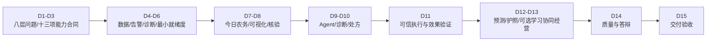
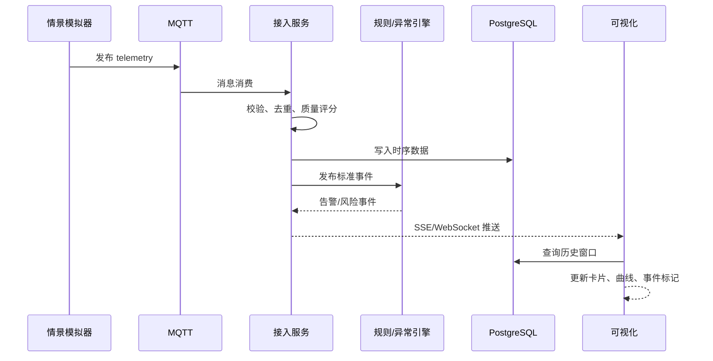
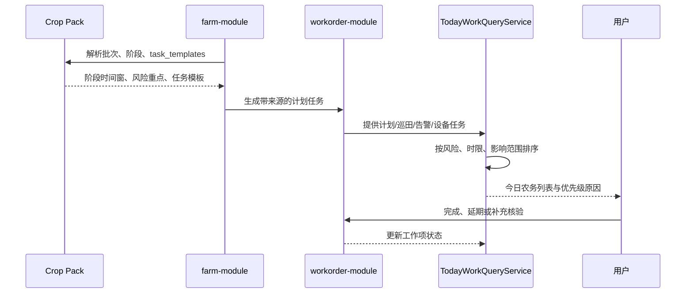
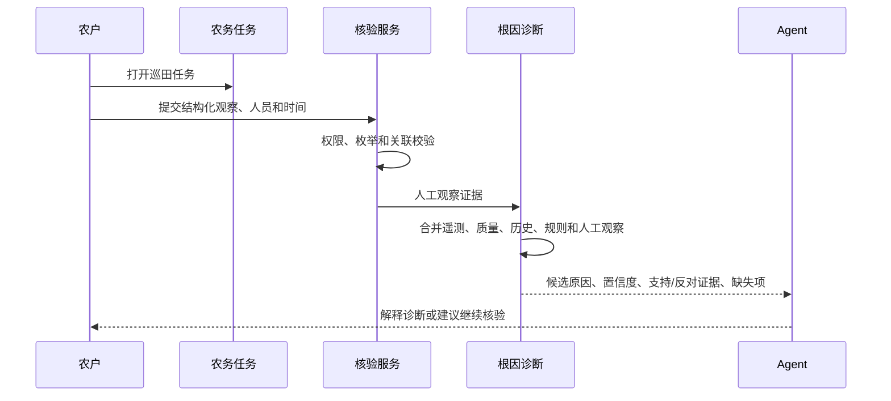
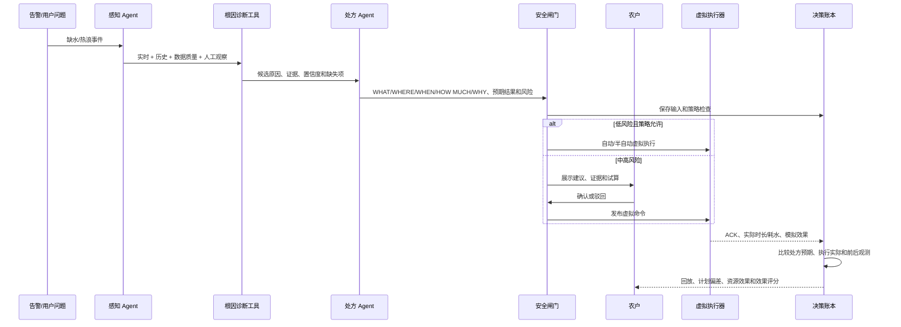
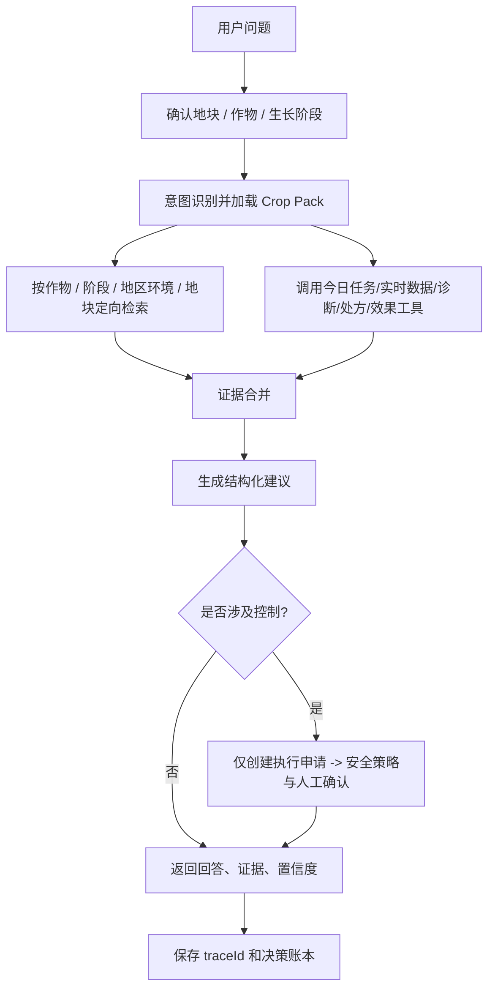
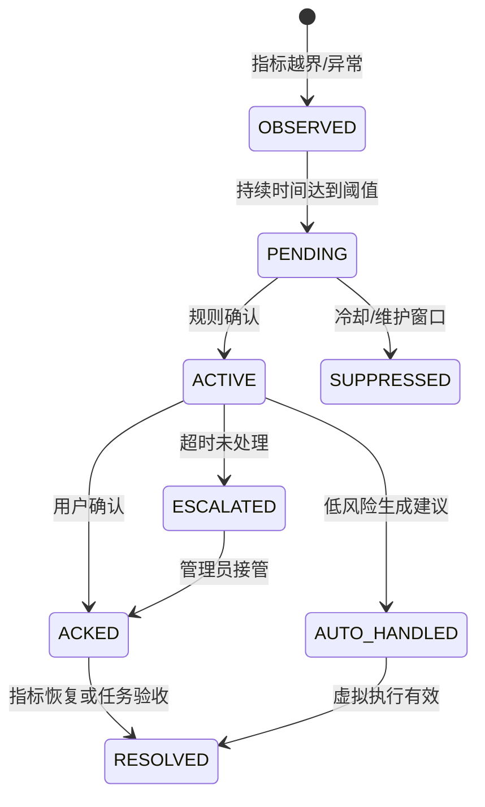
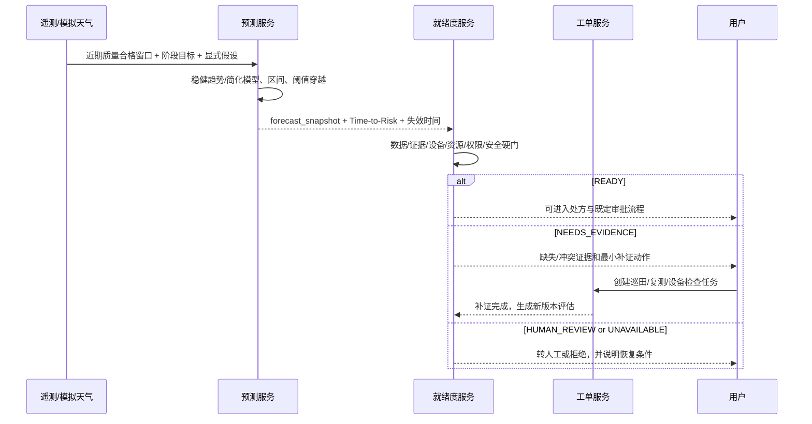
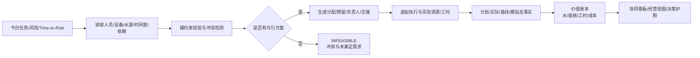
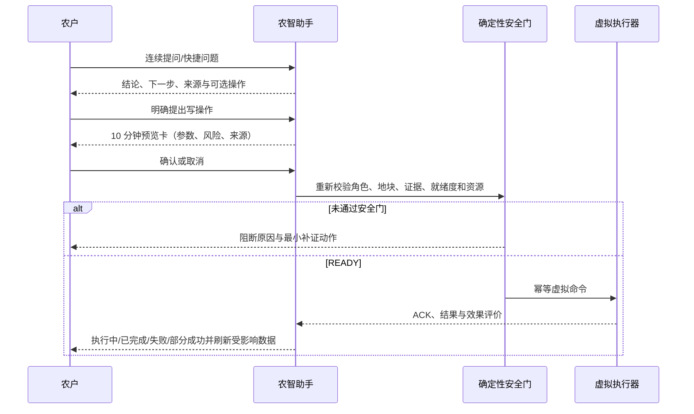

# 农智闭环：智慧农业大致路线与流程

> 版本：v0.4（2026-08-22）
> 项目周期：15 天  
> 交付目标：完成模拟数据传输、智能体、可视化三条软件主线开发联调  
> 本期边界：没有真实硬件、鸿蒙端接入和端-智-云真实联调
> 同步：功能架构 v0.5 的 P0 创新加深（质量门控、漂移分流、执行异常、双轨回放）

## 1. 15 天总体路线



### 1.1 目标版本

| 版本 | 时间 | 目标 | 不能缺少的证据 |
|---|---|---|---|
| V0 设计基线 | D1-D3 | 八层问题空间、核心八项 + 五项增强能力、事件/API/Tool 合同冻结 | PRD、架构图、数据字典、分期和看板 |
| V1 数据可流动 | D4-D6 | 模拟器到告警/诊断/最小就绪度链路跑通 | 1,000 条事件、落库、心跳、告警、就绪度硬门 |
| V2 三主线可见 | D7-D10 | 页面、问答和工具可用 | 基线页面、RAG 证据、Agent trace |
| V3 闭环可解释 | D11 | 根因、就绪度、处方、虚拟执行和效果评价可回放 | 硬门、补证/审批、命令、ACK、预期/实际、效果评分 |
| V4 高分演示版 | D12-D14 | 生命周期计划、短期预测、决策护照及按资源选择的案例/协同/价值切片 | 固定场景录屏、预测回测、约束/对账证据、安全清单 |
| V5 终验版 | D15 | 缺陷冻结、答辩交付 | Demo、代码、文档、PPT |

## 2. 每日路线与产物

| 天数 | 阶段 | 任务 | 当日可验收产物 |
|---|---|---|---|
| D1 | 启动 | 需求澄清、角色分工、仓库和看板、演示目标 | 任务看板、分支策略、风险清单 |
| D2 | 需求/设计 | 八层问题空间、十三项能力映射、领域模型、Crop Pack Schema、页面线框 | PRD、ER 草图、能力分期、作物包模板、页面草图 |
| D3 | 合同冻结 | Crop Pack、MQTT、事件、REST、计划/核验/诊断/预测/就绪度/处方/评价/反馈/资源/价值、Agent Tool | OpenAPI 草案、事件合同、Tool/Pack Schema |
| D4 | 数据主线 | 模拟器基础、首个作物包、阶段任务模板、正常情景、MQTT 接入 | 3 地块实时遥测、计划生成样例 |
| D5 | 数据主线 | Redis Streams、校验去重、时序落库、心跳 | 查询接口、重复/离线测试 |
| D6 | 数据主线 | 作物规则、阈值、迟滞、冷却、告警状态机、多风险根因诊断与最小就绪度硬门 | B-05/B-06/B-10、固定诊断和低质量阻断场景可用 |
| D7 | 可视化主线 | 今日农务聚合、配置驱动指标卡、实时推送、历史与目标曲线、就绪度入口 | B-01/B-02/B-03/B-08、CAP-02、CAP-13 最小视图可用 |
| D8 | 可视化主线 | 地块详情、设备管理、告警操作、田间核验表单骨架、虚拟开关 | B-04/B-09 可用，巡田入口完成合同对接 |
| D9 | 智能体主线 | MaxKB/本地分层知识库、作物/阶段定向检索、问答骨架 | 问题可返回带引用回答 |
| D10 | 智能体主线 | 冻结任务/核验/诊断/预测/就绪度/处方/效果 Tool；启用 P0 Tool、统一 Agent 编排和 trace | 带版本、来源和就绪状态的结构化处方工具链；P1 Tool 可明确返回未启用 |
| D11 | 闭环联调 | 就绪度硬门、安全闸门、补证/审批、虚拟执行器、ACK、实际量、效果评价 | 一次可信灌溉闭环与预期/实际对比 |
| D12 | 创新增强 | 核心主演示链稳定后：第二作物包、生命周期、田间核验、`gradual-drydown`、短期预测、完整决策护照、What-if | 预测先预警后越界，护照可追到全部来源与版本 |
| D13 | 创新增强 | 回放、统一工单、计划实绩、AI 降级；按顺序选择有限水源调度、价值账本、反馈/相似案例 | P0 稳定；每个启用的 P1 切片有约束、对账或案例过滤证据 |
| D14 | 质量/答辩 | 集成、性能、安全、AI/Crop Pack 回归、文档/PPT | 发布候选版、测试报告 |
| D15 | 交付 | 全流程演练、缺陷冻结、答辩和归档 | Demo、代码仓、设计文档、PPT |

## 3. 阶段门与范围保护

### Gate 1：D5 数据可流动

- 模拟器能稳定发送至少 1,000 条事件。
- 数据可校验、去重、落库、查询和实时推送。
- 模拟离线、重复事件和恢复有明确结果。

### Gate 2：D11 闭环可解释

- 一次异常触发告警、根因诊断、决策就绪度、补证/审批、结构化处方、虚拟执行、ACK 和效果评价。
- 低质量/`sensor-drift` 不得给出与干旱相同的可执行灌溉结论；虚拟执行至少一种非成功路径可观察。
- 同一 `scenarioId` 可回放，并具备执行/不执行最小双轨对比。
- UI 展示当前作物/阶段、Crop Pack 版本、诊断证据、决策就绪度、处方、风险、traceId、预期/实际和最终效果；规则与模型冲突时以安全闸门为准。
- 必要证据缺失、资源/设备不可用或动作超限时会补证、转人工或拒绝，Agent 不能绕过。
- 断开 LLM 后规则模式继续工作。

### Gate 3：D14 可答辩

- B-01 至 B-10 全部通过验收。
- 至少 2 个完整 Crop Pack 通过 Schema、规则、RAG、安全和情景回归。
- `drought` 与 `sensor-drift` 可用固定种子重复；干旱情景支持同一 `scenarioId` 回放与最小双轨对比。
- 今日农务、Agent 操作入口和完整执行效果链通过固定回归；P1 未完成能力有明确合同、任务和边界说明。
- 已宣称交付的 CAP-09~CAP-12 切片分别具有预测回测、案例资格、资源不超配和价值对账证据；未宣称交付的不进入完成率。
- 代码、接口、测试、安全、创新材料齐全。

### 进度落后时的裁剪顺序

1. 保护基线、数据链路、规则告警、虚拟灌溉和告警日志。
2. 保护 RAG 问答、工具调用和安全闸门。
3. 保护根因诊断、结构化灌溉处方、Agent 操作入口和效果验证这条主演示链。
4. 保护 CAP-13 的最小就绪度硬门；完整决策护照和 CAP-09 短期预测在核心稳定后实现。
5. CAP-11 有限水源协同、CAP-12 价值账本、CAP-10 相似案例依次裁剪为目标合同/P1，不得以 Mock 结果标完成。
6. 田间核验、完整生命周期页面和计划实绩可降为 P1，但保留数据合同。
7. 暂停复杂 Three.js、视觉病害、语音、真实天气、机器学习预测、自动排班和收益预测。

## 4. 业务流程

核心八项能力组成主演示闭环，五项增强能力分别向预测、学习、协同、经营和信任延伸；Agent 横跨查询、解释和受控操作，不是闭环中的单一节点：

```text
Crop Pack -> 全周期计划 -> 今日农务
-> 传感器 + 田间核验 -> 根因诊断 -> 结构化处方
-> What-if -> 安全确认 -> 虚拟执行 -> ACK
-> 效果验证 -> 计划 vs 实际 -> 资源效率 -> 决策回放
```

### 4.1 实时监测流程



**验收点**：停止模拟器后，心跳超时使设备变为离线；恢复后自动上线；重复事件不会产生重复告警；`sensor-drift` 与 `drought` 诊断结论可区分。

### 4.2 全周期计划与今日农务流程



批次日期或阶段变化时，只调整尚未执行的未来任务，并保留变更前版本；已完成任务、实际操作和审计记录不可被计划重算覆盖。Crop Pack 无有效模板时返回校验错误，不生成看似有效的计划。

### 4.3 田间核验与根因诊断流程



固定证据由确定性工具生成基础诊断，Agent 不生成原因概率。证据不足时返回 `INSUFFICIENT_EVIDENCE`；人工观察保留来源和修订历史，不覆盖传感器值。

### 4.4 智能灌溉、执行与效果验证闭环



ACK、执行实际量或后测窗口不完整时，评价状态为 `PENDING/INCONCLUSIVE`；系统不得让 Agent 用文本补造效果。

### 4.5 RAG 与 Agent 统一操作入口流程



流程约束：资料不足时按“地块 -> 地区/环境 -> 阶段 -> 作物 -> 通用知识”逐级回退并标明范围；模型不能直接拼接 SQL、MQTT topic 或发布命令，不能猜测不可用指标；工具参数必须经过 JSON Schema 校验；回答必须区分观测值、建议、用户确认和模拟结果。

Agent 的白名单操作覆盖查询今日农务、读取诊断、提交结构化核验、生成灌溉处方、查询效果与资源摘要、申请虚拟执行；AI 不可用时切换为规则结果和普通表单入口。

### 4.6 What-if 情景流程

```text
选择地块 -> 加载当前 Crop Pack 情景 -> 选择情景/持续时间 -> 复制当前状态快照
-> 模拟未来数据 -> 同一套规则和 Agent 推演
-> 对比“执行/不执行”两条路径（P0 最小双轨；完整报告见 P1）
-> 展示缺水时长、预计用水、风险变化和推荐方案
-> 低质量或漂移情景下不得推演出可执行灌溉处方
```

推荐情景：

| 情景 | 数据变化 | 期望系统行为 |
|---|---|---|
| `normal` | 周期波动 + 小噪声 | 正常监测，不产生严重告警 |
| `drought` | 湿度持续下降，温度/光照升高 | 复合风险、灌溉建议和回放 |
| `heavy-rain` | 降雨增加，湿度快速上升 | 抑制灌溉，提示过湿风险 |
| `sensor-drift` | 单个传感器缓慢偏移 | 数据质量下降，建议巡检/校准；不得给出与干旱相同的灌溉闭环结论 |
| `device-offline` | 心跳和数据停止 | 标记离线，创建检修任务 |
| `gradual-drydown` | 湿度按可控斜率缓慢下降 | 在后续模拟轨迹越界前生成 1/2/4 小时预测和 Time-to-Risk |
| `forecast-miss` | 预测后模拟天气或动作突然改变 | 新快照修订预测，旧预测保留，显示误差而非隐藏失败 |
| `evidence-conflict` | 传感器偏干、人工观察偏湿或流量未知 | 就绪度降级，列出冲突并创建最小补证任务 |
| `limited-water` | 多地块同时有需求且水源总量不足 | 分配不超容量，显示优先级、未满足需求和交接任务 |
| `repeated-case` | 重放相似上下文但包含完整/不完整效果记录 | 只让合格案例进入相似检索，策略不自动改写 |
| `cost-shift` | 模拟水电单价或工时基线变化 | 价值账本重算并保存价格/算法版本和来源标签 |

### 4.7 AI 不可用降级流程

```text
LLM/RAG 超时
  -> 标记 AI_DEGRADED
  -> 规则引擎继续监测
  -> 确定性根因诊断 + 结构化灌溉试算继续可用
  -> UI 显示“规则模式”
  -> 服务恢复后异步补写分析
```

### 4.8 告警状态流程



### 4.9 未来风险预测与主动补证流程



预测快照不能被后续数据覆盖；新数据只产生新快照。答辩既展示一次提前命中，也展示 `forecast-miss` 的修订和误差，证明系统知道自己可能出错。

### 4.10 决策记忆与受控学习流程

```text
处方执行 -> ACK/实际 -> 效果评价完成 -> 案例资格检查
-> 生成版本化案例指纹 -> 相似案例检索 -> 用户采纳/修改/驳回反馈
-> 可选 strategy_candidate(DRAFT) -> 固定情景离线回放/回归
-> 人工评审 -> 新版本发布或拒绝 -> 监控 -> 可回滚
```

缺少效果、证据质量不够、版本不完整或存在明显混杂的记录不进入案例库。Agent 只能解释案例和记录反馈，不能把反馈直接写回阈值或自动激活候选。

### 4.11 协同调度与经营价值流程



任何分配都必须满足容量；安全和不可逆风险优先于经营价值。经营视图把直接观测、人工输入、推导、模拟和估算分开展示，且本期直接观测明确来自模拟器；没有产量、价格或有效归因证据时不输出利润或“避免损失”。

## 5. 团队分工与每日节奏

### 5.1 推荐分工

| 角色 | 主责 | 交付证据 |
|---|---|---|
| PM/架构 | 需求、看板、接口合同、演示脚本、风险 | PRD、架构图、日报周报 |
| 前端 A | 今日农务、总览、地块详情、实时曲线 | 页面、组件测试 |
| 前端 B | 巡田、预测/就绪度、诊断/处方、智能体、协同/经营与决策护照 | 页面、交互验收 |
| 后端 A | MQTT/Streams/时序接入 | 消息链路、数据字典 |
| 后端 B | 生命周期任务、核验、根因诊断、预测/就绪度、资源约束、虚拟执行、效果/价值 | 状态机、算法、接口、测试 |
| 后端 C | Agent、RAG、处方/操作工具、反馈/案例、决策护照和降级 | Prompt/Tool、trace、案例资格、评测 |

### 5.2 敏捷节奏

- 上午：15 分钟站会，确认昨日完成、今日目标和阻塞项。
- 下午：接口联调或代码评审，至少合并一个可运行增量。
- 收工前：更新看板、登记缺陷、保留当天 Demo 快照。
- D5、D11、D14：阶段评审，不把问题留到最后一天。

推荐分支：`main`（稳定演示）、`develop`（集成）、`feature/*`（功能）、`fix/*`（修复）。提交示例：`feat(data): add drought scenario`、`fix(alert): add cooldown guard`。

## 6. 测试与验收

### 6.1 最小指标

| 指标 | 目标值 | 测量方式 |
|---|---:|---|
| 实时数据端到端延迟 | P95 < 2 秒 | 事件时间戳到 UI 更新时间 |
| 1,000 条事件落库成功率 | >= 99% | 模拟器序号与数据库比对 |
| 重复命令率 | 0 | 幂等键压测 |
| 同窗口告警重复率 | 0 | 告警聚合测试 |
| 本地首屏时间 | < 3 秒 | 浏览器 Performance |
| 固定问题 Agent 结构化输出 | >= 95% | 20 条问题回归 |
| AI 不可用时核心可用率 | 100% | 断开 LLM 执行基线流程 |
| 未审批高风险动作绕过率 | 0 | 安全策略测试 |
| 固定证据诊断结果一致率 | 100% | 相同快照和版本重复计算比对 |
| 处方-命令-评价关联完整率 | 100% | 决策账本外键/标识审计 |
| 低就绪度高风险动作拦截率 | 100% | 证据缺失、冲突、设备离线和超限回归 |
| 预测快照可复现率 | 100% | 相同输入/参数/算法版本重复计算比对 |
| 预测质量（P1） | 报告 MAE、提前量、区间覆盖率、弃权率 | 固定场景回测，不设无证据“高准确率”目标 |
| 资源超配次数（P1） | 0 | 并发容量与不可行场景测试 |
| 价值来源标注完整率（P1） | 100% | 汇总下钻到分子分母、单价、公式和来源 |
| 未批准策略候选激活次数（P1/P2） | 0 | 状态机、权限和回滚测试 |

### 6.2 测试矩阵

P0 相关项必须测试；CAP-09~CAP-12 和策略候选仅在团队宣称对应 P1/P2 切片已交付时成为必测项，未启用能力仍需验证其返回明确的不可用/目标设计状态。

| 类型 | 必测项 | 产物 |
|---|---|---|
| 单元测试 | 风险/根因、短期预测、就绪度硬门、优先级、迟滞、冷却、处方、资源约束、价值公式、效果评价、案例资格、权限 | 测试报告 |
| 集成测试 | MQTT -> DB -> 诊断/预测/就绪度 -> 今日农务 -> SSE；处方 -> 资源预留 -> 命令 -> ACK -> 评价/价值/护照 | 联调日志 |
| 场景测试 | 正常、干旱、渐进缺水、预测失准、暴雨、漂移、离线/恢复、核验一致/冲突、受限水源、重复案例、成本变化 | 场景结果 |
| Crop Pack 回归 | Schema、阶段、指标可用性、规则、RAG 回退、策略和版本回放 | 每个作物包测试报告 |
| AI 评测 | 事实性、引用、工具参数、越权请求 | 评测表 |
| 安全测试 | 越权、重放、注入、超限、敏感导出 | 安全检查单 |
| 演示回归 | 一键启动到回放的固定脚本 | 录屏/PPT |

## 7. 答辩演示流程（8-10 分钟）

下面是增强版脚本。若 CAP-09 或 CAP-12 尚未通过验收，则第 2 步回退固定 `drought`，第 7 步只展示计划实绩与效果评价；不得用目标页面或 Mock 数值冒充完成。

1. **0:00-0:40 产品定位**：说明八层用户问题空间和“目标架构不等于已实现”，明确本期是纯软件仿真态。
2. **0:40-1:50 今日农务与未来风险**：展示 2 种作物、3 个地块的计划来源；触发 `gradual-drydown`，显示 1/2/4 小时预测、Time-to-Risk、区间和假设。
3. **1:50-3:00 就绪度与主动补证**：用流量未知或证据冲突使动作被阻断，一键创建核验任务，补证后生成新版本就绪度。
4. **3:00-4:20 根因诊断**：展示遥测、人工观察、支持/反对证据、候选原因和缺失项。
5. **4:20-5:50 Agent 处方**：调用受控工具，展示 WHAT/WHERE/WHEN/HOW MUCH/WHY、RAG 证据、来源标签和风险。
6. **5:50-7:10 安全与执行**：高风险/低就绪度动作被拦截；符合条件并确认后虚拟执行，展示资源预留、ACK 和实际用水。
7. **7:10-8:50 效果、价值与护照**：P0 展示预期/实际、用水偏差、效果评分和最小决策链；CAP-12/完整护照已验收时追加工时、成本来源和全链护照；其他 P1 稳定时再追加受限水源或相似案例。
8. **8:50-10:00 失准、降级与边界**：展示一次预测修订或断开 AI 的规则模式；说明未交付的学习/经营/真实硬件边界。

答辩时使用固定 `scenarioId`，不要依赖现场随机数据；不要把“调用了大模型”作为唯一创新，要展示数据、智能体和可视化的因果链。

## 8. 评分点映射

| 评分关注点 | 过程/成果证据 |
|---|---|
| 系统设计与创新 | 八层问题空间、生命周期、预测提前量、主动补证、根因/处方/效果、受控学习、协同/经营合同和闭环回放 |
| 现代工具应用 | MQTT、Redis Streams、MaxKB/RAG、ECharts、Docker、CI |
| 文档规范性 | 功能架构、技术架构、路线流程、数据字典、OpenAPI、测试报告 |
| 安全与伦理 | 决策就绪度、人在回路、弃权/补证、来源标签、审计、权限、降级、提示注入防护 |
| 源代码质量 | 模拟/回放适配器、模块化单体、幂等、可测试规则 |
| 团队协作 | 看板、分支、PR 说明、阶段 Gate、角色交付物 |
| 答辩表达 | 固定情景、决策时间轴、指标对比、限制和后续计划 |

## 9. 风险与应对

| 风险 | 影响 | 应对 |
|---|---|---|
| LLM API 不稳定/无额度 | 问答无法展示 | `rules-only`/`mock` 降级，固定问题集回归 |
| 组件过多导致部署失败 | 联调延期 | P0 只保留 PostgreSQL、Redis、MQTT；向量库交给 MaxKB |
| 前后端接口变化 | 三主线互相阻塞 | D3 冻结事件合同和 OpenAPI，变更走版本字段 |
| AI 建议不可解释 | 答辩被追问 | 强制 evidence、trace、confidence 和审计 |
| 页面追求 3D 影响核心 | P0 不稳定 | 先保证 ECharts、回放和实时链路 |
| 模拟数据过于理想 | 演示缺乏可信度 | 内置缺失、漂移、延迟、失败、恢复情景 |
| Crop Pack 配置错误或知识串用 | 建议失真、跨作物误判 | Schema 校验、分层检索过滤、版本锁定和逐包回归 |
| 十三项能力同时开发导致范围膨胀 | Gate 2 延期 | P0 保护核心闭环和最小就绪度；预测优先 P1，协同/价值/案例按顺序裁剪 |
| 人工观察与遥测冲突 | 诊断不稳定 | 分开保存来源和可信度，输出冲突证据和待核验项，不静默覆盖 |
| 短期预测被误解为精确预言 | 决策误导、答辩被质疑 | 显示区间、假设、算法版本、失效时间和弃权；同时演示命中与失准修订 |
| 反馈直接修改规则 | 系统漂移且无法复现 | 只形成案例/候选，离线回放、人工批准、版本发布和回滚后才生效 |
| 多地块调度超配或饿死低优先任务 | 执行不可行、不公平 | 容量事务/预留、冲突解释、防饥饿规则和不可行状态 |
| 将模拟节省写成真实利润 | 产品失信 | 计划/实际/基线/反事实分开，来源标签和缺失项强制展示 |
| 五项增强挤占主演示 | Gate 2/3 延期 | 最小就绪度进 P0；预测优先 P1；协同、价值、案例按顺序裁剪，不用 Mock 冒充完成 |

## 10. 交付清单

```text
[ ] 可运行的软件仿真 Demo
[ ] 模拟器和情景脚本
[ ] MQTT/Redis/PostgreSQL 配置
[ ] 前端工作台、大屏、智能体和回放页面
[ ] 核心八项能力合同：计划/工单、核验、诊断、处方、执行评价和 Agent Tool
[ ] 五项增强能力合同：预测、案例/反馈、资源计划、价值账本、就绪度/决策护照
[ ] 今日农务、根因诊断、结构化灌溉处方和效果验证主演示链
[ ] 决策就绪度硬门、主动补证与低质量/冲突阻断证据
[ ] 若宣称 P1 已交付：预测回测、案例资格、资源不超配、价值对账对应证据
[ ] Agent/RAG/Tool 配置与降级说明
[ ] 至少 2 个完整 Crop Pack、Schema 和逐包回归结果
[ ] 功能架构、技术架构、路线与流程文档
[ ] OpenAPI、数据合同和数据库说明
[ ] 单元/集成/场景/AI/安全测试报告
[ ] 中期/终验答辩 PPT 和固定演示脚本
[ ] 已知限制与后续扩展说明
```

## 11. 后续演进边界

真实传感器、鸿蒙端和端-智-云联调不属于本期 15 天验收。后续只需将 `MockDataSource` 和 `VirtualActuator` 替换为新的适配器，并沿用本期冻结的事件、命令和安全合同；作物侧则在不改平台内核的前提下，将首批高质量 Crop Pack 扩展到 6–8 种代表性作物。

CAP-09~CAP-13 是完整产品目标，不等于要求 15 天全部上线：短期预测先从确定性模型与模拟天气开始，学习先做案例和候选审批，协同先做有限水源，经营先做资源/工时/成本，信任先做就绪度硬门再扩展完整护照。只有代码、异常路径、测试和可复现证据齐全的切片才能写成“已完成”；其余明确标为 P1/P2 或目标设计。

## 12. 农户农智助手闭环（本轮实现）



农户只能开始/继续/提交本人任务、记录文字巡田、申请授权地块补证和执行 `READY` 灌溉处方。任务歧义时返回候选，不自行猜测；提交缺少处理结果时要求补充；缺照片时引导进入巡田页面。`sensor-drift`、低质量、冷却或资源超限不生成执行卡，管理员新增地块、绑定设备、关闭告警和分配他人任务请求明确拒绝。所有灌溉结果均为“虚拟执行/模拟结果”，不代表真实水泵或阀门动作。
