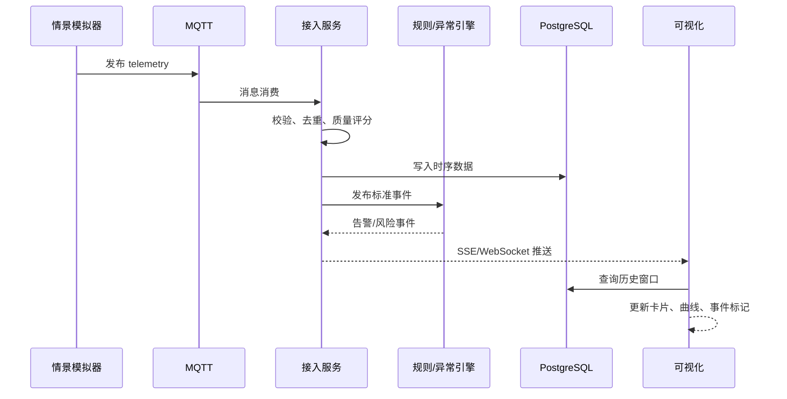
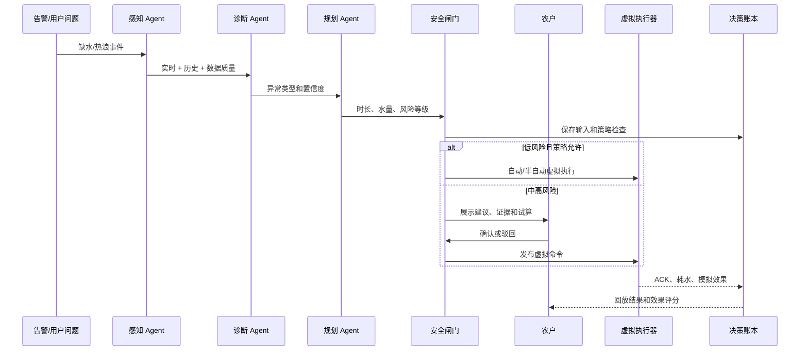
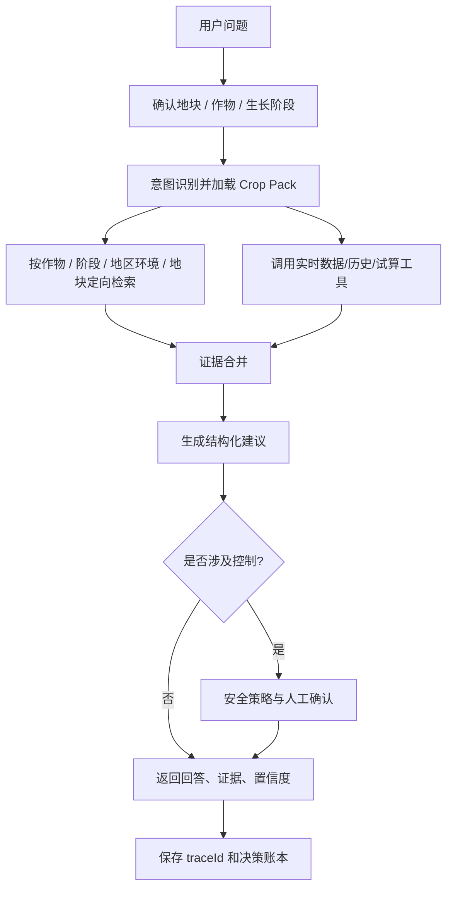
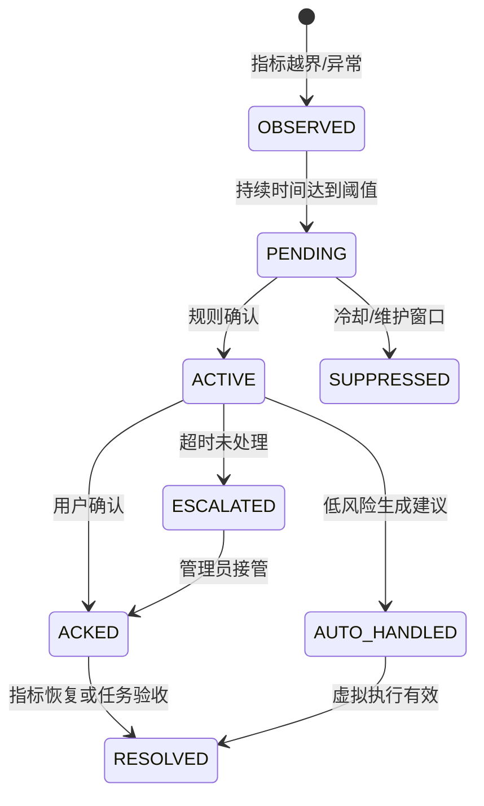

# 农智闭环：智慧农业大致路线与流程

> 项目周期：15 天  
> 交付目标：完成模拟数据传输、智能体、可视化三条软件主线开发联调  
> 本期边界：没有真实硬件、鸿蒙端接入和端-智-云真实联调

## 1. 15 天总体路线


### 1.1 目标版本

| 版本 | 时间 | 目标 | 不能缺少的证据 |
|---|---|---|---|
| V0 设计基线 | D1-D3 | 需求、事件、API、Tool 合同冻结 | PRD、架构图、数据字典、看板 |
| V1 数据可流动 | D4-D6 | 模拟器到告警的链路跑通 | 1,000 条事件、落库、心跳、告警 |
| V2 三主线可见 | D7-D10 | 页面、问答和工具可用 | 基线页面、RAG 证据、Agent trace |
| V3 闭环可解释 | D11 | 建议到虚拟执行可回放 | 审批、命令、ACK、状态改善 |
| V4 高分演示版 | D12-D14 | 情景、风险、回放、降级、测试 | 固定场景录屏、测试报告、安全清单 |
| V5 终验版 | D15 | 缺陷冻结、答辩交付 | Demo、代码、文档、PPT |

## 2. 每日路线与产物

| 天数 | 阶段 | 任务 | 当日可验收产物 |
|---|---|---|---|
| D1 | 启动 | 需求澄清、角色分工、仓库和看板、演示目标 | 任务看板、分支策略、风险清单 |
| D2 | 需求/设计 | 用户故事扩展、领域模型、Crop Pack Schema、页面线框 | PRD、ER 草图、作物包模板、页面草图 |
| D3 | 合同冻结 | Crop Pack、MQTT、内部事件、REST、Agent Tool、分层知识目录 | OpenAPI 草案、事件合同、Tool/Pack Schema |
| D4 | 数据主线 | 模拟器基础、首个作物包、正常情景、MQTT Broker 接入 | 3 地块实时遥测 |
| D5 | 数据主线 | Redis Streams、校验去重、时序落库、心跳 | 查询接口、重复/离线测试 |
| D6 | 数据主线 | 加载作物规则、阈值、迟滞、冷却、告警状态机 | B-05/B-06/B-10 可用 |
| D7 | 可视化主线 | 配置驱动指标卡、SSE/WebSocket、历史与目标曲线 | B-01/B-02/B-03/B-08 可用 |
| D8 | 可视化主线 | 地块详情、设备管理、告警操作、虚拟开关 | B-04/B-09 可用 |
| D9 | 智能体主线 | MaxKB/本地分层知识库、作物/阶段定向检索、问答骨架 | 问题可返回带引用回答 |
| D10 | 智能体主线 | 作物上下文、感知/诊断/规划工具、统一 Agent 编排、trace | 带版本的结构化建议和工具链 |
| D11 | 闭环联调 | 安全闸门、审批、虚拟执行器、ACK、效果回传 | 一次完整灌溉闭环 |
| D12 | 创新增强 | 第二种作物包、情景模拟、风险分、动态目标曲线、What-if | 作物与干旱/暴雨/热浪可切换 |
| D13 | 创新增强 | 回放时间轴、工单、节水指标、AI 降级 | 可重复演示，AI 断开仍可用 |
| D14 | 质量/答辩 | 集成、性能、安全、AI/Crop Pack 回归、文档/PPT | 发布候选版、测试报告 |
| D15 | 交付 | 全流程演练、缺陷冻结、答辩和归档 | Demo、代码仓、设计文档、PPT |

## 3. 阶段门与范围保护

### Gate 1：D5 数据可流动

- 模拟器能稳定发送至少 1,000 条事件。
- 数据可校验、去重、落库、查询和实时推送。
- 模拟离线、重复事件和恢复有明确结果。

### Gate 2：D11 闭环可解释

- 一次异常触发告警、Agent 建议、审批、虚拟执行和 ACK。
- UI 展示当前作物/阶段、Crop Pack 版本、证据、风险、traceId 和最终效果。
- 断开 LLM 后规则模式继续工作。

### Gate 3：D14 可答辩

- B-01 至 B-10 全部通过验收。
- 至少 2 个完整 Crop Pack 通过 Schema、规则、RAG、安全和情景回归。
- `drought` 情景可重复回放。
- 代码、接口、测试、安全、创新材料齐全。

### 进度落后时的裁剪顺序

1. 保护基线、数据链路、规则告警、虚拟灌溉和告警日志。
2. 保护 RAG 问答、工具调用和安全闸门。
3. 在风险分、情景模拟、回放中至少保留两个创新点。
4. 暂停复杂 Three.js、视觉病害、语音和外部天气 API。

## 4. 业务流程

### 4.1 实时监测流程



**验收点**：停止模拟器后，心跳超时使设备变为离线；恢复后自动上线；重复事件不会产生重复告警。

### 4.2 智能灌溉闭环



### 4.3 RAG 智能问答流程



流程约束：资料不足时按“地块 -> 地区/环境 -> 阶段 -> 作物 -> 通用知识”逐级回退并标明范围；模型不能直接拼接 SQL、MQTT topic 或发布命令，不能猜测不可用指标；工具参数必须经过 JSON Schema 校验；回答必须区分观测值、建议、用户确认和模拟结果。

### 4.4 What-if 情景流程

```text
选择地块 -> 加载当前 Crop Pack 情景 -> 选择情景/持续时间 -> 复制当前状态快照
-> 模拟未来数据 -> 同一套规则和 Agent 推演
-> 对比“执行/不执行”两条路径
-> 展示缺水时长、预计用水、风险变化和推荐方案
```

推荐情景：

| 情景 | 数据变化 | 期望系统行为 |
|---|---|---|
| `normal` | 周期波动 + 小噪声 | 正常监测，不产生严重告警 |
| `drought` | 湿度持续下降，温度/光照升高 | 复合风险、灌溉建议和回放 |
| `heavy-rain` | 降雨增加，湿度快速上升 | 抑制灌溉，提示过湿风险 |
| `sensor-drift` | 单个传感器缓慢偏移 | 数据质量下降，建议巡检 |
| `device-offline` | 心跳和数据停止 | 标记离线，创建检修任务 |

### 4.5 AI 不可用降级流程

```text
LLM/RAG 超时
  -> 标记 AI_DEGRADED
  -> 规则引擎继续监测
  -> 模板化诊断 + 灌溉试算继续可用
  -> UI 显示“规则模式”
  -> 服务恢复后异步补写分析
```

### 4.6 告警状态流程



## 5. 团队分工与每日节奏

### 5.1 推荐分工

| 角色 | 主责 | 交付证据 |
|---|---|---|
| PM/架构 | 需求、看板、接口合同、演示脚本、风险 | PRD、架构图、日报周报 |
| 前端 A | 总览、地块详情、实时曲线 | 页面、组件测试 |
| 前端 B | 智能体、回放、管理台 | 页面、交互验收 |
| 后端 A | MQTT/Streams/时序接入 | 消息链路、数据字典 |
| 后端 B | 规则、告警、虚拟执行、审计 | 状态机、接口、测试 |
| 后端 C | Agent、RAG、工具和降级 | Prompt/Tool、trace、评测 |

### 5.2 敏捷节奏

- 上午：15 分钟站会，确认昨日完成、今日目标和阻塞项。
- 下午：接口联调或代码评审，至少合并一个可运行增量。
- 收工前：更新看板、登记缺陷、保留当天 Demo 快照。
- D5、D11、D14：阶段评审，不把问题留到最后一天。

推荐分支：`main`（稳定演示）、`develop`（集成）、`feature/*`（功能）、`fix/*`（修复）。提交示例：`feat(data): add drought scenario`、`fix(alert): add cooldown guard`。

## 6. 测试与验收

### 6.1 最小指标

| 指标 | 目标值 | 测量方式 |
|---|---:|---|
| 实时数据端到端延迟 | P95 < 2 秒 | 事件时间戳到 UI 更新时间 |
| 1,000 条事件落库成功率 | >= 99% | 模拟器序号与数据库比对 |
| 重复命令率 | 0 | 幂等键压测 |
| 同窗口告警重复率 | 0 | 告警聚合测试 |
| 本地首屏时间 | < 3 秒 | 浏览器 Performance |
| 固定问题 Agent 结构化输出 | >= 95% | 20 条问题回归 |
| AI 不可用时核心可用率 | 100% | 断开 LLM 执行基线流程 |
| 未审批高风险动作绕过率 | 0 | 安全策略测试 |

### 6.2 测试矩阵

| 类型 | 必测项 | 产物 |
|---|---|---|
| 单元测试 | 风险分、迟滞、冷却、灌溉试算、权限 | 测试报告 |
| 集成测试 | MQTT -> Streams -> DB -> SSE | 联调日志 |
| 场景测试 | 正常、干旱、暴雨、漂移、离线、恢复 | 场景结果 |
| Crop Pack 回归 | Schema、阶段、指标可用性、规则、RAG 回退、策略和版本回放 | 每个作物包测试报告 |
| AI 评测 | 事实性、引用、工具参数、越权请求 | 评测表 |
| 安全测试 | 越权、重放、注入、超限、敏感导出 | 安全检查单 |
| 演示回归 | 一键启动到回放的固定脚本 | 录屏/PPT |

## 7. 答辩演示流程（8-10 分钟）

1. **0:00-0:45 产品定位**：说明“从看数据到可解释闭环”，明确本期是纯软件仿真态。
2. **0:45-2:00 正常总览**：展示至少 2 种作物、3 个地块；切换作物后指标卡和目标曲线自动变化。
3. **2:00-4:20 干旱情景**：点击情景按钮，观察湿度下降、复合风险、告警和排序。
4. **4:20-6:10 Agent 决策**：提问，展示 RAG 证据、工具调用、风险和灌溉试算。
5. **6:10-7:20 安全与执行**：尝试高风险动作被拦截；确认后虚拟执行，展示 ACK 和湿度回升。
6. **7:20-8:30 决策回放**：拖动时间轴，展示用水量、风险变化和审计记录。
7. **8:30-10:00 架构边界**：说明三主线、可替换适配器、降级策略和未纳入本期的真实硬件。

答辩时使用固定 `scenarioId`，不要依赖现场随机数据；不要把“调用了大模型”作为唯一创新，要展示数据、智能体和可视化的因果链。

## 8. 评分点映射

| 评分关注点 | 过程/成果证据 |
|---|---|
| 系统设计与创新 | 风险分、数字孪生情景、闭环回放、多智能体、安全闸门 |
| 现代工具应用 | MQTT、Redis Streams、MaxKB/RAG、ECharts、Docker、CI |
| 文档规范性 | 功能架构、技术架构、路线流程、数据字典、OpenAPI、测试报告 |
| 安全与伦理 | 人在回路、审计账本、权限、降级、提示注入防护 |
| 源代码质量 | 模拟/回放适配器、模块化单体、幂等、可测试规则 |
| 团队协作 | 看板、分支、PR 说明、阶段 Gate、角色交付物 |
| 答辩表达 | 固定情景、决策时间轴、指标对比、限制和后续计划 |

## 9. 风险与应对

| 风险 | 影响 | 应对 |
|---|---|---|
| LLM API 不稳定/无额度 | 问答无法展示 | `rules-only`/`mock` 降级，固定问题集回归 |
| 组件过多导致部署失败 | 联调延期 | P0 只保留 PostgreSQL、Redis、MQTT；向量库交给 MaxKB |
| 前后端接口变化 | 三主线互相阻塞 | D3 冻结事件合同和 OpenAPI，变更走版本字段 |
| AI 建议不可解释 | 答辩被追问 | 强制 evidence、trace、confidence 和审计 |
| 页面追求 3D 影响核心 | P0 不稳定 | 先保证 ECharts、回放和实时链路 |
| 模拟数据过于理想 | 演示缺乏可信度 | 内置缺失、漂移、延迟、失败、恢复情景 |
| Crop Pack 配置错误或知识串用 | 建议失真、跨作物误判 | Schema 校验、分层检索过滤、版本锁定和逐包回归 |

## 10. 交付清单

```text
[ ] 可运行的软件仿真 Demo
[ ] 模拟器和情景脚本
[ ] MQTT/Redis/PostgreSQL 配置
[ ] 前端工作台、大屏、智能体和回放页面
[ ] Agent/RAG/Tool 配置与降级说明
[ ] 至少 2 个完整 Crop Pack、Schema 和逐包回归结果
[ ] 功能架构、技术架构、路线与流程文档
[ ] OpenAPI、数据合同和数据库说明
[ ] 单元/集成/场景/AI/安全测试报告
[ ] 中期/终验答辩 PPT 和固定演示脚本
[ ] 已知限制与后续扩展说明
```

## 11. 后续演进边界

真实传感器、鸿蒙端和端-智-云联调不属于本期 15 天验收。后续只需将 `MockDataSource` 和 `VirtualActuator` 替换为新的适配器，并沿用本期冻结的事件、命令和安全合同；作物侧则在不改平台内核的前提下，将首批高质量 Crop Pack 扩展到 6–8 种代表性作物。本期答辩应明确说明“当前完成的是纯软件仿真态”，不夸大未完成内容。
