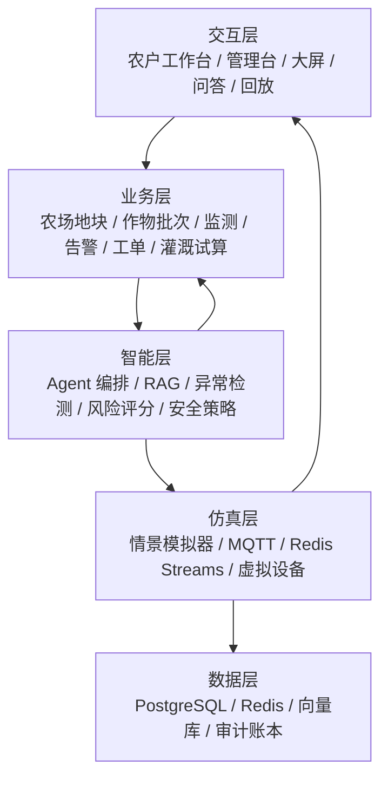
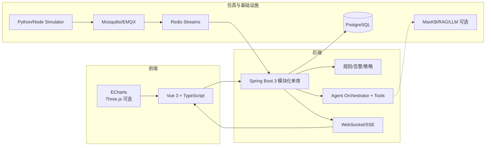
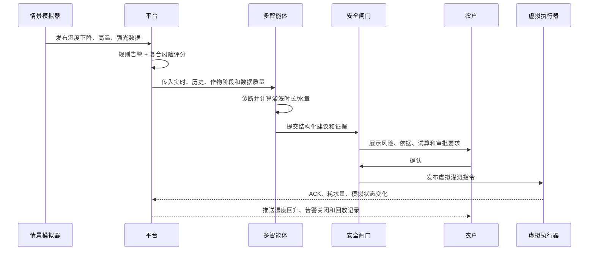

# 农智闭环 AgriLoop

15 天软件版智慧农业实训项目：用可配置的农田模拟数据，串起 MQTT 数据传输、智能体决策和可视化闭环。项目不依赖真实传感器、鸿蒙开发板或硬件接入，适合在没有现场设备的情况下完成可重复、可解释的演示。

> 本期交付边界：模拟数据传输 + 智能体 + 可视化三主线及联调。
> 真实硬件、鸿蒙端和端-智-云联调属于后续演进，不计入本期验收。

项目设计已经拆成三个文件，便于分工、评审和答辩：

- [功能架构](./02_智慧农业_功能架构.md)：产品定位、角色、基础功能覆盖、创新功能和验收边界。
- [技术架构](./03_智慧农业_技术架构.md)：技术选型、三主线架构、数据合同、接口、安全和部署。
- [大致路线与流程](./04_智慧农业_大致路线与流程.md)：15 天排期、业务流程、联调 Gate、测试、答辩和交付清单。

## 项目亮点

- **软件仿真闭环**：模拟器 -> MQTT -> 规则/异常检测 -> Agent -> 虚拟灌溉 -> ACK -> 趋势回升。
- **多角色智能体**：感知、诊断、规划、安全审核和报告角色通过受控工具协作，不让模型直接绕过策略层执行动作。
- **RAG 证据链**：回答同时展示实时数据、项目规则和农业知识来源，支持追问和决策回放。
- **风险感知灌溉**：从单一湿度阈值扩展到作物生长阶段、温度、光照、数据质量和设备健康度。
- **What-if 情景模拟**：一键模拟干旱、热浪、暴雨、传感器漂移和设备离线，验证策略而不是等待随机故障。
- **可解释与可审计**：每次建议保存输入快照、证据、工具调用、审批人、虚拟执行结果和效果评分。
- **可降级**：LLM 或知识库不可用时，规则引擎、灌溉试算和基础告警继续工作，并明确显示当前模式。

## 基线功能与创新增量

原始功能清单中的 10 项功能全部保留：

| 基线 | 交付内容 |
|---|---|
| B-01/B-02 | 土壤湿度、温度实时监测 |
| B-03 | 7/24/168 小时历史趋势 |
| B-04 | 虚拟灌溉开关、指令 ACK 和失败提示 |
| B-05 | 阈值、持续时间、迟滞、冷却窗口告警 |
| B-06 | 设备心跳、在线状态、数据新鲜度和健康分 |
| B-07 | RAG 农事问答与灌溉建议 |
| B-08 | 多地块总览和风险排序 |
| B-09 | 模拟设备注册、绑定、解绑 |
| B-10 | 告警日志、筛选、确认、关闭和审计 |

在此基础上，本期优先增加：作物生长阶段目标曲线、多指标异常检测、灌溉量试算、情景模拟、虚拟执行闭环、多智能体、RAG 证据、决策回放、安全闸门、AI 降级、工单和水量指标。新增功能按 P0/P1/P2 管理，避免为了“功能多”牺牲可运行性。

## 功能架构



### 三条主线

**数据主线**

```text
正常/异常情景模拟器
  -> MQTT Broker
  -> 数据校验、去重、质量评分
  -> Redis Streams
  -> PostgreSQL 时序表
  -> 规则告警、异常检测、SSE/WebSocket 推送
```

**智能体主线**

```text
用户问题或告警事件
  -> 感知 Agent
  -> 诊断 Agent
  -> 规划 Agent
  -> 安全审核
  -> 建议/虚拟命令
  -> 决策账本与回放
```

**可视化主线**

```text
REST 查询 + SSE 实时事件
  -> 总览卡片、趋势图、地块详情、风险排序
  -> 智能决策台、审批按钮、事件时间轴
```

## 技术架构



### 技术选型

| 方向 | 选型 | 说明 |
|---|---|---|
| 前端 | Vue 3、TypeScript、Vite、ECharts | 快速实现工作台、趋势、实时状态和大屏 |
| 后端 | Spring Boot 3、Java 17/21 | 模块化单体，降低 15 天联调成本 |
| 消息 | MQTT + Redis Streams | 体现物联网链路和可靠事件处理 |
| 实时 | SSE 或 WebSocket | 统一事件格式，保证页面秒级刷新 |
| 数据 | PostgreSQL + Redis | 配置、时序、告警、审计和缓存统一管理 |
| 智能体 | MaxKB/RAG + LLM Adapter + 规则兜底 | 支持证据、工具调用和降级 |
| 运行 | Docker Compose、GitHub Actions | 一键启动、健康检查、可重复演示 |

## 关键流程

### 干旱情景闭环



### AI 降级流程

```text
LLM/RAG 超时
  -> AI_DEGRADED 标记
  -> 规则告警、风险排序、灌溉试算继续可用
  -> UI 明确显示“规则模式”
  -> 服务恢复后异步补写分析，不影响主流程
```

## 15 天路线

| 天数 | 目标 | 交付物 |
|---|---|---|
| D1-D3 | 需求冻结、领域模型、MQTT/API/Tool 合同 | PRD、架构图、数据字典、看板 |
| D4-D6 | 模拟器、MQTT、Redis Streams、落库、规则告警 | 数据链路、心跳、告警状态机 |
| D7-D8 | 总览、趋势、地块、虚拟开关、设备管理 | 基线监测/控制/管理页面 |
| D9-D10 | RAG、问答、工具调用、多角色 Agent | 带证据的结构化建议 |
| D11 | 安全闸门、审批、虚拟执行、ACK | 首次完整闭环 |
| D12-D13 | 情景模拟、风险分、回放、工单、降级 | 高分创新功能和稳定演示 |
| D14 | 集成测试、性能、安全、文档、PPT | 发布候选版和测试报告 |
| D15 | 全流程演练、缺陷冻结、答辩 | Demo、代码仓、文档、答辩材料 |

### 阶段门

- **D5**：1,000 条模拟事件可发送、落库、查询和实时推送。
- **D11**：异常 -> 告警 -> Agent -> 审批 -> 虚拟执行 -> ACK -> 结果回放跑通。
- **D14**：基线 10 项通过，干旱场景可重复，AI 断开后核心功能仍可用。

如果进度落后，优先保护基线、数据链路、规则告警、虚拟灌溉、RAG 问答和安全闸门；复杂 3D、视觉病害、语音和外部天气 API 只做 P2。

## 高分答辩演示

建议固定使用 `drought` 情景，避免现场随机数据不可控：

1. 展示 3 个地块的实时指标、设备状态和历史曲线。
2. 一键触发干旱，观察湿度下降、复合风险和告警。
3. 提问“番茄结果期湿度 18% 是否需要灌溉”，展示 RAG 证据和实时工具结果。
4. 展示安全闸门：高风险动作先拦截，用户确认后才生成虚拟命令。
5. 展示 ACK、湿度回升、告警关闭、用水量和决策时间轴。
6. 断开 LLM，展示规则模式仍可告警和试算。
7. 最后说明：本期是纯软件仿真态，真实硬件属于后续适配层，不夸大未完成内容。

## 验收指标

| 指标 | 目标 |
|---|---:|
| 实时数据端到端延迟 | P95 < 2 秒 |
| 1,000 条事件落库成功率 | >= 99% |
| 重复命令率 | 0 |
| 同窗口告警重复率 | 0 |
| 固定问题 Agent 结构化输出成功率 | >= 95% |
| AI 不可用时核心功能可用率 | 100% |
| 未审批高风险命令绕过率 | 0 |

## 仓库建议结构

```text
smart-agriculture/
├─ README.md
├─ docs/
│  ├─ 01_智慧农业_基本功能清单.md
│  ├─ 02_智慧农业_功能架构.md
│  ├─ 03_智慧农业_技术架构.md
│  ├─ 04_智慧农业_大致路线与流程.md
│  ├─ api/openapi.yaml
│  ├─ data/event-contract.md
│  └─ defense/demo-script.md
├─ apps/
│  ├─ web-console/
│  ├─ api-service/
│  └─ ai-tools/
├─ simulator/
│  ├─ scenarios/
│  └─ runner/
├─ infra/docker-compose.yml
└─ .github/workflows/ci.yml
```

## 本地启动约定

实现代码补齐后，建议使用以下方式启动软件仿真态：

```bash
docker compose -f infra/docker-compose.yml up -d
./gradlew :apps:api-service:bootRun
pnpm --dir apps/web-console dev
python simulator/runner/main.py --scenario drought --speed 1
```

关键配置：

```text
APP_MODE=simulation
MQTT_URL=tcp://localhost:1883
REDIS_URL=redis://localhost:6379
AI_MODE=rag          # rag | rules-only | mock
COMMAND_MODE=virtual
```

## 文档与边界

- [功能架构](./02_智慧农业_功能架构.md)
- [技术架构](./03_智慧农业_技术架构.md)
- [大致路线与流程](./04_智慧农业_大致路线与流程.md)
- [基础功能清单](./01_智慧农业_基本功能清单.md)：原始需求基线。
- 当前版本不声称已经完成真实传感器、鸿蒙端或硬件联调；相关内容只作为未来增加 `DeviceGatewayDataSource` 的扩展方向。
