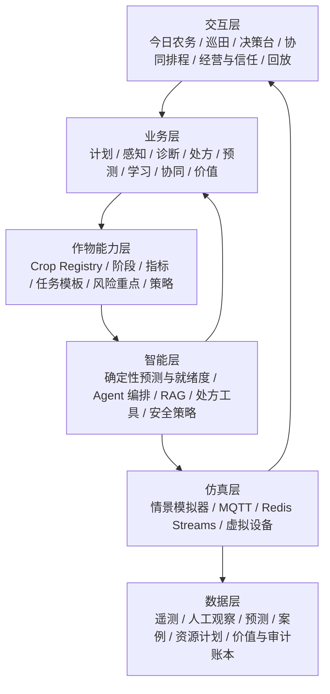
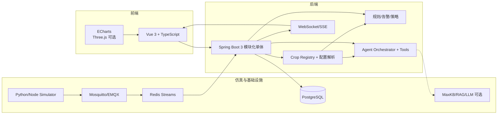
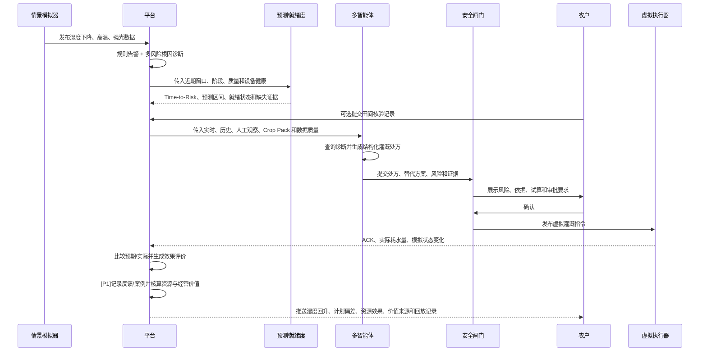

# 农智闭环 AgriLoop

> 方案基线：v0.5（2026-08-22）

15 天软件版智慧农业实训项目：用可配置的农田模拟数据，串起 MQTT 数据传输、智能体决策和可视化闭环。平台采用“统一农业智能内核 + 可插拔 Crop Pack（作物包）”，在复用数据、告警、Agent、控制和可视化能力的同时，按作物与生长阶段加载指标、规则、知识、任务模板和策略。产品目标从单纯监测扩展为“计划、感知、核验、诊断、处方、执行、验证、预测、学习、协同、经营与可信运行”，但本期仍只交付纯软件仿真态，不依赖真实传感器、鸿蒙开发板或硬件接入。

> 本期交付边界：模拟数据传输 + 智能体 + 可视化三主线及联调。
> 真实硬件、鸿蒙端和端-智-云联调属于后续演进，不计入本期验收。

核心设计继续保持原有三份文件，便于分工、评审和答辩：

- [功能架构](./02_智慧农业_功能架构.md)：产品定位、角色、基础功能覆盖、创新功能和验收边界。
- [技术架构](./03_智慧农业_技术架构.md)：技术选型、三主线架构、数据合同、接口、安全和部署。
- [大致路线与流程](./04_智慧农业_大致路线与流程.md)：15 天排期、业务流程、联调 Gate、测试、答辩和交付清单。

项目事实和任务状态分别记录在 [PROJECT_STATUS.md](./PROJECT_STATUS.md) 与 [TASKS.md](./TASKS.md)；当前合同、运行说明和验收入口统一收录在 [docs/README.md](./docs/README.md)。目标架构、当前实现和验收证据必须分开表述。

## 八层用户问题空间

AgriLoop 不以功能数量定义产品，而是按用户从“知道发生了什么”到“知道何时不该相信系统”的连续问题空间组织能力：

| 层级 | 用户真正的问题 | 当前设计基础 | 完善方向 | 能力编号 |
|---|---|---|---|---|
| 1. 看见 | 我的农场现在怎么样？ | 实时监测、历史趋势、设备状态、多地块总览 | 保持稳定并提升数据质量表达 | B-01~B-10 |
| 2. 理解 | 为什么出现这个情况？ | 多风险检测、根因诊断、人机证据融合 | 补齐冲突证据与缺失证据说明 | CAP-03、CAP-04 |
| 3. 行动 | 我应该怎么做？做多少？是否有效？ | 结构化处方、What-if、安全执行、效果验证 | 保持完整因果链 | CAP-05、CAP-06、CAP-08 |
| 4. 预测 | 接下来会发生什么？还有多久必须处理？ | 情景推演和目标曲线 | 短期风险预测与 Time-to-Risk | CAP-09 |
| 5. 学习 | 以前类似情况怎么做最有效？ | 效果评价、回放、建议反馈 | 决策记忆、相似案例和受控策略学习 | CAP-10 |
| 6. 协同 | 多地、多人、多设备和有限资源怎么协调？ | 工单、今日农务、多地块水量排序 | 资源日历、冲突检查、分配与交接 | CAP-11 |
| 7. 经营 | 到底节省了多少水、成本和时间？ | 计划实绩与单位资源效果 | 基线/实际/反事实和价值账本 | CAP-12 |
| 8. 信任 | 系统靠不靠谱，什么时候不应该听它？ | 数据质量、安全闸门、审计、降级 | 决策就绪度、主动补证和决策护照 | CAP-13 |

前 3 层构成 15 天主演示闭环；第 8 层的最小安全门随 P0 一起交付；第 4~7 层按 P1/P2 渐进增强。这样既形成完整产品目标，也不会把长期愿景误写成本期实现。

## 项目亮点

- **软件仿真闭环**：模拟器 -> MQTT -> 风险/根因诊断 -> 结构化处方 -> 虚拟灌溉 -> ACK -> 效果验证。
- **多作物可扩展**：通过版本化 Crop Pack 注入作物档案、生长阶段、动态指标、规则、知识、策略、情景和测试，新增作物主要增加配置，不重写平台。
- **农务经营闭环**：用作物全周期计划生成任务，在今日农务中心汇总优先级，并比较计划、执行实际与资源效果。
- **未来风险与提前量**：基于近期趋势、作物阶段、目标区间和模拟天气输出未来窗口、Time-to-Risk、误差范围与失效条件。
- **受控经验学习**：把采纳、修改、执行和效果沉淀为可检索案例；策略调整必须经过离线回放和人工批准，不在线静默自改规则。
- **协同与资源约束**：在有限水源、设备、人员和时间窗下发现冲突、解释优先级并生成可执行分配方案。
- **经营价值归因**：对比计划、实际、基线和模拟反事实，核算水、能耗、工时与成本，并统一标明 `OBSERVED` / `USER_PROVIDED` / `DERIVED` / `SIMULATED` / `ESTIMATED` 来源。
- **可信决策护照**：同时展示证据完整性、决策就绪度、不确定性、安全检查、人工修改、版本和不适用条件。
- **人机证据融合**：传感器观测与田间核验共同进入诊断证据链，保留来源、时间、人员和可信度。
- **多角色智能体**：感知、诊断、规划、安全审核和报告角色通过受控工具协作；Agent 也是统一操作入口，但不能绕过策略层执行动作。
- **RAG 证据链**：回答同时展示实时数据、项目规则和农业知识来源，支持追问和决策回放。
- **风险感知灌溉**：从单一湿度阈值扩展到作物生长阶段、温度、光照、数据质量和设备健康度。
- **What-if 情景模拟**：一键模拟干旱、热浪、暴雨、传感器漂移和设备离线，验证策略而不是等待随机故障。
- **可解释与可审计**：每次建议保存输入快照、证据、工具调用、审批人、虚拟执行结果和效果评分。
- **可降级**：LLM 或知识库不可用时，规则引擎、灌溉试算和基础告警继续工作，并明确显示当前模式。

## 业务能力全景（核心八项 + 五项增强）

核心闭环沿用 `CAP-01`～`CAP-08`，不改号、不改义：

| 编号 | 业务能力 | 现有架构落点 | 15 天范围 |
|---|---|---|---|
| CAP-01 | 作物全周期生产计划 | Crop Pack 阶段任务模板 + `crop_batch` + `work_order` | P0 冻结合同和两种作物模板；P1 完整时间轴 |
| CAP-02 | 今日农务中心 | 告警、诊断、计划任务、设备健康的聚合读模型 | P0 首页聚合与优先级排序 |
| CAP-03 | 田间核验 | `inspection_record` 人工观察证据 | P1 结构化巡田记录与证据融合 |
| CAP-04 | 多风险根因诊断 | `rule-module` 的证据收集、候选原因和置信度 | P0 干旱/漂移/设备异常基础诊断 |
| CAP-05 | 结构化农业处方 | 现有灌溉试算升级为 `irrigation_plan` 业务合同 | P0 先实现灌溉处方 |
| CAP-06 | 执行与效果验证 | `command` + ACK + `decision_ledger` 前后对比 | P0 主演示闭环 |
| CAP-07 | 计划 vs 实际与资源效率 | 作物批次、工单、命令实际量和审计汇总 | P1 用水偏差与单位效果 |
| CAP-08 | Agent 统一操作入口 | 现有 Agent Orchestrator + 白名单 Tool + 安全闸门 | P0 查询、诊断、处方、申请虚拟执行 |

为补齐用户问题空间第 4~8 层，新增五项增强能力；它们继续复用现有模块，不新增五个服务：

| 编号 | 增强能力 | 现有架构落点 | 15 天范围 |
|---|---|---|---|
| CAP-09 | 未来风险预测与 Time-to-Risk | `rule-module` 趋势预测 + Crop Pack 阈值 + `scenario-module` | P1 实现缺水/热风险 1/2/4 小时确定性预测；数据不足明确弃权 |
| CAP-10 | 决策记忆与受控学习 | 效果评价 + 决策回放 + 建议反馈 + `audit-module` | P1 记录反馈并检索相似案例；P2 才生成和审批策略候选 |
| CAP-11 | 多人多地多资源协同 | 今日农务 + `workorder-module` + I-22 水资源调度 | P1 有限水源的多地块分配与冲突提示；复杂排班/路径为 P2 |
| CAP-12 | 经营价值与效益归因 | 计划实绩 + 资源效率 + `decision_ledger` | P1 核算水/能耗/工时/成本；无产量价格数据不宣称真实利润 |
| CAP-13 | 决策就绪度与可信运行 | 数据质量 + 证据链 + 安全闸门 + 审计/降级 | P0 最小就绪度门控；P1 完整决策护照与主动补证 |

完整定义、输入输出、降级路径和验收证据见[功能架构](./02_智慧农业_功能架构.md)。

## 基线功能与创新增量

原始功能清单中的 10 项功能全部保留：

| 基线 | 交付内容 |
|---|---|
| B-01/B-02 | 土壤湿度、温度实时监测 |
| B-03 | 7/24/168 小时历史趋势 |
| B-04 | 虚拟灌溉开关、指令 ACK 和失败提示 |
| B-05 | 阈值、持续时间、迟滞、冷却窗口告警 |
| B-06 | 设备心跳、在线状态、数据新鲜度和健康分 |
| B-07 | RAG 农事问答与灌溉建议 |
| B-08 | 多地块总览和风险排序 |
| B-09 | 模拟设备注册、绑定、解绑 |
| B-10 | 告警日志、筛选、确认、关闭和审计 |

在此基础上，本期优先增加：Crop Pack、全周期任务模板、今日农务聚合、多风险根因诊断、结构化灌溉处方、情景模拟、执行效果验证、Agent 统一操作入口、分层 RAG 证据、决策回放、安全闸门和 AI 降级。P0 还必须证明质量门控、干旱/传感器漂移分流、规则优先于模型、至少一种虚拟执行非成功路径，以及执行/不执行最小双轨回放。田间核验、完整生产计划页面及计划 vs 实际分析按 P1 实现。15 天 P0 至少完成 2 种代表性作物的完整最小包；平台结构支持后续将首批高质量作物包扩展到 6–8 种。所有新增能力按 P0/P1/P2 管理，避免为了“功能多”牺牲可运行性。

## 功能架构



### 三条主线

**数据主线**

```text
正常/异常情景模拟器
  -> MQTT Broker
  -> 数据校验、去重、质量评分
  -> Redis Streams
  -> PostgreSQL 时序表
  -> 与田间核验共同形成证据
  -> 风险告警、根因诊断、短期预测、决策就绪度
  -> SSE/WebSocket 推送
```

**智能体主线**

```text
用户问题、今日任务或风险事件
  -> 确认地块、作物与生长阶段
  -> 加载并解析对应 Crop Pack
  -> 查询确定性的诊断、预测与就绪度
  -> 感知/诊断 Agent 解释
  -> 处方/规划 Agent
  -> 安全审核
  -> 建议/虚拟执行申请
  -> 效果验证、反馈、相似案例、决策账本与回放
```

**可视化主线**

```text
REST 查询 + SSE 实时事件
  -> 按 Crop Pack 配置生成指标卡片和目标曲线
  -> 今日农务、地块详情、巡田核验、风险排序
  -> 未来风险、诊断解释、结构化处方、就绪度与审批
  -> 协同排程、效果、计划实绩、经营价值与决策护照
```

## 技术架构



### 技术选型

| 方向 | 选型 | 说明 |
|---|---|---|
| 前端 | Vue 3、TypeScript、Vite、ECharts | 快速实现工作台、趋势、实时状态和大屏 |
| 后端 | Spring Boot 3、Java 17/21 | 模块化单体，降低 15 天联调成本 |
| 消息 | MQTT + Redis Streams | 体现物联网链路和可靠事件处理 |
| 实时 | SSE 或 WebSocket | 统一事件格式，保证页面秒级刷新 |
| 数据 | PostgreSQL + Redis | 配置、时序、告警、审计和缓存统一管理 |
| 作物能力 | YAML/JSON + PostgreSQL | Crop Pack 版本管理、分层参数解析和配置校验 |
| 智能体 | MaxKB/RAG + LLM Adapter + 规则兜底 | 支持证据、工具调用和降级 |
| 运行 | Docker Compose、GitHub Actions | 一键启动、健康检查、可重复演示 |

## 关键流程

### 干旱情景闭环



### AI 降级流程

```text
LLM/RAG 超时
  -> AI_DEGRADED 标记
  -> 规则告警、风险排序、灌溉试算继续可用
  -> UI 明确显示“规则模式”
  -> 服务恢复后异步补写分析，不影响主流程
```

## 15 天路线

| 天数 | 目标 | 交付物 |
|---|---|---|
| D1-D3 | 需求冻结、领域模型、Crop Pack、核心八项 + 五项增强能力及 MQTT/API/Tool 合同 | PRD、架构图、数据字典、分期、看板 |
| D4-D6 | 模拟器、MQTT、落库、规则告警、根因诊断和最小就绪度 | 数据链路、心跳、诊断结果、低质量阻断 |
| D7-D8 | 今日农务、趋势、地块、巡田入口、就绪度入口、虚拟开关 | 基线页面、聚合待办和补证入口 |
| D9-D10 | 分层 RAG、诊断/就绪度/处方工具、多角色 Agent 操作入口 | 带证据、来源、版本和就绪状态的结构化处方 |
| D11 | 就绪度硬门、安全闸门、补证/审批、虚拟执行、ACK、效果验证 | 首次可信完整闭环 |
| D12-D13 | 核心主演示链稳定后推进生命周期、短期预测、完整决策护照、情景、回放和增强切片 | 作物包回归、Time-to-Risk、可信门控及可选协同/经营演示 |
| D14 | 集成测试、性能、安全、文档、PPT | 发布候选版和测试报告 |
| D15 | 全流程演练、缺陷冻结、答辩 | Demo、代码仓、文档、答辩材料 |

### 阶段门

- **D5**：1,000 条模拟事件可发送、落库、查询和实时推送。
- **D11**：异常 -> 根因诊断 -> 决策就绪度 -> 处方 -> 审批 -> 虚拟执行 -> ACK -> 效果验证 -> 回放跑通；质量门控、规则/模型冲突和至少一种非成功执行不会被误判为成功。
- **D14**：基线 10 项通过，`drought` 与 `sensor-drift` 可重复且结论分流，干旱支持执行/不执行最小双轨，AI 断开后核心功能仍可用。

如果进度落后，优先保护基线、数据链路、规则告警、虚拟灌溉、RAG 问答和安全闸门；复杂 3D、视觉病害、语音和外部天气 API 只做 P2。

## 后端实现与运行

当前仓库已包含可运行的后端工作区：

```text
apps/api-service/        Spring Boot 3 + Java 17 模块化单体
simulator/               可重复 Python/MQTT 情景模拟器
crop-packs/              tomato/cucumber 配置与 Schema
infra/                   Docker Compose、Mosquitto、Supervisor、日志/备份
scripts/                 standalone、smoke、远端部署和健康检查
docs/api/                OpenAPI 与 JSON Schema
```

本地 standalone（无需外部数据库/Redis/MQTT）执行：

```bash
./gradlew :apps:api-service:test
./gradlew :apps:api-service:bootRun
```

真实依赖仿真执行：

```bash
docker compose -f infra/docker-compose.yml up --build
python simulator/runner.py --scenario drought --seed 42 --mqtt --mqtt-host 127.0.0.1 --speed 1 --interval 5
# 默认 60 个采样点 × 3 个地块 × 7 个指标 = 1,260 条可重复事件；持续模式使用平滑温湿度和昼夜光照
```

BearPi HM Nano E53_IA1 的本地实时适配器见 [`docs/hardware/bearpi-e53-ia1.md`](docs/hardware/bearpi-e53-ia1.md)。它通过串口桥接温度、空气湿度和光照到 MQTT，并标记 `REAL/HARDWARE`；真实读数在后端优先于同指标模拟值。板卡烧录 E53_IA1 固件前不要把物理端到端状态写成已完成。

默认演示用户为 `farmer`（种植农户）、`admin`（农场管理员）和 `sysadmin`（系统管理员）；演示密码只在受控环境配置，不进入 Git。API 默认端口为 `8080`，登录后可使用 `/api/v1/overview`、`/api/v1/plots/{plotId}/telemetry`、`/api/v1/diagnoses/evaluate`、`/api/v1/irrigation/estimate`、`/api/v1/commands/virtual`、`/api/v1/events/stream` 等接口。

远端无 Docker/systemd 时，目标目录为 `/srv/agriloop`，使用 Supervisor：

```bash
/srv/agriloop/app/scripts/start-services.sh
supervisorctl -c /srv/agriloop/supervisor.conf status
/srv/agriloop/app/scripts/healthcheck.sh
```

远端环境文件 `/srv/agriloop/.env` 必须保持 `600`，JWT/数据库密钥不写入仓库。远端验收记录和已知边界见 [`docs/acceptance/REMOTE_ACCEPTANCE.md`](docs/acceptance/REMOTE_ACCEPTANCE.md)。

## 高分答辩演示

P0 使用固定 `drought`；只有 CAP-09 已通过回测时才改用 `gradual-drydown` 展示预测，避免把未验收增强功能放进主演示：

1. 从今日农务中心进入北棚番茄任务，查看批次阶段和计划来源。
2. P0 触发固定干旱；P1 已验收时改为渐进缺水，先展示 1/2/4 小时预测、预计越界时间和误差范围，再观察后续模拟轨迹实际越界。
3. 展示决策就绪度；证据不足时由系统说明缺什么，并一键创建巡田/复测任务。
4. 补录田间核验，展示传感器与人工观察共同进入证据链并更新候选根因。
5. 通过 Agent 提问并生成包含 WHAT/WHERE/WHEN/HOW MUCH/WHY 的灌溉处方。
6. 展示安全闸门：低就绪度或高风险动作先拦截，用户确认后才生成虚拟命令。
7. 展示 ACK、湿度回升、预期与实际、用水偏差、效果评分和最小决策链；CAP-12/完整护照已验收时再追加工时、成本和全链护照。
8. 若 P1 稳定，再展示受限水源下的多地块分配与相似历史案例；断开 LLM 后规则模式仍可运行。

另备 `sensor-drift`、规则否决模型建议、ACK 超时/半成功，以及执行/不执行最小双轨脚本；主演示时间不足时放入录屏和测试证据，不从验收中删除。

## 验收指标

| 指标 | 目标 |
|---|---:|
| 实时数据端到端延迟 | P95 < 2 秒 |
| 1,000 条事件落库成功率 | >= 99% |
| 重复命令率 | 0 |
| 同窗口告警重复率 | 0 |
| 固定问题 Agent 结构化输出成功率 | >= 95% |
| AI 不可用时核心功能可用率 | 100% |
| 未审批高风险命令绕过率 | 0 |
| P0 Crop Pack 回归通过率 | 100% |
| 固定证据诊断结果一致率 | 100% |
| 执行记录与效果评价关联完整率 | 100% |
| 低就绪度高风险动作拦截率 | 100% |
| 干旱/漂移错误合流次数 | 0 |
| 非成功执行误标成功次数 | 0 |
| 预测结果输入/时间窗/算法版本可追溯率（P1） | 100% |
| 资源分配超容量次数（P1） | 0 |
| 经营指标来源标注完整率（P1） | 100% |

## 仓库建议结构

```text
smart-agriculture/
├─ README.md
├─ docs/
│  ├─ 01_智慧农业_基本功能清单.md
│  ├─ 02_智慧农业_功能架构.md
│  ├─ 03_智慧农业_技术架构.md
│  ├─ 04_智慧农业_大致路线与流程.md
│  ├─ api/openapi.yaml
│  ├─ data/event-contract.md
│  └─ defense/demo-script.md
├─ apps/
│  ├─ web-console/
│  ├─ api-service/
│  └─ ai-tools/
├─ simulator/
│  ├─ scenarios/
│  └─ runner/
├─ crop-packs/              # 作物档案、阶段、指标、规则、知识、情景和测试
├─ infra/docker-compose.yml
└─ .github/workflows/ci.yml
```

## 本地启动约定

后端与静态 Web 工作台均已补齐，推荐以下方式启动软件仿真态：

```bash
docker compose -f infra/docker-compose.yml up -d
./gradlew :apps:api-service:test :apps:api-service:bootJar
java -jar apps/api-service/build/libs/api-service-0.1.0.jar
python simulator/runner.py --scenario drought --mqtt --speed 20
```

关键配置：

```text
APP_MODE=simulation
MQTT_URL=tcp://localhost:1883
REDIS_URL=redis://localhost:6379
AI_MODE=rules-only   # rules-only | mock | maxkb | openai-compatible（外部不可用自动降级）
LLM_MAX_TOKENS=512  # 连续问答/清单留足完整输出空间
COMMAND_MODE=virtual
```

### Agent 连续对话与账号历史

- `POST /api/v1/agent/chat` 可携带 `conversationId`；未提供时自动使用当前账号的默认会话。
- `GET /api/v1/agent/history` 返回当前 JWT 用户自己的最近消息，`GET /api/v1/agent/conversations` 返回该用户的会话列表。
- 用户问题和最终回答以 `agent-message` / `agent-conversation` 实体持久化到 PostgreSQL；服务降级为 standalone 时仍保留内存读写能力，但不会冒充生产持久化。
- 最近对话只用于识别“复测清单”“然后呢”等指代与追问；实时遥测、规则结果和 RAG 证据仍是当前事实，历史回答不能覆盖新数据。
- 普通状态解释不会再因单项遥测降级而被统一替换成拒绝模板；灌溉执行、越权控制和直接命令仍受确定性安全门约束。

## 文档与边界

- [文档索引](./docs/README.md)：当前合同、运行说明、验收证据与历史材料读取方式。
- [功能架构](./02_智慧农业_功能架构.md)
- [技术架构](./03_智慧农业_技术架构.md)
- [大致路线与流程](./04_智慧农业_大致路线与流程.md)
- [基础功能清单](./01_智慧农业_基本功能清单.md)：原始需求基线。
- 当前版本不声称已经完成真实传感器、鸿蒙端或硬件联调；相关内容只作为未来增加 `DeviceGatewayDataSource` 的扩展方向。
