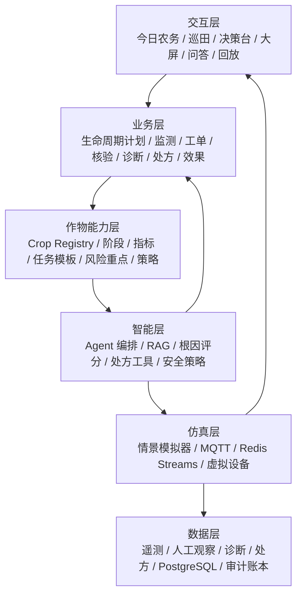
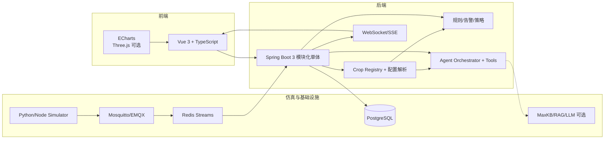
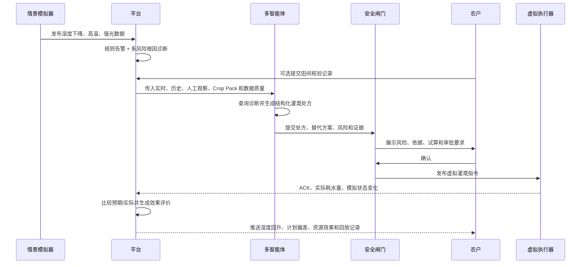

# 农智闭环 AgriLoop

15 天软件版智慧农业实训项目：用可配置的农田模拟数据，串起 MQTT 数据传输、智能体决策和可视化闭环。平台采用“统一农业智能内核 + 可插拔 Crop Pack（作物包）”，在复用数据、告警、Agent、控制和可视化能力的同时，按作物与生长阶段加载指标、规则、知识、任务模板和策略。业务链路从单纯监测扩展为“计划、感知、核验、诊断、处方、执行、验证、优化”，但仍只交付纯软件仿真态，不依赖真实传感器、鸿蒙开发板或硬件接入。

> 本期交付边界：模拟数据传输 + 智能体 + 可视化三主线及联调。
> 真实硬件、鸿蒙端和端-智-云联调属于后续演进，不计入本期验收。

项目设计已经拆成三个文件，便于分工、评审和答辩：

- [功能架构](./02_智慧农业_功能架构.md)：产品定位、角色、基础功能覆盖、创新功能和验收边界。
- [技术架构](./03_智慧农业_技术架构.md)：技术选型、三主线架构、数据合同、接口、安全和部署。
- [大致路线与流程](./04_智慧农业_大致路线与流程.md)：15 天排期、业务流程、联调 Gate、测试、答辩和交付清单。

## 项目亮点

- **软件仿真闭环**：模拟器 -> MQTT -> 风险/根因诊断 -> 结构化处方 -> 虚拟灌溉 -> ACK -> 效果验证。
- **多作物可扩展**：通过版本化 Crop Pack 注入作物档案、生长阶段、动态指标、规则、知识、策略、情景和测试，新增作物主要增加配置，不重写平台。
- **农务经营闭环**：用作物全周期计划生成任务，在今日农务中心汇总优先级，并比较计划、执行实际与资源效果。
- **人机证据融合**：传感器观测与田间核验共同进入诊断证据链，保留来源、时间、人员和可信度。
- **多角色智能体**：感知、诊断、规划、安全审核和报告角色通过受控工具协作；Agent 也是统一操作入口，但不能绕过策略层执行动作。
- **RAG 证据链**：回答同时展示实时数据、项目规则和农业知识来源，支持追问和决策回放。
- **风险感知灌溉**：从单一湿度阈值扩展到作物生长阶段、温度、光照、数据质量和设备健康度。
- **What-if 情景模拟**：一键模拟干旱、热浪、暴雨、传感器漂移和设备离线，验证策略而不是等待随机故障。
- **可解释与可审计**：每次建议保存输入快照、证据、工具调用、审批人、虚拟执行结果和效果评分。
- **可降级**：LLM 或知识库不可用时，规则引擎、灌溉试算和基础告警继续工作，并明确显示当前模式。

## 八项业务能力

八项能力使用 `CAP-01`～`CAP-08` 作为稳定业务编号。它们是现有三条软件主线之上的能力组合，不对应八个新服务。

| 编号 | 业务能力 | 现有架构落点 | 15 天范围 |
|---|---|---|---|
| CAP-01 | 作物全周期生产计划 | Crop Pack 阶段任务模板 + `crop_batch` + `work_order` | P0 冻结合同和两种作物模板；P1 完整时间轴 |
| CAP-02 | 今日农务中心 | 告警、诊断、计划任务、设备健康的聚合读模型 | P0 首页聚合与优先级排序 |
| CAP-03 | 田间核验 | `inspection_record` 人工观察证据 | P1 结构化巡田记录与证据融合 |
| CAP-04 | 多风险根因诊断 | `rule-module` 的证据收集、候选原因和置信度 | P0 干旱/漂移/设备异常基础诊断 |
| CAP-05 | 结构化农业处方 | 现有灌溉试算升级为 `irrigation_plan` 业务合同 | P0 先实现灌溉处方 |
| CAP-06 | 执行与效果验证 | `command` + ACK + `decision_ledger` 前后对比 | P0 主演示闭环 |
| CAP-07 | 计划 vs 实际与资源效率 | 作物批次、工单、命令实际量和审计汇总 | P1 用水偏差与单位效果 |
| CAP-08 | Agent 统一操作入口 | 现有 Agent Orchestrator + 白名单 Tool + 安全闸门 | P0 查询、诊断、处方、申请虚拟执行 |

完整定义、输入输出、降级路径和验收证据见[功能架构](./02_智慧农业_功能架构.md)。

## 基线功能与创新增量

原始功能清单中的 10 项功能全部保留：

| 基线 | 交付内容 |
|---|---|
| B-01/B-02 | 土壤湿度、温度实时监测 |
| B-03 | 7/24/168 小时历史趋势 |
| B-04 | 虚拟灌溉开关、指令 ACK 和失败提示 |
| B-05 | 阈值、持续时间、迟滞、冷却窗口告警 |
| B-06 | 设备心跳、在线状态、数据新鲜度和健康分 |
| B-07 | RAG 农事问答与灌溉建议 |
| B-08 | 多地块总览和风险排序 |
| B-09 | 模拟设备注册、绑定、解绑 |
| B-10 | 告警日志、筛选、确认、关闭和审计 |

在此基础上，本期优先增加：Crop Pack、全周期任务模板、今日农务聚合、多风险根因诊断、结构化灌溉处方、情景模拟、执行效果验证、Agent 统一操作入口、分层 RAG 证据、决策回放、安全闸门和 AI 降级。田间核验、完整生产计划页面及计划 vs 实际分析按 P1 实现。15 天 P0 至少完成 2 种代表性作物的完整最小包；平台结构支持后续将首批高质量作物包扩展到 6–8 种。所有新增能力按 P0/P1/P2 管理，避免为了“功能多”牺牲可运行性。

## 功能架构



### 三条主线

**数据主线**

```text
正常/异常情景模拟器
  -> MQTT Broker
  -> 数据校验、去重、质量评分
  -> Redis Streams
  -> PostgreSQL 时序表
  -> 与田间核验共同形成证据
  -> 风险告警、根因诊断、SSE/WebSocket 推送
```

**智能体主线**

```text
用户问题、今日任务或风险事件
  -> 确认地块、作物与生长阶段
  -> 加载并解析对应 Crop Pack
  -> 感知 Agent
  -> 诊断 Agent
  -> 处方/规划 Agent
  -> 安全审核
  -> 建议/虚拟执行申请
  -> 效果验证、决策账本与回放
```

**可视化主线**

```text
REST 查询 + SSE 实时事件
  -> 按 Crop Pack 配置生成指标卡片和目标曲线
  -> 今日农务、地块详情、巡田核验、风险排序
  -> 诊断解释、结构化处方、审批、效果与计划实绩
```

## 技术架构



### 技术选型

| 方向 | 选型 | 说明 |
|---|---|---|
| 前端 | Vue 3、TypeScript、Vite、ECharts | 快速实现工作台、趋势、实时状态和大屏 |
| 后端 | Spring Boot 3、Java 17/21 | 模块化单体，降低 15 天联调成本 |
| 消息 | MQTT + Redis Streams | 体现物联网链路和可靠事件处理 |
| 实时 | SSE 或 WebSocket | 统一事件格式，保证页面秒级刷新 |
| 数据 | PostgreSQL + Redis | 配置、时序、告警、审计和缓存统一管理 |
| 作物能力 | YAML/JSON + PostgreSQL | Crop Pack 版本管理、分层参数解析和配置校验 |
| 智能体 | MaxKB/RAG + LLM Adapter + 规则兜底 | 支持证据、工具调用和降级 |
| 运行 | Docker Compose、GitHub Actions | 一键启动、健康检查、可重复演示 |

## 关键流程

### 干旱情景闭环



### AI 降级流程

```text
LLM/RAG 超时
  -> AI_DEGRADED 标记
  -> 规则告警、风险排序、灌溉试算继续可用
  -> UI 明确显示“规则模式”
  -> 服务恢复后异步补写分析，不影响主流程
```

## 15 天路线

| 天数 | 目标 | 交付物 |
|---|---|---|
| D1-D3 | 需求冻结、领域模型、Crop Pack、八项能力及 MQTT/API/Tool 合同 | PRD、架构图、数据字典、看板 |
| D4-D6 | 模拟器、MQTT、落库、规则告警、根因诊断基础版 | 数据链路、心跳、诊断结果 |
| D7-D8 | 今日农务、趋势、地块、巡田入口、虚拟开关 | 基线页面与聚合待办 |
| D9-D10 | 分层 RAG、诊断/处方工具、多角色 Agent 操作入口 | 带证据和版本的结构化处方 |
| D11 | 安全闸门、审批、虚拟执行、ACK、效果验证 | 首次完整闭环 |
| D12-D13 | 生命周期计划、情景、回放、计划实绩、降级 | 作物包回归和稳定演示 |
| D14 | 集成测试、性能、安全、文档、PPT | 发布候选版和测试报告 |
| D15 | 全流程演练、缺陷冻结、答辩 | Demo、代码仓、文档、答辩材料 |

### 阶段门

- **D5**：1,000 条模拟事件可发送、落库、查询和实时推送。
- **D11**：异常 -> 根因诊断 -> 处方 -> 审批 -> 虚拟执行 -> ACK -> 效果验证 -> 回放跑通。
- **D14**：基线 10 项通过，干旱场景可重复，AI 断开后核心功能仍可用。

如果进度落后，优先保护基线、数据链路、规则告警、虚拟灌溉、RAG 问答和安全闸门；复杂 3D、视觉病害、语音和外部天气 API 只做 P2。

## 高分答辩演示

建议固定使用 `drought` 情景，避免现场随机数据不可控：

1. 从今日农务中心进入北棚番茄任务，查看批次阶段和计划来源。
2. 一键触发干旱，观察湿度下降、复合风险、候选根因和告警。
3. 可选补录一次田间核验，展示传感器与人工观察共同进入证据链。
4. 通过 Agent 提问并生成包含 WHAT/WHERE/WHEN/HOW MUCH/WHY 的灌溉处方。
5. 展示安全闸门：高风险动作先拦截，用户确认后才生成虚拟命令。
6. 展示 ACK、湿度回升、预期与实际、用水偏差、效果评分和决策时间轴。
7. 断开 LLM，展示规则模式仍可诊断、试算和执行受控流程；最后明确真实硬件属于后续适配层。

## 验收指标

| 指标 | 目标 |
|---|---:|
| 实时数据端到端延迟 | P95 < 2 秒 |
| 1,000 条事件落库成功率 | >= 99% |
| 重复命令率 | 0 |
| 同窗口告警重复率 | 0 |
| 固定问题 Agent 结构化输出成功率 | >= 95% |
| AI 不可用时核心功能可用率 | 100% |
| 未审批高风险命令绕过率 | 0 |
| P0 Crop Pack 回归通过率 | 100% |
| 固定证据诊断结果一致率 | 100% |
| 执行记录与效果评价关联完整率 | 100% |

## 仓库建议结构

```text
smart-agriculture/
├─ README.md
├─ docs/
│  ├─ 01_智慧农业_基本功能清单.md
│  ├─ 02_智慧农业_功能架构.md
│  ├─ 03_智慧农业_技术架构.md
│  ├─ 04_智慧农业_大致路线与流程.md
│  ├─ api/openapi.yaml
│  ├─ data/event-contract.md
│  └─ defense/demo-script.md
├─ apps/
│  ├─ web-console/
│  ├─ api-service/
│  └─ ai-tools/
├─ simulator/
│  ├─ scenarios/
│  └─ runner/
├─ crop-packs/              # 作物档案、阶段、指标、规则、知识、情景和测试
├─ infra/docker-compose.yml
└─ .github/workflows/ci.yml
```

## 本地启动约定

实现代码补齐后，建议使用以下方式启动软件仿真态：

```bash
docker compose -f infra/docker-compose.yml up -d
./gradlew :apps:api-service:bootRun
pnpm --dir apps/web-console dev
python simulator/runner/main.py --scenario drought --speed 1
```

关键配置：

```text
APP_MODE=simulation
MQTT_URL=tcp://localhost:1883
REDIS_URL=redis://localhost:6379
AI_MODE=rag          # rag | rules-only | mock
COMMAND_MODE=virtual
```

## 文档与边界

- [功能架构](./02_智慧农业_功能架构.md)
- [技术架构](./03_智慧农业_技术架构.md)
- [大致路线与流程](./04_智慧农业_大致路线与流程.md)
- [基础功能清单](./01_智慧农业_基本功能清单.md)：原始需求基线。
- 当前版本不声称已经完成真实传感器、鸿蒙端或硬件联调；相关内容只作为未来增加 `DeviceGatewayDataSource` 的扩展方向。
